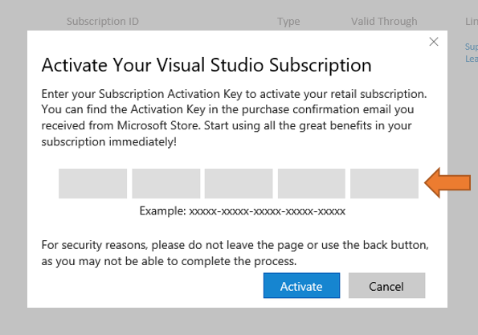

# How Do I Activate a Subscription Acquired from the Microsoft Store?
If you've purchased a Visual Studio subscription through the Microsoft Store, the activation steps can be initiated from the payment "Confirmation Page" or "Confirmation Email" you received after your purchase. 

> [!NOTE] 
> If you have not received an email, please validate your email address and check your junk mail folders 
  
## Activate Your Subscription: 
1. Click on **Click here to sign in**. 
2. You will be taken to [https://my.visualstudio.com/subscriptions/activate](https://my.visualstudio.com/subscriptions/activate?wt.mc_id=o~msft~docs).
3. Enter the email address that requires access to the Visual Studio subscription and click **Continue**.
4. You may be redirected to one of two different sign-in pages depending on the type of account you are using:
    - Subscribers using their personal "Microsoft Account" (MSA) will see the Microsoft Account password page.
    - Subscribers using their work/school accounts will be redirected to their organization's sign-in page.  
6. Enter your password, or complete your organization's sign-in requirements.
7. Upon successful sign-in, an "Activate Your Visual Studio Subscription" window will appear.
8. Enter the product key information available from the payment "Confirmation Page" or "Confirmation Email" and click **Activate**.

    

9. The subscription should now be visible on the [Subscriptions](https://my.visualstudio.com/subscriptions?wt.mc_id=o~msft~docs) page and you should access to all your subscription benefits. 

