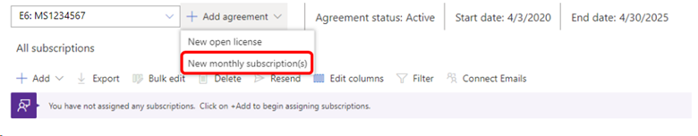
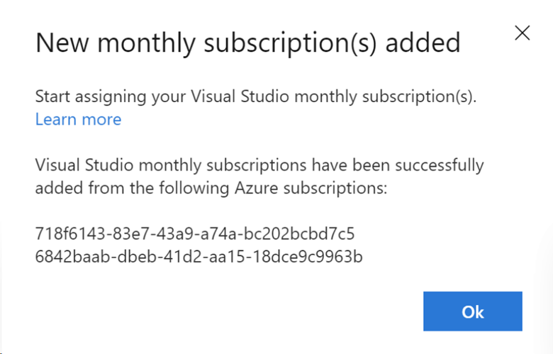

# Link new monthly Visual Studio subscriptions to the Subscriptions Admin portal

If you're an Azure admin and purchased new monthly Visual Studio subscriptions by using an Azure subscription in the [Visual Studio Marketplace](https://marketplace.visualstudio.com/subscriptions), you might need to link them into your specific admin group. You can link them by using the Subscriptions Admin portal.

## How do I know if I need to link my subscriptions?

Whether you need to link your subscription depends on the type of subscriptions your organization already has, and whether you're a new admin.

* If you're a new admin, the first time you sign in to the Subscriptions Admin portal, we check to see if you have User Access Administrator rights for any Azure subscriptions. If we find monthly subscriptions for you, we link them automatically.
* If you linked or administered monthly subscriptions that you purchased by using an Azure subscription, we check for new monthly subscriptions each time you sign in.
* If you're already an admin for Volume Licensing subscriptions but *haven't* linked or managed monthly subscriptions, you need to link them by using the following steps.

## How to link monthly subscriptions

1. Sign in to the [Subscriptions Admin portal](https://manage.visualstudio.com).
0. On the **Manage subscribers** tab, select the **Add agreement** dropdown menu, and then select **New monthly subscription(s)**.
   > [!div class="mx-imgBorder"]
   > 

   > [!NOTE]
   > If the **New monthly subscription(s)** option isn't visible when you select the **Add agreement** dropdown menu, it indicates that no monthly subscriptions were purchased in the marketplace, or that the monthly subscriptions were automatically linked, allowing for immediate assignment.

4. The system searches to see if you have User Access Administrator rights for any Azure subscriptions and imports any Visual Studio subscriptions purchased with those Azure subscriptions.
0. If you don't have User Access Administrator rights on any Azure subscriptions, or no Visual Studio subscriptions are found, you receive the following message:
   > [!div class="mx-imgBorder"]
   > 
0. If new monthly subscriptions are found, you receive a confirmation message.
   > [!div class="mx-imgBorder"]
   > 

## Things to keep in mind

* The option to link new monthly subscriptions is available only the first time you purchase them. After you link monthly subscriptions, we check for new subscriptions each time you sign in to the portal.
* When new subscriptions are found, you might see that they're already assigned to subscribers. The reason is that there are other admins with access to the Azure subscription, and they can also assign the new Visual Studio subscriptions to users. Now that you linked them to your portal, you can administer those subscriptions.

## Support resources

For assistance with administration of Visual Studio subscriptions, contact [Visual Studio subscriptions support](https://aka.ms/vsadminhelp).

## Related content

Now that you linked subscriptions, you're ready to assign them to users. You can do that in several ways:
* [Assign subscriptions individually](assign-license.md)
* [Assign subscriptions to multiple users](assign-license-bulk.md)
* [Assign specific subscriptions to specific users](assign-guid.md)

For more help, see:
* [Visual Studio documentation](/visualstudio/)
* [Azure DevOps Services documentation](/azure/devops/)
* [Azure documentation](/azure/)
* [Microsoft 365 documentation](/microsoft-365/)