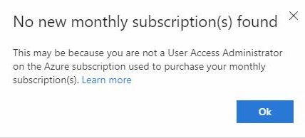

# Add new monthly Visual Studio subscriptions to the Subscriptions Administration Portal

When you purchase new monthly Visual Studio subscriptions using an Azure subscription, you may need to add them to the Subscriptions Administration Portal in order to assign them to users.  

## How do I know if I need to add my subscriptions?

The steps to add monthly subscriptions depend on what kinds of subscriptions your organization already has, and whether you're a new admin.
+ If you're a new admin, we check for Azure subscriptions on which you have User Access Administrator rights when you sign in to the Subscriptions Administration portal the first time.  If we find monthly subscriptions for you, we add them automatically. 
+ If you've previously added or administered monthly subscriptions purchased using an Azure subscription, we check for new monthly subscriptions each time you sign in. 
+ If you're already an admin for Volume Licensing subscriptions but haven't already added or managed monthly subscriptions, you need to add them using the following steps.

## How to add monthly subscriptions

1. Sign in to the Subscriptions Administration portal at <https://manage.visualstudio.com>
0. On the **Manage subscribers** tab, choose the **Add agreement** drop-down 
0. Choose **New monthly subscriptions** in the drop-down
   > [!div class="mx-imgBorder"]
   > 
0. The system searches for any Azure subscriptions on which you have User Access Administrator rights, and imports any Visual Studio subscriptions purchased with those Azure subscriptions.
0. If you don't have User Access Administrator rights on any Azure subscriptions, or no Visual Studio subscriptions are found, you receive the following message:
   > [!div class="mx-imgBorder"]
   > 
0. If new monthly subscriptions are found, you receive a confirmation message
   > [!div class="mx-imgBorder"]
   > 

## Things to keep in mind

+ The option to add new monthly subscriptions is only available the first time you purchase them.  After you've added monthly subscriptions, we check for new subscriptions each time you sign in to the portal. 
+ When new subscriptions are found, you may see that they're already assigned to subscribers.  That's because there are other admins with access to the Azure subscription, and they've already assigned the new Visual Studio subscriptions to users.  Now that you've also added them to your portal, you can administer those subscriptions. 

## Support resources

For assistance with administration of Visual Studio Subscriptions, contact [Visual Studio subscriptions support](https://aka.ms/vsadminhelp).

## Next steps

Now that you've added subscriptions, you're ready to assign them to users.  You can do that in several ways:
+ [Assign subscriptions individually](assign-license.md)
+ [Assign subscriptions to multiple users](assign-license-bulk.md)
+ [Assign specific subscriptions to specific users](assign-guid.md)

## See also

+ [Visual Studio documentation](/visualstudio/)
+ [Azure DevOps Services documentation](/azure/devops/)
+ [Azure documentation](/azure/)
+ [Microsoft 365 documentation](/microsoft-365/)