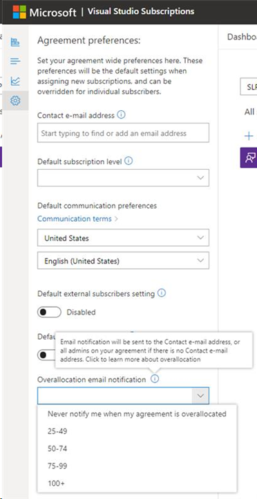

# Set preferences for your agreements in the admin portal

Super admins can set certain preferences in the Admin portal (admin portal) that are applied globally for each agreement. These preferences automatically populate subscription details during assignment, simplifying the process for admins. After they're set, only super admins can modify them. 

## Access preferences

To view or modify preferences, you must be signed in to the [admin portal](https://manage.visualstudio.com) using a sign-in ID that has super admin rights on the agreement. 

To set your preferences:
1. Sign in to the admin portal with an ID that has super admin privileges.
2. Select the setting icon in the left pane.
   > [!div class="mx-imgBorder"]
   > 

3. Select **Agreement Preferences**.
A side panel opens and your available preferences are displayed. 

   > [!div class="mx-imgBorder"]
   > 

## Set your preferences

Here are the preferences you can set, and what they do. 

### Agreement

If you're a super admin on several agreements, you're able to choose the desired agreement in the drop-down on the menu bar. The preferences you set apply only to that agreement. Individual admins can override some of these preferences on a case-by-case basis when assigning subscriptions. 

If there's only one agreement for your email address, the drop-down is disabled. 

### Contact email address

This preference provides a way for your subscribers to reach out to admins by using the **Contact my Admin** button on the [subscriptions page](https://my.visualstudio.com/subscriptions) of the subscription portal. If this preference is left blank, subscriber messages are forwarded to all admins and super admins on the agreement. We recommend using a group email alias or security group to tailor your audience for this contact email. You can also choose to input an individual’s email address if you prefer.

> [!NOTE]
> The email address you list here **won't** be provided to subscribers. When a subscriber submits a **Contact my Admin** request in the subscription portal, the message will be forwarded to the alias without exposing it to the subscriber. 

### Default subscription level

Here you can set which default subscription level from your agreement is assigned to a user. Admins can change the subscription level to any level from your agreement--this option just simplifies the assignment process since most admins assign the same subscription level to the bulk of their subscribers. 

### Default communication preferences

Setting a default communication language and locale can streamline the process of assigning subscriptions. For example, if your development team is based in a different country/region than your admin team, you can set the preferences best suited to the subscribers' location. Admins can still change these settings for individual subscribers. 

### Default external subscribers setting

This security feature allows you to restrict admins from adding subscribers outside your organization's tenant/directory. Turn off this option to prevent assignments to external subscribers. When enabled, if an admin attempts to add an outside subscriber, they're asked to confirm their choice, and are allowed to assign the subscription. Admins can't override this setting. 

### Default downloads setting

Enable this setting, which is on by default, to allow subscribers to access downloads when admins create new subscriptions. Admins can still disable downloads on an individual subscription basis. Disabling access to downloads also disables access to product keys. 

### Overallocation notification 

Opt in here to receive emails when assignments on your agreement become overallocated. This email notification is sent to the [Contact e-mail address](admin-preferences.md#contact-email-address), or all admins on your agreement if there's no Contact e-mail address. Use the drop-down menu to configure the threshold at which you'd like to be notified. 

 
## Frequently asked questions

### Q:  Can I disable the **Contact email address** so subscribers can't contact admins?

A:  No - while you can determine which admins are contacted using a security group, group email alias, or an individual email address, the feature can't be disabled.

### Q: If I answer a subscriber's email, do they have my email address now?

A:  Since your response comes from whatever email client you're using, the response the subscriber receives sees whatever email address you're using. So, if you're responding from a group alias, they see the group alias. If you respond from your own email address, they see that. 

### Q: Where can I find out more about the **Contact my Admin** feature in the subscription portal?

A:  Check out our [Contact my Admin](contact-my-admin.md) article. 

### Q: If we don't complete the **Contact email address** and a subscriber uses the **Contact my Admin** feature, who receives their request?

A:  If no specific email address is set in the **Contact email address** preference, all admins on the agreement receive the request. 

## Resources

[Visual Studio administration and subscriptions support](https://aka.ms/vsadminhelp).

## See also
+ [Visual Studio documentation](/visualstudio/)
+ [Azure DevOps Services documentation](/azure/devops/)
+ [Azure documentation](/azure/)
+ [Microsoft 365 documentation](/microsoft-365/)

## Next steps
Learn more about managing Visual Studio subscriptions.
+ [Assign individual subscriptions](assign-license.md)
+ [Assign multiple subscriptions](assign-license-bulk.md)
+ [Edit subscriptions](edit-license.md)
+ [Determine maximum usage](maximum-usage.md)
