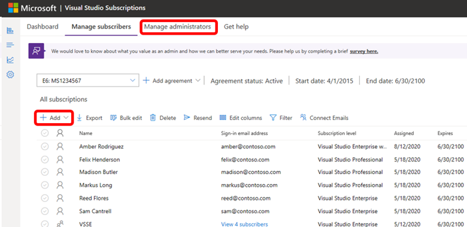
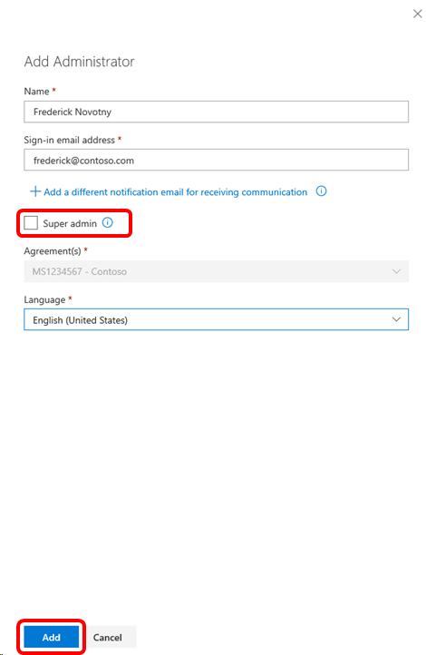

# Super admins and admins for Visual Studio Subscription agreements

The Visual Studio Subscriptions Admin Portal for Volume Licensing customers has two roles, similar to the Primary/Notices Contact and Subscriptions Manager roles that previously existed in the Volume Licensing Service Center (VLSC).

**Super admins:** When you initially set up an organization, the Primary or Notices Contact becomes a super admin by default. The Primary or Notices Contact can assign more super admins or admins. A super admin can add and remove other admins and subscribers. For security, if the system has more than two super admins, a super admin can delete all but the last two. In addition to assigning admins and managing subscribers, super admins can set global preferences for agreements.

**Admins:** Only super admins can assign new admins and add them to agreements. Admins can manage subscribers only in the agreements that a super admin assigns to them.

Watch a demonstration about how to manage admins.
> [!VIDEO https://medius.microsoft.com/Embed/video-nc/b2a63234-a82a-402b-a729-8e1259bc12fd?r=484038674989]

## Assigning admins

To assign new admins:
1. Sign in to the [Visual Studio Subscriptions portal](https://manage.visualstudio.com) by using an email address that's listed as a super admin on the agreement through which you purchased the subscriptions.
0. Select the tab labeled **Manage Administrators**.
0. Select **Add**.
   > [!div class="mx-imgBorder"]
   > 
0. Complete the form with the new admin's information.
   > [!div class="mx-imgBorder"]
   > 

   > [!NOTE]
   > If you want this admin to be able to assign more admins, select the **Super Admin** box.

1. After you select **Add**, the new admin receives an email inviting them to sign in to the portal.

## Resources

[Visual Studio administration and subscriptions support](https://aka.ms/vsadminhelp)

## See also

+ [Visual Studio documentation](/visualstudio/)
+ [Azure DevOps documentation](/azure/devops/)
+ [Azure documentation](/azure/)
+ [Microsoft 365 documentation](/microsoft-365/)

## Next steps

+ Learn how to [assign subscriptions](assign-license.md)
+ Learn more about the full range of [subscription benefits](https://visualstudio.microsoft.com/vs/benefits/)
+ [Set agreement preferences](admin-preferences.md)
