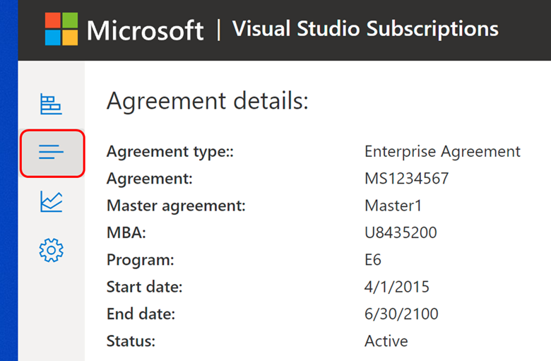
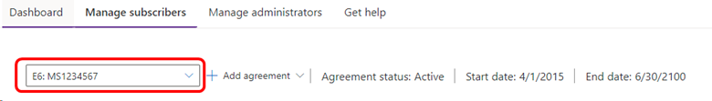

# What happens when Visual Studio subscription agreements are renewed

When your company renews an agreement that includes Visual Studio subscriptions, what you see in the [admin portal](https://manage.visualstudio.com) depends on how the renewal was accomplished.  

## Agreement was renewed with the existing agreement number

If your company renewed the existing agreement and the agreement number is unchanged, you see a new agreement end date and all of your subscriptions show an updated expiration date.  You can view information about your agreement by selecting the **Details** button to the far left. 
   > [!div class="mx-imgBorder"]
   > 

## A new agreement was created

If your company renewed their agreement but you're still seeing the old agreement information, there are a couple of possible causes:
+ You may be viewing the old agreement.  To view the new agreement, select the agreement picker and select the new agreement.  
   > [!div class="mx-imgBorder"]
   > 
+ You may not be listed as an admin on the new agreement.  If you don't see any new agreements listed in the agreement picker, you need to contact a super admin to be granted permissions to the new agreement number.  

## Resources

Need help?  Contact [Subscriptions Support](https://aka.ms/vsadminhelp).

## See also

+ [Visual Studio documentation](/visualstudio/)
+ [Azure DevOps Services documentation](/azure/devops/)
+ [Azure documentation](/azure/)
+ [Microsoft 365 documentation](/microsoft-365/)

## Next steps

Learn about using the admin portal:
+ [Add a single user](assign-license.md)
+ Have many users to add?  Learn how to assign subscriptions to [multiple subscribers](assign-license-bulk.md).
+ [Assign GitHub subscriptions](assign-github.md)
+ [Edit existing subscriptions](edit-license.md)
