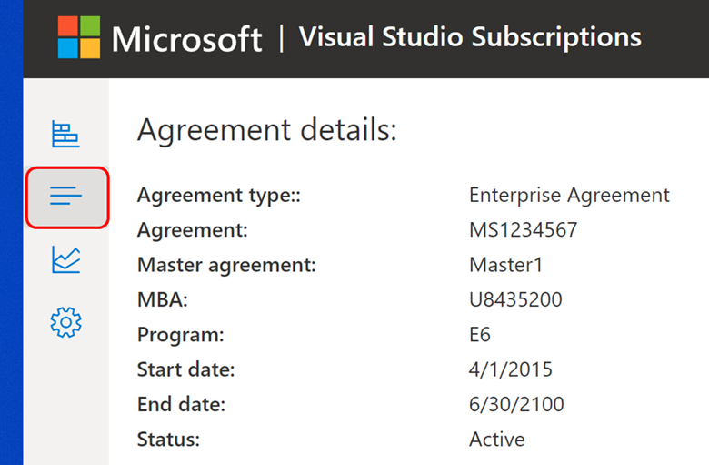
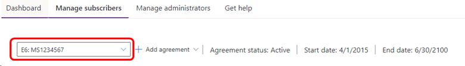

# What happens when Visual Studio Subscription agreements are renewed

When your company renews an agreement that includes Visual Studio Subscriptions, what appears in the [admin portal](https://manage.visualstudio.com) depends on how the renewal is processed. A renewal might extend the existing agreement or create a new agreement with a different agreement number.

## If the agreement is renewed using the existing agreement number

If the agreement is renewed and the agreement number remains the same, the agreement end date is updated and all associated subscriptions reflect the new expiration date. In the admin portal, select **Details** on the Agreements page to view agreement information, as shown in the following image. 
   > [!div class="mx-imgBorder"]
   > 

## If a new agreement is created during renewal

If the renewal resulted in a new agreement number, the new agreement is listed separately in the admin portal. To view the new agreement, use the agreement picker in the admin portal to select the appropriate agreement, as shown in the following image.
  
   > [!div class="mx-imgBorder"]
   > 

## If the new agreement doesn't appear

If the new agreement isn't visible in the admin portal, possible causes include:

+ The previous agreement is still selected in the agreement picker. Select the new agreement to view updated information.
+ Access hasn't been assigned to the new agreement. Contact an administrator with permission to manage the agreement to request access.  

## Resources

Need help? Contact [Subscriptions Support](https://aka.ms/vsadminhelp).

## See also

+ [Visual Studio documentation](/visualstudio/)
+ [Azure DevOps Services documentation](/azure/devops/)
+ [Azure documentation](/azure/)
+ [Microsoft 365 documentation](/microsoft-365/)

## Next steps

After confirming the renewal, verify that subscription expiration dates and agreement details are updated as expected. You can then continue managing subscriptions in the admin portal:
+ [Add a single user](assign-license.md)
+ [Assign subscriptions to multiple subscribers](assign-license-bulk.md)
+ [Assign GitHub subscriptions](assign-github.md)
+ [Edit existing subscriptions](edit-license.md)
