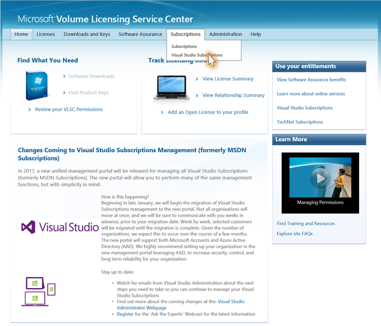
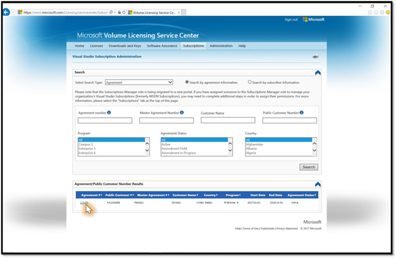

# Signing in to Visual Studio subscriptions may fail when using aliases
Depending on the account type used to sign in, available subscriptions may not be correctly displayed when signing in to [https://my.visualstudio.com](https://my.visualstudio.com?wt.mc_id=o~msft~docs). One potential cause is the use of "aliases" or "friendly names" in place of the sign-in identity to which the subscription is assigned. This is called "aliasing".

## What is aliasing?
The term “aliasing” refers to users having different identities to sign in to Windows (or your Active Directory) and to access email.

Aliasing can be encountered when a company has a Microsoft Online Service for their directory sign-in, like 'JohnD@contoso.com', but users access their email accounts using aliases or friendly names, such as 'John.Doe@contoso.com'. For many customers who manage their subscriptions through the Volume Licensing Service Center (VLSC), this can result in an unsuccessful sign-in experience as the email address provided ('John.Doe@contoso.com') does not match the directory address ('JohnD@contoso.com') required for successful authentication through the “Work or School Account” option.

## As an administrator, what options do I have?
As an administrator, there are two options to ensure your subscribers have a successful sign-in experience on [https://my.visualstudio.com](https://my.visualstudio.com?wt.mc_id=o~msft~docs).
- The first option (recommended), is to leverage the directory account as the assigned address in the Volume Licensing Service Center (VLSC). Refer to [Assigning Subscribers to a Directory Account](#assigning-subscribers-to-a-directory-account) section in this article for more details.
- The second option (less secure), is to allow your subscribers to associate their “Work or School” email address to a “Personal” account (a.k.a. Microsoft Account or MSA). Refer to [Defining a Work or School Account as a Personal Account](#defining-a-work-or-school-account-as-a-personal-account) section in this article for more details.

> [!NOTE]
> Once your company is migrated to the new Visual Studio subscriptions [administration portal](https://manage.visualstudio.com), you will be able to take advantage of the new administration experience which allows both Directory and email addresses to be provided as part of the subscriber’s profile. Learn more about the [migration](https://support.microsoft.com/help/4013930/visual-studio-subscriptions-administrator-migration-details).

## Assigning subscribers to a directory account
In all cases, the Subscription Manager within the Volume Licensing Service Center (VLSC) will need to use the directory address for new subscribers, or update the email address for “existing” subscribers. It is important to note that using the directory address will mean any new subscribers will not receive a Welcome Email, and the Administrator will need to notify the subscriber that a subscription has been assigned to them. After following the below steps, please also feel free to use the email [template](#notifying-your-subscribers-with-directory-addresses) to notify your subscribers, and help them through the sign-in process.

### Adding new subscribers
Please follow these steps to add a new subscriber with a directory account.

1. Visit the [Volume Licensing Service Center](https://www.microsoft.com/Licensing/servicecenter/default.aspx) (VLSC) and sign in.
2. From the VLSC Admin page, click **Subscriptions** and then **Visual Studio Subscriptions**.

    > [!div class="mx-imgBorder"]
    > 

3. Click the **Agreement Number** associated with the Visual Studio Subscription.

    > [!div class="mx-imgBorder"]
    > 

4. Click **Assign Subscription**.
5. Select the desired **Subscription Level**.
6. Validate you have subscriptions available to assign, and click **Next**.
7. Enter the subscriber details and directory address in the Email Address field, and click **Next**.
8. Validate the subscriber information, and click **Finish**.
9. Notify the subscriber that their subscription has been provisioned by using the below [template](#notifying-your-subscribers-with-directory-addresses).

### Updating an existing subscriber
Please follow the below steps to update an existing subscriber with a directory account.

1. Visit the [Volume Licensing Service Center](https://www.microsoft.com/Licensing/servicecenter/default.aspx) (VLSC) and sign in.
2. From the VLSC Admin pages, click **Subscriptions** and then **Visual Studio Subscriptions**.
3. Click the **Agreement Number** associated with the Visual Studio Subscription.
4. Click the **down arrow** on the Search bar.
5. Search for the subscriber using the “Email Address” field.
6. From the results list, click the **Last Name** of the subscriber.
7. Click **Edit**.
8. Change the Email Address field to the desired directory address, and click **Save**.
9. Notify the subscriber that their subscription has been provisioned by using the below email template.

### Notifying your subscribers with directory addresses
Since the Welcome Email will not successfully reach your subscriber, please copy and paste the below message into an email and send to your subscriber. Replace %WORD% with the appropriate information for each subscriber.

```
----------- Copy Below (Ctrl+C) -----------

Hello %SUBSCRIBER NAME%

You have been assigned a Visual Studio subscription. Please visit https://my.visualstudio.com, and log in with your %DIRECTORY ADDRESS% address to activate and access your subscription.

If you’re having trouble, please contact the support team (https://visualstudio.microsoft.com/subscriptions/support/).

At the bottom of the page, select the following:
   - Accounts, Subscriptions, and Billing Support
   - From Issue, choose Subscription sign in support
   - Choose the appropriate Country
   - Select the desired Assisted Support option

----------- End Copy -----------
```

## Defining a work or school account as a personal account
Please leverage the instructions described in the [Assigning Subscribers to a Directory Account](#assigning-subscribers-to-a-directory-account) section to add a new user or update a user’s email address within the Volume Licensing Service Center (VLSC).  In cases where the email address is not recognized by the directory, the user will need to step through the process to create a new account to define the email address as a personal account.  For the short term, the Visual Studio Subscriptions team has secured an exemption from the identity policy defined below, but we are investing in the capabilities necessary to remove this policy.

> [!WARNING]
> Microsoft does not recommend combining “Work or School” identities with “Personal” identities.  This action causes the organization to lose ownership and control of the account, and the employee can continue to access specific products or services, even after leaving the company.  

### Defining an email address as a personal account
After a subscription is  assigned to the Subscriber, they will receive an email asking them to visit [https://my.visualstudio.com](https://my.visualstudio.com?wt.mc_id=o~msft~docs) to take advantage of their subscription benefits.  When attempting to sign-in, the Visual Studio Subscription sign-in will fail with an error stating that the account isn’t recognized.  Before logging into the [https://my.visualstudio.com](https://my.visualstudio.com?wt.mc_id=o~msft~docs) experience, ask your subscriber to  follow these instructions.  If necessary, you can use this [template](#notifying-your-subscribers-using-personal-accounts) to notify your subscriber after you have assigned a subscription.

1. Navigate to https://my.visualstudio.com, and click **Create new Microsoft account**.

2. Complete the Fields:
   - Enter the email address which received the Welcome Email in the Someone@example.com box
   - Create your password
   - Choose your promotional settings
   - Click **Next**

3. Complete the validation steps and click **Next**.

4. New users may need to complete the Visual Studio profile.

5. The subscription and benefits should now be visible.

### Notifying your subscribers using personal accounts
In the scenario outlined above, your subscriber will receive a “Welcome Email”, but due to aliasing they may find they are unable to sign in.  You can use the below text to notify your subscriber of the above steps, and recommend support options if required.  Replace %WORD% with the appropriate information for each subscriber.

```
----------- Copy Below (Ctrl+C) -----------

Hello %SUBSCRIBER NAME%

You have been assigned a Visual Studio subscription, and may have been directed to log into https://my.visualstudio.com based on your Welcome email.  While this is the correct website for consuming benefits, our organization requires you to take a few extra steps before you can access the site.  Please follow the below instructions to help you create a “Microsoft Account” that is tied to our corporate email address.  Once these steps are completed, you will use your email address to access the Subscription benefits.
1. Visit https://my.visualstudio.com

2. Click Create new Microsoft Account on the right hand side

3. Complete the Form:
   - Use your corporate email address in the someone@example.com box
   - Enter a password
   - Select your promotional preference
   - Click Next

4. Complete the account validation steps

5. If necessary, complete the Visual Studio profile

6. You should now see your benefits

Note:  When visiting https://my.visualstudio.com in the future, you may be prompted to select which account you’d like to use (e.g. “Work or School Account” or “Personal Account”).  After following the steps above, you will need to leverage the “Personal Account” option.

If you’re having trouble, please contact the support team (https://visualstudio.microsoft.com/subscriptions/support/).

At the bottom of the page, select the following:
   - Accounts, Subscriptions, and Billing Support
   - From Issue, choose Subscription sign in support
   - Choose the appropriate Country
   - Select the desired Assisted Support option

----------- End Copy -----------
```
