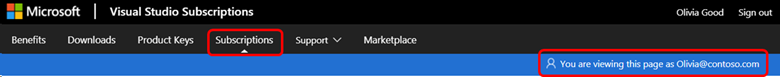

# Signing in to Visual Studio subscriptions may fail when using aliases
Depending on the account type used to sign in, available subscriptions may not be correctly displayed when signing in to [https://my.visualstudio.com](https://my.visualstudio.com?wt.mc_id=o~msft~docs). One potential cause is the use of "aliases" or "friendly names" in place of the sign-in identity to which the subscription is assigned. This is called "aliasing".

## What is aliasing?
The term “aliasing” refers to users having different identities to sign in to Windows (or your Active Directory) and to access email.

Aliasing can be encountered when a company has a Microsoft Online Service for their directory sign-in, like 'olivia@contoso.com', but users access their email accounts using aliases or friendly names, such as 'OliviaG@contoso.com'. Make sure your users are signing in using the "Sign-in Email Address" as listed in the Visual Studio Subscriptions Administration Portal at https://manage.visualstudio.com to access their subscriptions

## As an administrator, what options do I have?

Depending on the subscriber's account type, find the applicable solution below:

### Work or school account UPN mismatch issue

A User Principal Name (UPN) mismatch can be encountered when a compnay has an Active Diretory set up where the UPN is not the same as the Primary SMTP Address. 

#### How to detect if a user's sign-in address has a UPN mismatch

Have the user complete the following steps:

1. Sign in to https://my.visualstudio.com using the sign-in address mentioned in their subscription assignment email.  

> [!NOTE]
> If they don't have their subscription assignment email, you can resend it to them from within the adminstration portal.  

2. Click on the **Subscriptions** tab.
3. Verify that the email address displayed in the upper right where it says "You are signed in as..." is the same as the sign-in email address in their subscription assignment email.  If it isn't, they will not be able to access their subscription benefits. 

   > [!div class="mx-imgBorder"]
   > 

#### How to correct the UPN mismatch

1. Access the Visual Studio Administration Management portal at https://manage.visualstudio.com 

2. Locate the user having the UPN mismatch issue.  The [Filter](search-license.md) feature can make this easier if you have a lot of subscriptions. 

3. Change the Sign-in Email address to the user’s UPN.

4. Save the changes 

5. Ask the user to logout of the subscriber portal and sign in again using the UPN.   

### Personal account aliasing issue

Aliasing issues can also impact personal accounts. 

#### How to detect if a personal account has an aliasing issue

1. Sign in https://my.visualstudio.com.

2. Click on the **Subscriptions** tab and check the address with which you are signed in. 

3. If the signed-in email address is not the same as the email address used to access the website there is a conflict between your account and the alias. 

#### How to fix a personal account aliasing issue

The Visual Studio subscriptions platform prioritizes the primary alias to show subscription details.  To resolve the issue, you need to make a different email alias your primary alias for signing in. 

1. Go to [Manage how you sign in to Microsoft](https://go.microsoft.com/fwlink/p/?linkid=842796).
2. Sign in to your Microsoft account if prompted. 
3. Under Account aliases, select **Make primary** next to the email address used to assign the subscription. 
4. Under Account aliases, select Make primary next to the email address used to assign the subscription. 
5. Sign out of the Visual Studio Subscriber portal (https://my.visualstudio.com) 
6. Access the portal again using the new primary alias. 

### Ensure a successful experience for your users

As an administrator, there are two options to ensure your subscribers have a successful sign-in experience on https://my.visualstudio.com. 

- The first option (recommended) is to leverage the directory account as the sign-in address on https://manage.visualstudio.com.
- The second option, which is less secure, The second option (less secure), is to allow your subscribers to sign in using a different email address than their directory email address.

Both options are configured in the admin portal by completing the following steps:

1. Sign into https://manage.visualstudio.com 

2. If you are altering a single user, select that user in the table and right click to edit. This will open a panel where you can modify the sign-in email address.  

3. Make the necessary updates in the sign-in email address field. 

4. Click save and the changes will take effect.  
If you need to make these changes to a large quantity of users, you can utilize the bulk edit feature. Read the [Edit multiple subscribers using bulk edit](edit-license#edit-multiple-subscribers-using-bulk-edit) article for more information about that process.  

## Next steps
Learn more about managing Visual Studio subscriptions.
- [Assign individual subscriptions](assign-license.md)
- [Assign multiple subscriptions](assign-license-bulk.md)
- [Edit subscriptions](edit-license.md)
- [Delete subscriptions](delete-license.md)
- [Determine maximum usage](maximum-usage.md)

## See also
- [Visual Studio documentation](/visualstudio/)
- [Azure DevOps documentation](/azure/devops/)
- [Azure documentation](/azure/)
- [Microsoft 365 documentation](/microsoft-365/)
