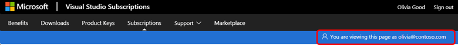
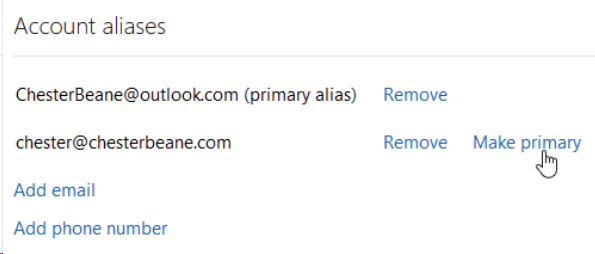

# Signing into Visual Studio subscriptions might fail when using aliases

Depending on the account type used to sign in, available subscriptions might not be correctly displayed when signing in to [https://my.visualstudio.com](https://my.visualstudio.com?wt.mc_id=o~msft~docs). One potential cause is the use of 'aliases' or 'friendly names' in place of the sign-in identity to which the subscription is assigned. This technique is called "aliasing."

## What is aliasing?

The term 'aliasing' refers to users having different identities to sign in to Windows (or your Microsoft Entra ID) and to access email.

Aliasing can be encountered when a company has a Microsoft Online Service for their directory sign-in, like `JohnD@contoso.com`, but users access their email accounts using aliases or friendly names, such as `John.Doe@contoso.com`. Make sure your users are using the 'Sign-in Email Address' as listed in the admin portal at https://manage.visualstudio.com to access their subscriptions. 

## What are the potential issues?

Depending on the subscriber’s account type, they might encounter one of two issues. 

### Work or school account UPN mismatch issue

A UPN mismatch can be encountered when a company has a Microsoft Entra ID set up where the UserPrincipalName (UPN) isn't the same as the Primary Simple Mail Transfer Protocol Address (SMTP). 

#### How to detect if a UPN mismatch is affecting your sign-in address 

1. Sign into https://my.visualstudio.com/subscriptions using the sign-in address mentioned in your subscription assignment email.

2. Select your name in the upper right corner of the page. Your profile opens. Verify that the sign-in email address listed in your profile matches the address you used to sign in. If it doesn't, your UPN is mismatched and you aren't able to view your subscription. 

> [!div class="mx-imgBorder"]
> 

#### How to fix a UPN mismatch

1. Access the Visual Studio Admin portal [https://manage.visualstudio.com](https://manage.visualstudio.com).

2. Locate the subscriber having the UPN mismatch issue. (The [Filter](search-license.md) feature can make it easy to find a subscriber).

3. Change the sign-in mail address to the subscriber's UPN.

0. Save the changes. 

0. Inform the subscriber to sign out of the subscription portal and access again using the UPN.

### Personal account aliasing issue

Personal subscription accounts can also experience issues if the email address used to sign in to the Visual Studio Subscriptions portal doesn't match the email address associated with the subscription. 

#### How to tell if your personal subscription account has an aliasing issue

1. Sign in to [https://my.visualstudio.com/subscriptions](https://my.visualstudio.com/subscriptions).

0. Verify that the sign-in email address listed at the top right of the page matches the address you used to sign in. If the signed-in email address isn't the same as the email address used to access the website there's a conflict between your account and the alias.

#### How to fix an alias issue

The Visual Studio platform prioritizes the primary alias to show subscription details. 

1. Go to **Manage how you sign in to Microsoft**. Sign in to your Microsoft account if prompted. 

2. Under Account aliases, select **Make primary** next to the email address used to assign the subscription. 

> [!div class="mx-imgBorder"]
> 

3. Sign out of the Visual Studio Subscriptions portal (https://my.visualstudio.com). 

4. Sign back in using the account used to assign the subscription, which should now be configured as primary alias. 

## Preventing aliasing issues

As an admin, there are two options to ensure your subscribers have a successful sign-in experience on [https://my.visualstudio.com](https://my.visualstudio.com?wt.mc_id=o~msft~docs).
+ The first option (recommended), is to use the directory account as the sign-in for the Visual Studio Subscriptions portal at https://my.visualstudio.com. 
+ The second option (less secure), is to allow your subscribers to sign in using a different email address than their directory email address.

Both of these options are configured in the admin portal by completing the following steps:  
1. Sign into [https://manage.visualstudio.com](https://manage.visualstudio.com). 

0. To change a single user, select that user in the table and right-select to edit. A panel opens to allow you to modify the sign-in email address. Make the necessary updates in the sign-in email address field. Select save and the changes take effect. 

0. If you need to make these changes to a large quantity of users, you can utilize the bulk edit feature. Read the [Edit multiple subscribers using bulk edit](./edit-license.md#edit-multiple-subscribers-using-bulk-edit) article for more information.

> [!NOTE]
> For both individual and bulk changes, the subscribers will receive an email with instructions that their sign-in email address has changed and they will need to sign in using the updated email address. It’s also important to note that if the subscriber previously activated benefits under the other sign-in address, they’ll need to continue using the other sign-in address to access them. 

## Support resources

For assistance with administration of Visual Studio Subscriptions, contact [Visual Studio subscriptions support](https://aka.ms/vsadminhelp).

## See also

+ [Visual Studio documentation](/visualstudio/)
+ [Azure DevOps documentation](/azure/devops/)
+ [Azure documentation](/azure/)
+ [Microsoft 365 documentation](/microsoft-365/)

## Next steps

Learn more about managing Visual Studio subscriptions.
+ [Assign individual subscriptions](assign-license.md)
+ [Assign multiple subscriptions](assign-license-bulk.md)
+ [Edit subscriptions](edit-license.md)
+ [Determine maximum usage](maximum-usage.md)