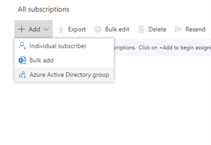
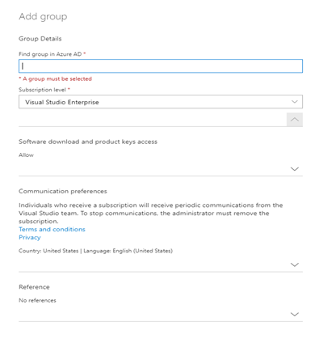

# How to automate your Visual Studio Subscriptions using Azure Active Directory groups

This guide will show you how to take advantage of Azure Active Directory (Azure AD) groups to create a simple and convenient process to automate and manage your Visual Studio subscriptions.
Once you’ve assigned a subscription level to an Azure Active Directory group, your users will be able to request to join an Azure Active Directory group based on the subscription level they need. Once they are approved to join the group, they will be automatically assigned the corresponding subscription. If they are removed from the group or from Azure Active Directory they will automatically have their subscription removed.

## Requirements
- Your organization must be using an Azure Active Directory tenent for identity management.
- You must have admin rights and access to the [Administration Portal](https://manage.visualstudio.com).
- You must have Global Administrator or Privileged Role Administrator role for the directory in the [Azure Active Directory admin center](https://aad.portal.azure.com/).

## How-To
1.	Create an Azure Active Directory group for each subscription level you plan to use 
    > [!NOTE]
    > Some tips when creating your Azure Active directory group:
    > - Add at least one member into the group.
    > - Members must all be at the top level (do not nest other groups).
    > - Incorporate the subscription level into the Azure Active Directory group name, so it’s clearly indicated what the group will be used for. 
    > - All group members will receive their Welcome to Visual Studio Subscriptions email in the same language. Use a different group for each region to ensure your subscribers receive this email in their preferred language.
    > - All members must have an email address associated with their Azure Active Directory account.

2.	(Optional) Set up a way for users to request to join a group There are multiple options for this:
    1.	Create an internal portal that leverages the [Azure Active Directory Graph API](https://docs.microsoft.com/graph/api/resources/groups-overview?view=graph-rest-1.0) to manage group memberships.
    2.	Use the [Self Help portal](https://docs.microsoft.com/azure/active-directory/enterprise-users/groups-self-service-management) through Access Panel 
3.	Go to the [Administration Portal](https://manage.visualstudio.com).
4.	Select **Add** and **Azure Active Directory group**
    > [!div class="mx-imgBorder"]
    > 

5.	In the **Add group** slide out find the Azure Active Directory group that you would like subscriptions assigned to. Make sure the subscription level is correct and complete the rest of the fields before clicking the ‘Add’ button.
    a.	If members of the Azure Active Directory group already have a subscription assigned to them they will be updated to be managed by the group moving forward.\*
    > [!div class="mx-imgBorder"]
	> 

6.	Repeat the process for each subscription level if necessary, for example make an Azure Active Directory for Visual Studio Professional users, and one for Visual Studio Enterprise.
7.	You’re done! As users are added or removed from their Azure Active Directory groups, they will be automatically assigned or unassigned a subscription and notified by email.

\* If you have already been managing Visual Studio Subscriptions for a while you likely already have assignments that you’d like to update to use Azure Active Directory groups. We’ve made this easy! if you add an Azure Active Directory group containing individuals who already have subscriptions they will automatically be grouped under the newly added Azure Active Directory group once the first sync has completed. The subscriber will retain their subscription ID, and will not realize anything has changed. If they are removed from the Azure Active Directory group in the future they will automatically have their subscription removed. 

> [!NOTE]
>If the individual subscription is for a different subscription level, they will be given an additional subscription for the new level. Example: If a user has an individual Visual Studio Professional subscription, and they are a member of a group to which you assign Visual Studio Enterprise subscriptions they will now have both. 
