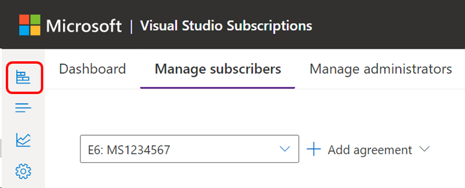
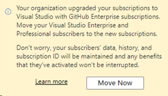
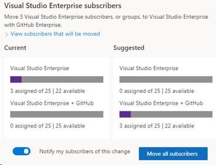
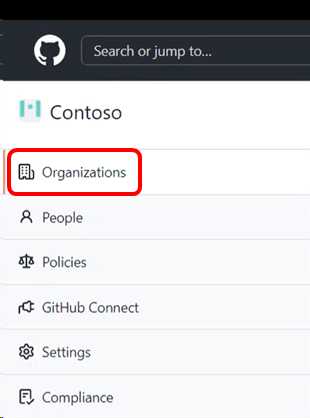
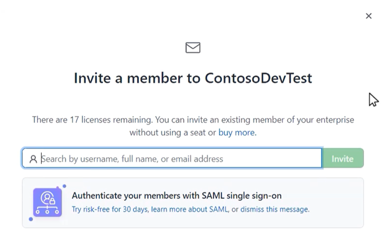

# Set up GitHub Enterprise licenses with Visual Studio subscriptions

Customers who have Enterprise Agreements (EAs) with Microsoft are eligible to purchase a subscription offer that brings together Visual Studio standard subscriptions and GitHub Enterprise. It's an easy and economical way for Visual Studio subscribers to acquire GitHub Enterprise.

Watch the following video to learn how to set up your organization and invite new members, or read on for step-by-step instructions.

> [!VIDEO https://medius.microsoft.com/Embed/video-nc/a453595a-8166-40e0-b1a6-03070413d193?r=813985405783]

After you purchase Visual Studio subscriptions with GitHub Enterprise, you can set up your organization. Follow the instructions for new GitHub Enterprise customers. If you're an existing GitHub Enterprise customer, skip ahead to [Assigning Visual Studio subscriptions to organization members](#assign-visual-studio-subscriptions-to-organization-members).

> [!IMPORTANT]
> If subscription admins assign Visual Studio subscriptions with GitHub Enterprise before they purchase any subscriptions, GitHub isn't notified that they want to create a GitHub Enterprise account. 
>
> A purchase *of at least one* Visual Studio subscription with GitHub Enterprise should be made before subscriptions are assigned. If you already purchased Visual Studio subscriptions with GitHub Enterprise, you don't need to wait for the GitHub setup process to be completed before you assign subscriptions.

## Create your organization

As a new GitHub Enterprise customer, you and your team need to get access to your GitHub Enterprise account. As soon as GitHub processes your order, an Enterprise account is created with your allocated license count. At this time, you're added to the account as the Enterprise admin and you receive an email invitation.

1. In the email, select the **Become an owner...** button to go to your GitHub Enterprise account, and then select **Accept invitation**.
   > [!div class="mx-imgBorder"]
   > 

0. To add users, you need to have an organization to invite them to. To create an organization, select the **New Organization** button.

0. Enter a name for your new organization. This name appears on [GitHub](https://github.com/). Select **Create organization**.

0. Add users with **Organization Owner** permissions. These users can add members and manage organization-level settings. Be sure to select **Finish** when you're done adding organization owners. Now your new organization is ready for members to be added.

## Assign Visual Studio subscriptions to organization members

In the Visual Studio Subscriptions Admin portal, the Visual Studio subscriptions admin can assign a subscription to a user. If you're new to Visual Studio subscription administration, you receive an invitation to the Visual Studio Subscriptions Admin portal to begin assigning subscriptions. After you select the link to sign in to the [Admin portal](https://manage.visualstudio.com), you'll be able to use the **Add** dropdown menu to add Visual Studio subscribers individually, or in bulk by using Microsoft Excel or Microsoft Entra groups. Follow the prompts for adding subscribers. Make sure to use email domains that can receive email, and choose subscription levels that contain GitHub Enterprise.

For more information about assigning subscriptions, see:
* [Add single users](assign-license.md)
* [Add multiple users](assign-license-bulk.md)

> [!NOTE]
> If you don't have existing subscribers to move, you still need to invite your subscribers to your GitHub organization. For more information, see [Invite subscribers to your organization](#invite-subscribers-to-your-organization).

## Move existing subscribers to subscriptions with GitHub

If any of your subscribers renewed from regular Visual Studio subscriptions to Visual Studio subscriptions with GitHub Enterprise, you need to move your subscribers to the new level. Then they're eligible to use GitHub.

1. Select the **Overview** icon on the left menu.
   > [!div class="mx-imgBorder"]
   > 
0. Select **Move now**, and follow the prompts to finish the transition.
   > [!div class="mx-imgBorder"]
   > 
0. When you select the **Move Now** button, a flyout panel presents you with recommendations on how to move your Enterprise and/or Professional subscriptions:
   > [!div class="mx-imgBorder"]
   > 

You can review the impacted subscribers and specify if you want them to receive an email after the move is finished. This email informs subscribers that their benefits remain unchanged and encourages them to begin setting up a presence in GitHub.

When you select the **Move subscribers** button, you can move all recommended subscribers or choose individuals from a list. After you confirm your selections, it takes a few seconds for the subscription moves to finish. If applicable, perform these steps for Professional and Enterprise separately.

> [!NOTE]
> If you need to update a single subscriber who is currently assigned through a Microsoft Entra group, see this article about [Editing Visual Studio subscription assignments](/visualstudio/subscriptions/edit-license).

## Invite subscribers to your organization

After a subscriber is assigned a subscription in the Visual Studio Subscriptions Admin portal, GitHub is updated with these users and reflects them as **Pending Members**. An organization owner needs to invite pending members to an organization to access their GitHub Enterprise benefits.

To add a user to your organization in GitHub:

1. Select **Organizations** on the left menu.
0. Select the organization to which you want to add subscribers.
   > [!div class="mx-imgBorder"]
   > 
0. Select the **People** tab.
0. If you're an owner of the organization, you see an **Invite member** button. Select it.
0. Enter the email address you used to assign a subscription to the new member, and then select **Invite**.
   > [!div class="mx-imgBorder"]
   > 
0. Select **Send invitation**. The user appears in the list of pending invitations.
0. After a user receives an invitation to GitHub, they need to select the button in the email, which will take them to your organization and grant them member access.

   > [!IMPORTANT]
   > User invitations are valid for seven days. After seven days, you need to send a new invite. If your enterprise uses enterprise-managed users, you might need to inform your users of their access to GitHub.

If you have questions, contact your GitHub or Microsoft account manager. For more information, see [About Visual Studio subscriptions with GitHub Enterprise](https://aka.ms/GHEandVSS).

## Support resources

* Learn more about GitHub assignment at [GitHub Docs](https://docs.github.com/en/enterprise-cloud@latest/billing/managing-licenses-for-visual-studio-subscriptions-with-github-enterprise/about-visual-studio-subscriptions-with-github-enterprise).
* Find answers to questions on a wide array of GitHub articles at [GitHub Help](https://help.github.com/en).
* Get help from other GitHub users in the [GitHub Community Forum](https://github.community/).
* Get assistance with administration of Visual Studio subscriptions. Contact [Visual Studio subscriptions support](https://aka.ms/vsadminhelp).
* Have a question about Visual Studio IDE, Azure DevOps Services, or other Visual Studio products or services? See [Visual Studio support](https://visualstudio.microsoft.com/support/).
* Get [technical support](https://support.microsoft.com/supportforbusiness/productselection?sapId=b77fe80f-5417-80bd-4b2a-275cf0018c24) for GitHub Enterprise.

## Related content

* [Visual Studio documentation](/visualstudio/)
* [Azure DevOps documentation](/azure/devops/)
* [Azure documentation](/azure/)
* [Microsoft 365 documentation](/microsoft-365/)

Learn more about managing Visual Studio subscriptions:

* [Assign individual subscriptions](assign-license.md)
* [Assign multiple subscriptions](assign-license-bulk.md)
* [Edit subscriptions](edit-license.md)
* [Delete subscriptions](delete-license.md)
* [Determine maximum usage](maximum-usage.md)

For more information about managing Visual Studio subscriptions with GitHub Enterprise, check out the Visual Studio [Subscriptions Admin portal](https://visualstudio.microsoft.com/subscriptions-administration/).
