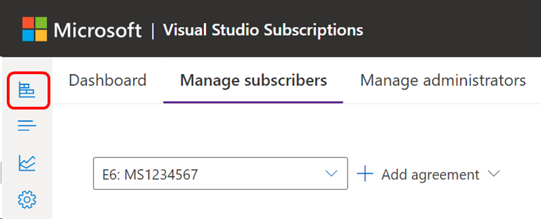
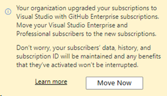
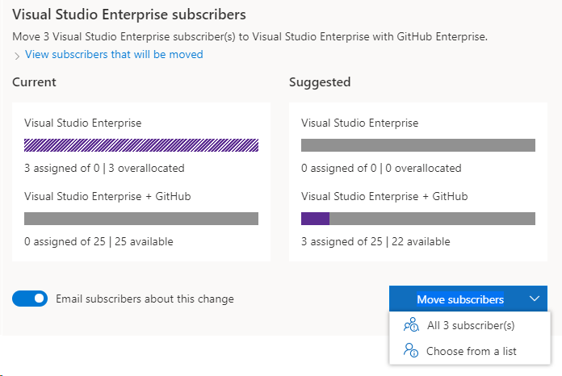
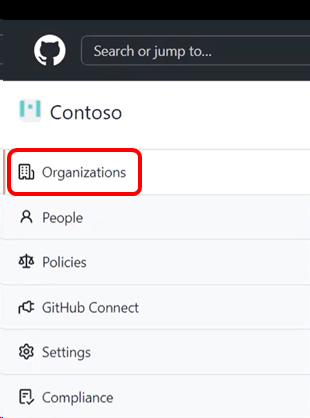
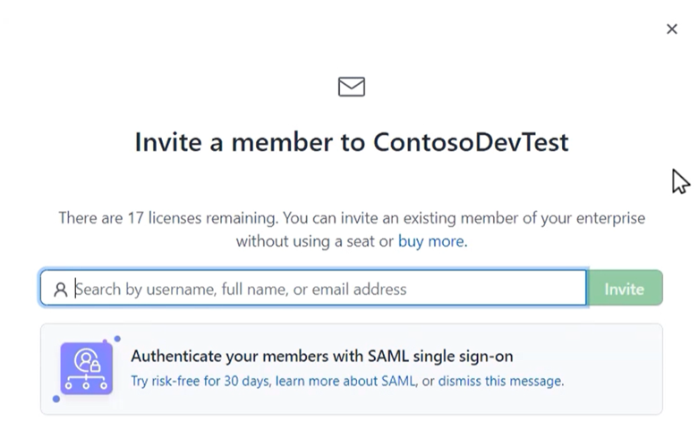

# Set up GitHub Enterprise licenses with Visual Studio Subscriptions

Customers with Microsoft Enterprise Agreements (EAs) can purchase a subscription offer that brings together Visual Studio standard subscriptions and GitHub Enterprise. It's an easy and economical way for Visual Studio subscribers to acquire GitHub Enterprise.

Watch the following video to learn how to set up your organization and invite new members, or read on for step-by-step instructions.

> [!VIDEO https://medius.microsoft.com/Embed/video-nc/a453595a-8166-40e0-b1a6-03070413d193?r=813985405783]

After you purchase Visual Studio Subscriptions with GitHub Enterprise, set up your organization by following the instructions for new GitHub Enterprise customers. If you're an existing GitHub Enterprise customer, skip to [Assigning Visual Studio Subscriptions to organization members](#assign-visual-studio-subscriptions-to-organization-members).

> [!IMPORTANT]
> If subscription administrators assign Visual Studio Subscriptions with GitHub Enterprise before purchasing any subscriptions, GitHub isn't notified that they want to create a GitHub Enterprise account. 
>
> Purchase *at least one* Visual Studio Subscription with GitHub Enterprise before assigning subscriptions. If you've already purchased Visual Studio Subscriptions with GitHub Enterprise, you don't need to wait for the GitHub setup process to complete before assigning subscriptions.

## Create your organization

As a new GitHub Enterprise customer, you and your team need access to your GitHub Enterprise account. After GitHub processes your order, it creates an Enterprise account with your allocated license count. GitHub adds you to the account as the Enterprise admin and sends you an email invitation.

1. In the email, select **Become an owner...** to go to your GitHub Enterprise account, then select **Accept invitation**.
   > [!div class="mx-imgBorder"]
   > 

1. To add users, you need an organization to invite them to. To create an organization, select **New Organization**.

0. Enter a name for your new organization. This name appears on [GitHub](https://github.com/). Select **Create organization**.

1. Add users with **Organization Owner** permissions. These users can add members and manage organization-level settings. Select **Finish** when you're done adding organization owners. Your new organization is ready for members.

## Assign Visual Studio Subscriptions to organization members

In the [Visual Studio Subscriptions Admin portal](https://manage.visualstudio.com/), the Visual Studio Subscriptions administrator can assign subscriptions to users. If you're new to Visual Studio Subscriptions administration, you receive an invitation to the Visual Studio Subscriptions Admin portal to begin assigning subscriptions. After you sign in, use the **Add** dropdown menu to add Visual Studio subscribers individually, or in bulk by selecting **Bulk add** or Microsoft Entra groups. Follow the prompts to add subscribers. Use email domains that can receive email, and choose subscription levels that include GitHub Enterprise.

For more information about assigning subscriptions, see:
* [Add single users](assign-license.md)
* [Add multiple users](assign-license-bulk.md)

> [!NOTE]
> If you don't have existing subscribers to move, you still need to invite your subscribers to your GitHub organization. For more information, see [Invite subscribers to your organization](#invite-subscribers-to-your-organization).

## Move existing subscribers to subscriptions with GitHub

If any of your subscribers renewed from Visual Studio Subscriptions to Visual Studio Subscriptions with GitHub Enterprise, move them to the new subscription level. After you move them, they're eligible to use GitHub.

1. Select the **Overview** icon in the left menu.
   > [!div class="mx-imgBorder"]
   > 
1. Select **Move Now**, then follow the prompts to complete the transition.
   > [!div class="mx-imgBorder"]
   > 
1. When you select **Move Now**, a flyout panel displays recommendations for moving your Enterprise and Professional subscriptions.
   > [!div class="mx-imgBorder"]
   > 

Review the impacted subscribers and use the **Email subscribers about this change** toggle to choose whether subscribers receive an email after the move completes. This email informs subscribers that their benefits remain unchanged and encourages them to set up a presence in GitHub.

When you select **Move subscribers**, you can move all recommended subscribers or choose individuals from a list. After you confirm your selections, the selected subscribers are moved to the new subscription level within a few seconds. If applicable, perform these steps separately for Professional and Enterprise subscriptions.

> [!NOTE]
> To update a subscriber assigned through a Microsoft Entra group, see [Editing Visual Studio Subscription assignments](/visualstudio/subscriptions/edit-license).

## Invite subscribers to your organization

After you assign a subscription to a subscriber in the Visual Studio Subscriptions Admin portal, GitHub shows the subscriber as a **Pending Member**. An organization owner must invite members to an organization before they can access their GitHub Enterprise benefits.

To add a user to your organization in GitHub:

1. Select **Organizations** in the left menu.
0. Select the organization to which you want to add subscribers.
   > [!div class="mx-imgBorder"]
   > 
0. Select the **People** tab.
0. If you're an organization owner, select **Invite member**.
0. Enter the email address used to assign a subscription to the new member, then select **Invite**.
   > [!div class="mx-imgBorder"]
   > 
0. Select **Send invitation**. The user appears in the list of pending invitations.
0. After users receive the GitHub invitation email, they must select the button in the email to join your organization and gain member access.

   > [!IMPORTANT]
   > User invitations are valid for seven days. After seven days, you can send a new invitation. If your enterprise uses enterprise-managed users, you might need to inform your users of their access to GitHub.

If you have questions, contact your GitHub or Microsoft account manager. For more information, see [About Visual Studio subscriptions with GitHub Enterprise](https://aka.ms/GHEandVSS).

## Support resources

* Learn more about GitHub assignment at [GitHub Docs](https://docs.github.com/en/enterprise-cloud@latest/billing/managing-licenses-for-visual-studio-subscriptions-with-github-enterprise/about-visual-studio-subscriptions-with-github-enterprise).
* Find answers to questions on a wide array of GitHub articles at [GitHub Help](https://help.github.com/en).
* Get help from other GitHub users in the [GitHub Community Forum](https://github.community/).
* Get assistance with administration of Visual Studio subscriptions. Contact [Visual Studio Subscriptions support](https://aka.ms/vsadminhelp).
* Have a question about Visual Studio IDE, Azure DevOps Services, or other Visual Studio products or services? See [Visual Studio support](https://visualstudio.microsoft.com/support/).
* Get [technical support](https://support.microsoft.com/supportforbusiness/productselection?sapId=b77fe80f-5417-80bd-4b2a-275cf0018c24) for GitHub Enterprise.

## Related content

* [Visual Studio documentation](/visualstudio/)
* [Azure DevOps documentation](/azure/devops/)
* [Azure documentation](/azure/)
* [Microsoft 365 documentation](/microsoft-365/)

Learn more about managing Visual Studio Subscriptions:

* [Assign individual subscriptions](assign-license.md)
* [Assign multiple subscriptions](assign-license-bulk.md)
* [Edit subscriptions](edit-license.md)
* [Delete subscriptions](delete-license.md)
* [Determine maximum usage](maximum-usage.md)

For more information about managing Visual Studio Subscriptions with GitHub Enterprise, see the Visual Studio [Subscriptions Administration website](https://visualstudio.microsoft.com/subscriptions-administration/).
