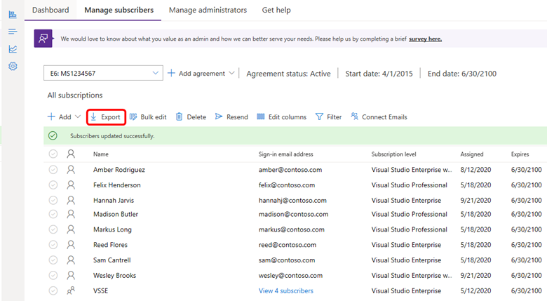

# Assign specific subscriptions in the Visual Studio Subscriptions Admin Portal

Use the Visual Studio Subscriptions Admin Portal to assign specific subscriptions to individual users. Assign a partially used subscription to temporary staff or vendors who need access for a limited time, and reserve new subscriptions for longer-term use.

Watch the video or read on to learn how to assign specific subscription GUIDs to users. 

> [!VIDEO https://medius.microsoft.com/Embed/video-nc/0873adfc-6e4b-4676-9eee-76e79103c44e?r=253107379154]

## Assign specific subscription GUIDs to users

Use two existing admin processes to assign specific subscription GUIDs to users. The process has three steps:
1. Export a list of current subscriptions and assignments.
1. Identify the GUIDs you want to assign.
1. Use **Bulk add** to upload the assignments.

### Export your subscription information

To perform the export:
1. Sign in to the [Admin Portal](https://manage.visualstudio.com).
1. Select **Export** to download a file that lists your subscriptions and current assignments.
> [!div class="mx-imgBorder"]
> 

### Identify the GUIDs you want to assign

If you previously used the Export tool, you see new fields in the spreadsheet. Use these fields to identify the subscriptions associated with the GUIDs you want to assign. 

+ **Subscription Status**: Shows whether a subscription is **assigned** or **unassigned**. If a subscription has a status of **assigned**, it includes subscriber information such as name and email address. 
+ **Usage Status**: Shows whether a subscription is **new** or **used**. A **new** subscription means it isn't assigned to a user. A **used** subscription means it was assigned previously. 

Use the values in these fields and other spreadsheet information to identify the subscriptions associated with the GUIDs you want to assign. Filter the spreadsheet in Excel by status, subscription level, expiration date, and other criteria to narrow the list. 

### Upload your new assignments

Download the **Bulk add** template, complete the required information for the subscriptions you want to assign, and upload the template. For complete details, see the [Add multiple users](assign-license-bulk.md) article. 

> [!IMPORTANT]
>
> To ensure a successful upload:
>  
> + Use the template linked in the dialog box when you select **Bulk add**. 
> + Don't use a locally stored copy of the template. Older versions might not contain all the required fields and can cause the upload to fail.
>
> Verify the following items before you upload the template:
> 
> + All fields marked **Required** in the template are completed.
> + There are no errors listed in the **Error message** column.
> + Each GUID is used only once in the template. 
> + The subscription level in the template matches the subscription level of the GUID in the exported list. 
> + The GUID is not already assigned to another user in the exported list. 

## Frequently asked questions

### Q: How do I assign a different GUID to a user?

A: To assign a different GUID to a user, first delete the user's subscription. For more information, see [Delete subscriptions](delete-license.md). Then, follow the process in this article to export the list and upload the new assignment information. 

## Resources

+ [Subscriptions Support](https://aka.ms/vsadminhelp)
+ [Assign individual subscriptions](assign-license.md)
+ [Assign multiple subscriptions](assign-license-bulk.md)
+ [Edit subscriptions](edit-license.md)
+ [Delete subscriptions](delete-license.md)
+ [Determine maximum usage](maximum-usage.md)
