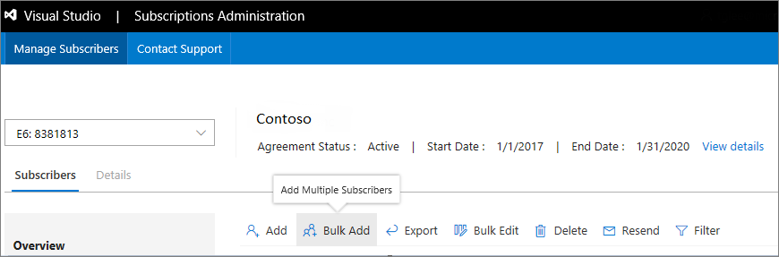
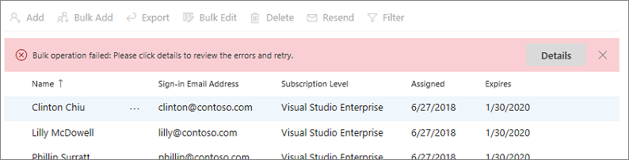
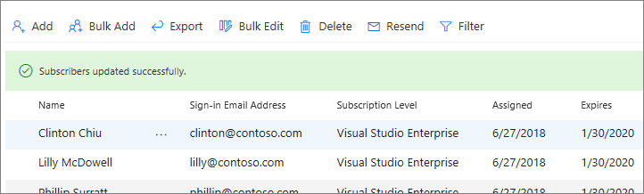

# Assign subscriptions to multiple users
The Subscriptions Administration Portal lets you add users one-at-a-time, or in large groups.  To add individual users, see [Add single users](assign-license.md).

## Use Bulk Add to assign subscriptions
1. Sign in to the Visual Studio Subscriptions Administration Portal at https://manage.visualstudio.com.
2. To add multiple subscribers at one time, navigate to the **Manage Subscribers** tab. In the ribbon at the top, click **Bulk Add**.
   > [!div class="mx-imgBorder"]
   > 

2. Bulk Add uses a Microsoft Excel template to upload subscriber information. In the Upload Multiple Subscribers dialog box, click **Download** to download the template.
   > [!div class="mx-imgBorder"]
   > 
   >
   > [!NOTE]
   > Always download the latest version of this template. If you use an older version, your bulk upload may fail.

3. In the Excel spreadsheet, fill out the fields with the information for the individuals that you want to assign subscriptions to. (*Reference* is an optional field.) Save the file locally after you're done.

   To help ensure a smooth upload, observe the following best practices:

    - Ensure that none of the form fields contain commas.
    - Remove spaces before and after form fields.
    - Make sure user's names do not contain extra spaces between two-part first or last names (for example, if a person has a two-part first name such as "Maggie May", it should be typed as "MaggieMay" because the system won't trim the extra space.)

4. Return to the Visual Studio Subscriptions Administration portal. In the **Upload Multiple Subscribers** dialog box, click **Browse**.
   > [!div class="mx-imgBorder"]
   > 

5. Navigate to the Excel file that you saved, and then click **OK**.
   > [!div class="mx-imgBorder"]
   > 

    An upload progress dialog appears.

    If the template contains errors, the upload will fail, and you will be shown the errors so that you can correct the template and attempt the bulk upload again.
   > [!div class="mx-imgBorder"]
   > 

    When the upload is successful, you'll see the list of subscribers and a confirmation message.
   > [!div class="mx-imgBorder"]
   > 

## Next steps
- Have just one or two subscribers to add?  Check out [Add single users](assign-license.md)
- Learn how to [edit](edit-license.md) existing subscriptions
- Need help? Contact [Visual Studio Administration and Subscriptions Support](https://visualstudio.microsoft.com/support/support-overview-vs).
