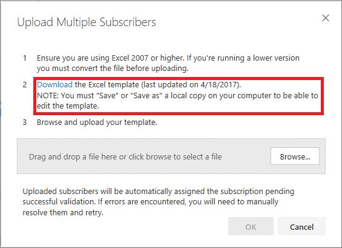
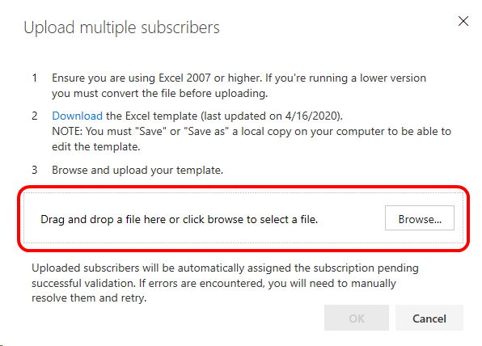
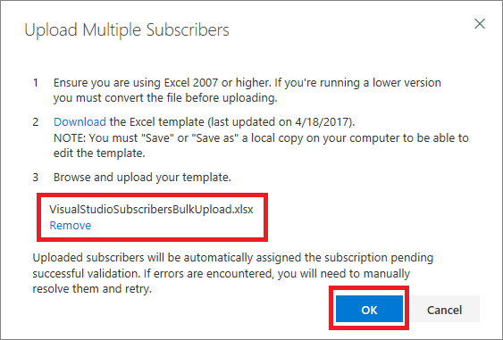
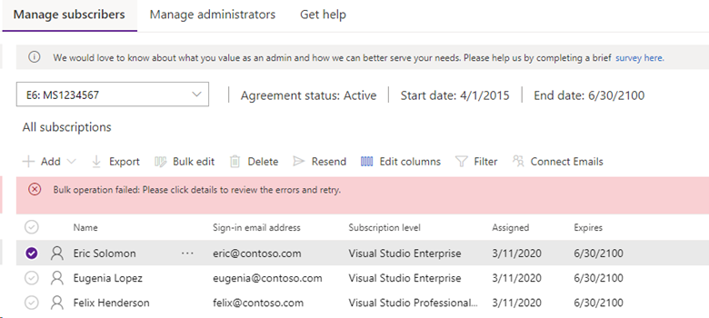
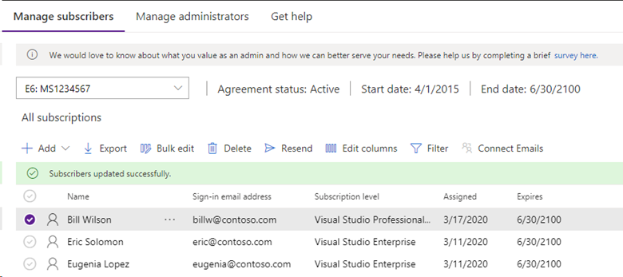
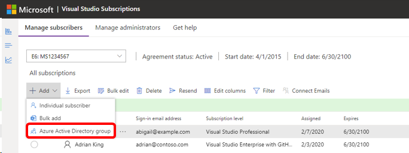
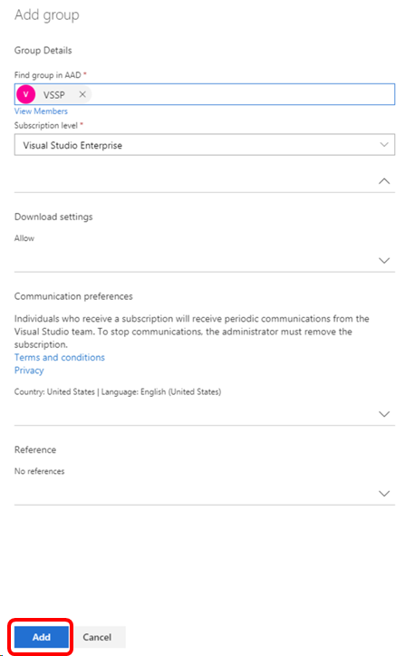

# Assign subscriptions to multiple users
The Subscriptions Administration Portal lets you add users one-at-a-time, or in large groups.  To add individual users, see [Add single users](assign-license.md).

To add large groups of users, you can use the bulk add feature, or if your organization is using Microsoft Azure Active Directory (Azure AD), you can use Azure AD groups. This article will explain the process for both options.  Watch this video or read on to learn more about the bulk add feature. 

 

> [!VIDEO https://www.microsoft.com/videoplayer/embed/RE4vxNq]

## Use Bulk add to assign subscriptions
1. Sign into the Visual Studio Subscriptions Administration Portal at <https://manage.visualstudio.com>.

1. To add multiple subscribers at one time, navigate to the **Manage Subscribers** tab. Choose the **Add** tab, then choose **Bulk add** in the drop-down.  

1. Bulk add uses a Microsoft Excel template to upload subscriber information. In the Upload Multiple Subscribers dialog box, select **Download** to download the template.
   > [!div class="mx-imgBorder"]
   > 
   >
   > [!NOTE]
   > Always download the latest version of this template. If you use an older version, your bulk upload may fail.

1. In the Excel spreadsheet, fill out the fields with the information for the individuals that you want to assign subscriptions to. (*Reference* is an optional field.) Save the file locally after you're done.

    > [!NOTE]
    > One of the fields in the template allows admins to enable or disable subscribers' ability to download software.  Disabling downloads also disables their access to product keys.

   To help ensure a smooth upload, observe the following best practices:

    - Ensure that none of the form fields contain commas.
    - Remove spaces before and after form fields.
    - Make sure user's names do not contain extra spaces between two-part first or last names (for example, if a person has a two-part first name such as "Maggie May", it should be typed as "MaggieMay" because the system won't trim the extra space.)
    - Make sure all required fields are completed. 
    - Check the **Error message** column.  If any errors are listed, resolve those before attempting to upload the file. 

1. Return to the Visual Studio Subscriptions Administration portal. In the **Upload Multiple Subscribers** dialog box, select **Browse**.
   > [!div class="mx-imgBorder"]
   > 

1. Navigate to the Excel file that you saved, and then select **OK**.
   > [!div class="mx-imgBorder"]
   > 

    An upload progress dialog appears.

    If the template contains errors, the upload will fail, and you will be shown the errors so that you can correct the template and attempt the bulk upload again.
   > [!div class="mx-imgBorder"]
   > 

   If you encounter a failure follow these steps:
   1. Open the Excel file you created, correct the problems, and save the file.
   0. Return to the Administration Portal and dismiss the error message.
   0. Choose **Add**.
   0. Select **Bulk add**.
   0. Since you already have the Excel file saved, you do not need to download the template.  Select **Browse**, locate the file you just saved, and select **Open**.
   0. Select **OK**.

    When the upload is successful, you'll see the list of subscribers and a confirmation message.
   > [!div class="mx-imgBorder"]
   > 

## Use Azure Active Directory groups to assign subscriptions 
Using this feature makes it easy to stay on top of your subscription assignments. You can add Azure Active Directory Security Groups in the Subscriptions Administration Portal which will ensure that all individuals in the group are assigned a subscription. And to make it easier, when individuals leave your organization and are removed from Azure Active Directory, their access to subscriptions is also removed. 

> [!IMPORTANT]
>
> The following limitations apply to the use of Azure AD groups for adding subscribers:
> - The admin must be a member of the Azure AD tenant when initially adding a group to the admin portal.  After the group has been added, changes to the membership of the groups does not require admin involvement. 
> - Groups must contain at least one member.  Empty groups are not supported.
> - All users must be in the top level of the group.  Nested groups are not supported.
> - Only trusted agreements are supported. (Only agreements who can 'overallocate' subscriptions are trusted.)
> - All members of the group must have an email address associated with their Azure AD account.
> - Separate email addresses for notifications are not supported for subscriptions added using Azure AD groups.  

Watch this video or read on to learn more about adding subscribers using the Azure Active Directory group feature. 
 

> [!VIDEO https://www.microsoft.com/videoplayer/embed/RE4rvvW]

1. Sign in to the Visual Studio Subscriptions Administration Portal at [https://manage.visualstudio.com](https://manage.visualstudio.com).

2. To add multiple subscribers at one time, navigate to the **Manage subscribers** tab.

3. Choose the **Add** tab, then select **Azure Active Directory group** in the drop-down.  

   > [!div class="mx-imgBorder"]
   > 

4. A fly-out window will appear on the right.  Begin to enter the name of the Azure AD group that you'd like to add into the form field. This will search the available Azure AD groups within your organization. 

5. When you select the group, the field will automatically populate with the group name. You will have the option to view the users in that group before you add them. Next, you can choose the subscription level, download rights, and communication preferences for the group. You can add details into the reference field if you wish. 

   > [!div class="mx-imgBorder"]
   > 

6. Select **Add** and then **Confirm**. 

7. To see the added group, scroll to the bottom of your list of users.  

8. Select **View subscribers** to display the members of the group. You can view details about the subscribers in the group, but you cannot make any edits to the subscribers or the subscriptions that they are assigned.    

> [!NOTE]
> If you have already assigned subscriptions individually to users who are subsequently added as part of an Azure AD group, they will be added as part of the group and will no longer be listed individually. However, if the individual subscription is for a different subscription level, they will have two subscriptions.  Example:  If a user has an individual Visual Studio Professional subscription, and they are a member of a group to which you assign Visual Studio Enterprise subscriptions, they will have both.  
>
> If you remove a subscriber from an Azure Active Directory group that has had subscriptions assigned to it, it may take up to 24 hours for the update to be reflected in the admin portal. 

## Frequently asked questions

### Q: Why can't I see the option to use Azure Active Directory groups to add subscribers?
A: The feature is currently only available to organizations with trusted agreements.  Select the **Details** button to display your agreement information.

   > [!div class="mx-imgBorder"]
   > 

### Q: I added users to my Azure Active Directory group, but they don’t have subscriptions yet. Why? 
A: If the changes were made directly in Azure Active Directory the subscriptions should be assigned very quickly, however if the changes were made in an on-prem Active Directory it will first need to be sync’d to Azure Active Directory. Depending how your on-prem Active Directory is configured the changes could take up to 24 hours to be reflected. If it has been longer than 24 hours our [support team can help troubleshoot any issues](https://aka.ms/vsadminhelp). 

### Q: Can I choose multiple subscription levels to be assigned within an Azure Active Directory group?
A: No -- everyone in the group receives the same subscription level.

### Q: Can I edit subscriber details of individuals added in an Azure Active Directory group?
A: No -- To modify information for an individual subscriber, you will need to remove them from the Azure Active Directory security group and assign them a subscription individually.

### Q: Can I add separate notification email addresses for members of an Azure Active Directory group?
A: No – separate email addresses for notifications are currently not supported for subscriptions added using Azure Active Directory groups. All emails will be sent to the primary email (user principle name)

## Resources
- [Visual Studio administration and subscriptions support](https://aka.ms/vsadminhelp)

## See also
- [Visual Studio documentation](/visualstudio/)
- [Azure DevOps documentation](/azure/devops/)
- [Azure documentation](/azure/)
- [Microsoft 365 documentation](/microsoft-365/)

## Next steps
- Have just one or two subscribers to add? Check out [Add single users](assign-license.md)
