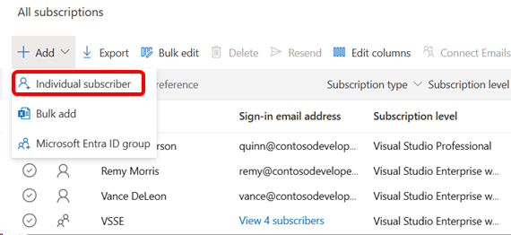
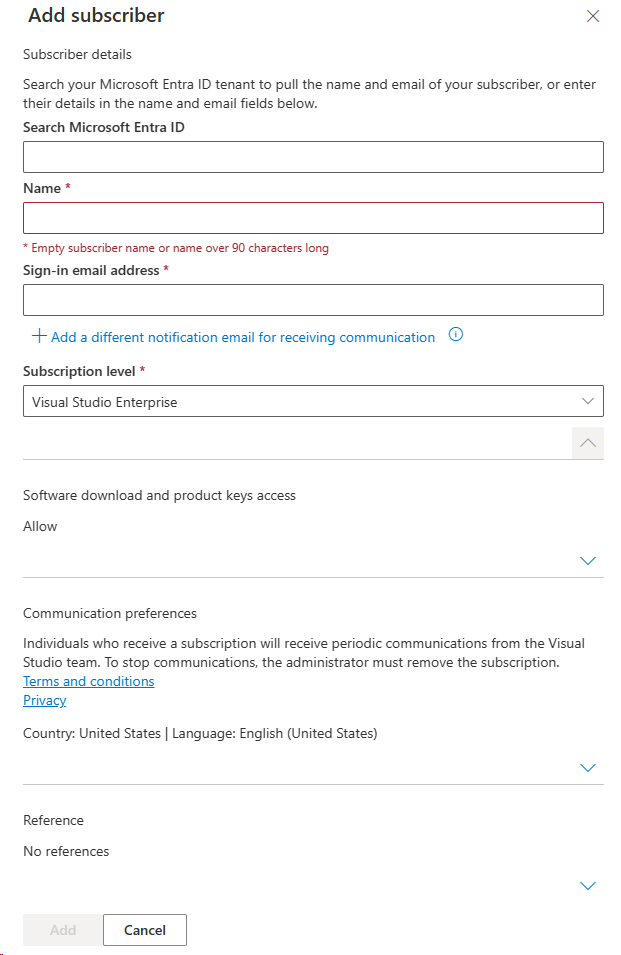
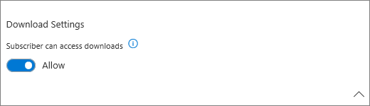
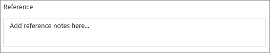

# Assign licenses in the Visual Studio Subscriptions Admin Portal

As a Visual Studio subscriptions admin, you can use the admin portal to assign subscriptions to individual users and groups of users.

For groups of users, you have choices for how you assign subscriptions. 
+ You can assign subscriptions one at a time.
+ You can also quickly and easily upload lists of subscribers and their subscription information using the [Bulk add](assign-license-bulk.md) feature.
+ If your organization uses Microsoft Entra ID, you can [use Microsoft Entra groups to assign subscriptions](./assign-license-bulk.md#use-entra-id-groups-to-assign-subscriptions) to groups of users. 

## Add a single subscriber

Watch the video or read on to learn how to assign a Visual Studio subscription to a new user so that they can access the subscription benefits.
 

> [!VIDEO https://medius.microsoft.com/Embed/video-nc/b28f7c0a-74b9-450f-b3b6-9a6c3489b105?r=903677913064]

1. Sign in to the [admin portal](https://manage.visualstudio.com).
2. To assign a license to a single Visual Studio subscriber, at the top of the table, select **Add**, then choose **Individual subscriber**.
   > [!div class="mx-imgBorder"]
   > 
3. A fly-out panel appears. Enter the information into the form fields for the new subscriber. 
   + If your organization is using Microsoft Entra ID, typing the name of the subscriber in the **Search Microsoft Entra ID** box returns the names of any Microsoft Entra group members matching your criteria. After you select that person, sign-in email and notification email will automatically populate. 
   + If the subscriber wasn't found in your organization, you can enter the subscriber's name in the **Name** field. 
   + Enter the email address you want your subscriber to use to sign in. You can also select the **Add a different notification email for receiving communication** link and specify a different notification email address so subscribers and admins receive important subscription-related emails from Microsoft.
      > [!div class="mx-imgBorder"]
      > 

      > [!NOTE]
      > In order for members of a Microsoft Entra tenant to be visible when you enter a subscriber name, the admin must be a member of the tenant. 
   + Choose the subscription level you want to assign to this user. (The list only contains the subscription levels that were purchased as part of your agreement.)  
   + If you want this subscriber to have access to software downloads when they sign into the [Visual Studio Subscriptions Portal](https://my.visualstudio.com?wt.mc_id=o~msft~docs), make sure to leave the downloads toggle enabled in the **Download Settings** section. If you choose to disable downloads, the user doesn't have access to software downloads or product keys. The subscriber still has access to all other benefits included in the subscription.
     > [!div class="mx-imgBorder"]
     > 

   + If you'd like to add your own reference notes to the subscription, you can do so in the **Add reference** section.
      > [!div class="mx-imgBorder"]
      > 

    When you're done selecting options and entering data for the subscriber, choose **Add** at the bottom of the **Add Subscriber** fly-out.
      > [!div class="mx-imgBorder"]
      > 

## Why use a different notification email address?

Some organizations set up their email services to block incoming emails from other domains. Blocking incoming emails means that subscribers and admins miss important communications:
  + Subscribers don't receive a notification when a subscription is assigned to them. They might also not be able to activate some of the included benefits. 
  + Subscribers who assigned Visual Studio subscriptions with GitHub Enterprise don't receive the invitation to join your GitHub organization. They aren't able to access GitHub since they **must accept the emailed invitation** in order to gain access to your GitHub organization. 
  + Admins aren't notified when they're added to an agreement. They don't receive monthly admin statements or notifications of feature changes that affect the way they manage subscriptions.

Using a notification email address lets you allow your subscribers to receive important communications about their subscriptions without changing their sign-in email addresses. 

## Resend assignment emails

After you add a subscriber, an assignment email is automatically sent to the new subscriber with further instructions. You can send the assignment email again at any time by selecting the subscriber and then selecting the **Resend** button in the top menu. To resend emails to multiple users, hold down the **Ctrl** key while selecting the subscribers. When you select the **Resend** button, you see a dialog asking you to confirm you want to resend to those subscribers. 

## Resources

Need help? Contact [Subscriptions Support](https://aka.ms/vsadminhelp).

## See also

+ [Visual Studio documentation](/visualstudio/)
+ [Azure DevOps Services documentation](/azure/devops/)
+ [Azure documentation](/azure/)
+ [Microsoft 365 documentation](/microsoft-365/)
+ [Microsoft Entra documentation](https://learn.microsoft.com/entra/)

## Next steps

Have lots of users to add? Learn how to assign subscriptions to [multiple subscribers](assign-license-bulk.md).
