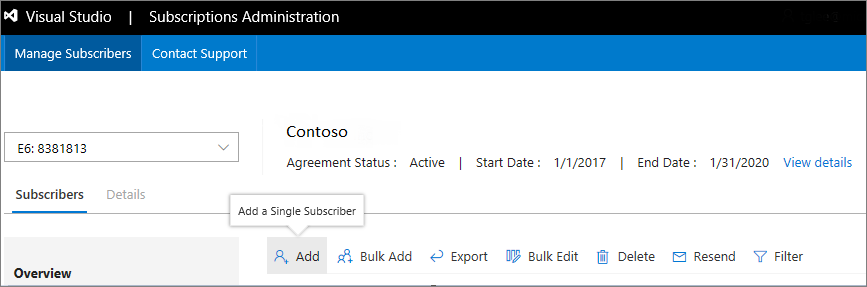

# Assign licenses in the Visual Studio Subscriptions Administration Portal
As a Visual Studio subscriptions administrator, you can use the administration portal to assign subscriptions to individual users and groups of users.

For groups of users, you can assign subscriptions to them one at a time, or use the [Bulk Add](assign-license-bulk.md) feature to quickly and easily upload lists of subscribers and their subscription information.

## Add a single subscriber
Here's how to assign a Visual Studio subscription license to a new user so that they can access the subscription benefits.

1. Sign in to the [administration portal](https://manage.visualstudio.com).
2. To assign a license to a single Visual Studio subscriber, at the top of the table, select **Add**.
   > [!div class="mx-imgBorder"]
   > 
3. Enter the information into the form fields for the new subscriber. If your organization is using Azure Active Directory, the **Name** field acts as a search function to find people in your current directory so you can select the correct user from the search results. After you select that person, sign-in email and notification email will automatically populate.
   > [!div class="mx-imgBorder"]
   > 

    If you want this subscriber to have access to software downloads when they sign into the [Visual Studio Subscriptions Portal](https://my.visualstudio.com?wt.mc_id=o~msft~docs), make sure to leave the downloads toggle enabled in the **Download Settings** section. If you choose to disable downloads, the user will not have access to software downloads, but will still have access to all other benefits included in the subscription.
   > [!div class="mx-imgBorder"]
   > 

       If you'd like to add your own reference notes to the subscription, you can do so in the **Add reference** section.
   > [!div class="mx-imgBorder"]
   > 

    When you're done selecting options and entering data for the subscriber, choose **Add** at the bottom of the **Add Subscriber** fly-out.
   > [!div class="mx-imgBorder"]
   > 

## Resend assignment emails
After you add a subscriber, an assignment email will be automatically sent to the new subscriber with further instructions. You can send the assignment email again at any time by selecting the subscriber and clicking the **Resend** button in the top menu.  To resend emails to multiple users, hold down the **Ctrl** key while selecting the subscribers.  When you click the **Resend** button, you'll see a dialog asking you to confirm you want to resend to those subscribers.  

## Next steps
- Have a lot of users to add?  Learn how to assign subscriptions to [multiple subscribers](assign-license-bulk.md).
- Need help?  Contact [Visual Studio Administration and Subscriptions Support](https://visualstudio.microsoft.com/support/support-overview-vs).

