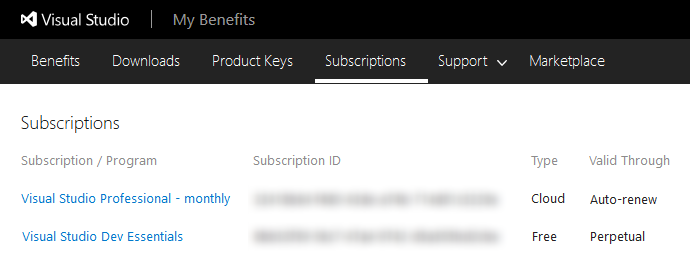
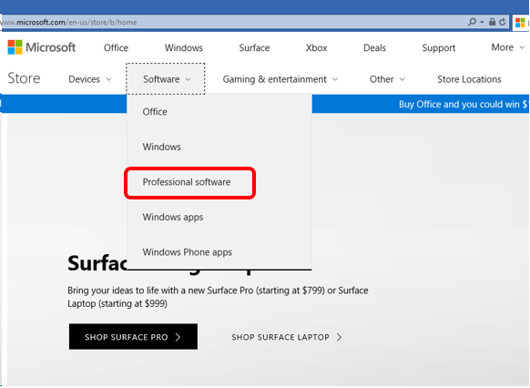
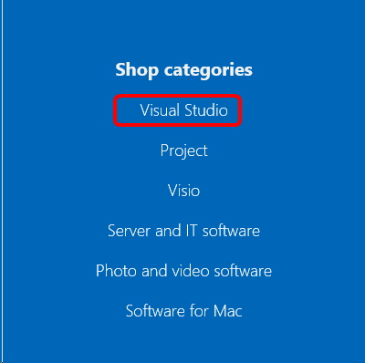
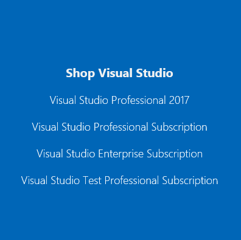
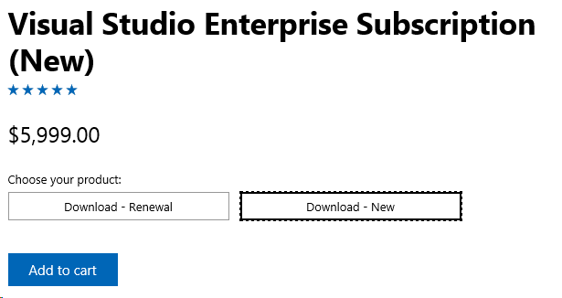

#	How to Buy a Subscription
There are three ways to buy Visual Studio subscriptions.  
- Cloud subscriptions can be purchased through the Visual Studio Marketplace.
- Standard subscriptions can be purchased through the Microsoft Store. 
- Organizations can purchase Volume License subscriptions through resellers.  

## Buying Cloud Subscriptions through the Visual Studio Marketplace
You can buy Visual Studio Professional and Visual Studio Enterprise [subscriptions](https://www.visualstudio.com/subscriptions/) 
from the [Visual Studio Marketplace](https://marketplace.visualstudio.com). 
Learn about the full benefits for these subscriptions, 
[compare features](https://www.visualstudio.com/vs/compare/) of the IDE, and find [subscription pricing](https://www.visualstudio.com/vs/pricing/).

### Before you start

*	To bill your purchases, you'll need an [Azure subscription](https://azure.microsoft.com/en-us/pricing/purchase-options/). 
You can [sign up](https://account.windowsazure.com/Subscriptions) 
before your first purchase or during your first purchase in the Visual Studio Marketplace.
Learn [which Azure subscriptions you can use for Visual Studio Marketplace purchases](#billing). 

*	To sign up for your Azure subscription and buy from the Visual Studio Marketplace, 
you'll need a ["personal" Microsoft account](https://www.microsoft.com/account) 
or a ["work or school account"](https://azure.microsoft.com/en-us/documentation/articles/sign-up-organization/) 
if you're buying for your organization, and they manage identities with Azure Active Directory (Azure AD).

### Buy subscriptions


1.	Sign in to 
[Visual Studio Marketplace > Subscriptions](https://marketplace.visualstudio.com/subscriptions).

2.	Choose the subscription that you want to buy, for example:

	

3.  Select the Azure subscription to use for billing.
Or sign up for a new subscription, if you don't have one.

	

4.	Select the number of subscriptions to buy.

	

	If you don't want subscriptions assigned to yourself, clear **Assign this subscription to me**.

5.	Confirm and finish your purchase. 
To view your subscription benefits now, 
go to the Visual Studio subscriptions portal 
[(https://my.visualstudio.com)](https://my.visualstudio.com) or click **View my subscription**.

	

	

	If you purchased more than one subscription, you can
	assign subscriptions to others in the 
	[Visual Studio Subscriptions Administration portal]( https://manage.visualstudio.com/cloud) or click **Assign to users**.

	

	

<a name="manage-subscriptions"></a>
###  Manage purchased Visual Studio subscriptions as administrator

To view all Visual Studio subscriptions purchased 
from the Visual Studio Marketplace and their assignments to users, 
change these subscriptions, 
or cancel these subscriptions as the subscription administrator, go to the 
[Visual Studio Subscriptions Administration portal](https://manage.visualstudio.com/cloud), 
and sign in with the identity used to purchase these subscriptions.

*   To change the number of purchased subscriptions:

    

*   To cancel these subscriptions, reduce the number of subscriptions to zero (0). 
They won't renew at the end of the month.

### View Visual Studio subscriptions assigned to you

To view Visual Studio subscriptions assigned to you 
specifically and your subscription benefits, 
go to the Visual Studio subscriptions portal 
(```https://my.visualstudio.com```).




### Marketplace and Billing Q&A

Visit the [Marketplace and Billing Q&A](../marketplace-billing-qa.md) to find answers to multiple common questions around the Visual Studio Marketplace and Azure billing. 

## Buying Standard subscriptions through the Microsoft Store
Visual Studio Standard subscriptions are available through the Microsoft Store.  To purchase or renew a subscription:

1. Connect to the [Microsoft Store](https://www.microsoft.com).
2. Click on the **Software** tab.
3. Select **Professional software**.



4. In the **Shop categories** list, choose **Visual Studio**.



5. In the **Shop Visual Studio** list, choose the subscription you would like to purchase. (Visual Studio Professional 2017 is a standlone license for the IDE and does not include a subscription.)



6. On the product description page, you'll have the option to purchase a new subscription or purchase a new one.  Select your desired subscription type and add it to your cart. 



7. In the Cart, click the **Checkout** button to move to the **Review and place order** page.  (You may need to sign in to your Microsoft Account to continue.) 

8. Choose your payment type and click **Select**.

9. If you have a payment instrument on file, select it.  To add a payment instrument, such as a credit card, provide the details for your payment instrument and click **Save**.

10. Click **Place order** to complete your purchase.  

### Activating subscriptions purchased through the Microsoft Store

If you've purchased a Visual Studio Subscription through the Microsoft Store, the activation steps can be initiated from the payment Confirmation Page or Confirmation Email. Note:  If you have not received an email, please validate your email address and check your spam folders.

To activate your subscription: 

1. Click on **Click here to sign in**. You will be redirected to [https://my.visualstudio.com/subscriptions/activate](https://my.visualstudio.com/subscriptions/activate)

2. Enter the email address you'll be using to access to the Visual Studio subscription and click **Continue**.

3. Depending on the email address, you may be redirected to either the **Microsoft Account (MSA)** sign-in page or the **Work or School** account sign-in page. 

4. Enter your password, or complete sign in requirements.
5. Upon successful sign in, an **Activate Your Visual Studio Subscription** window will appear.
6. Enter the **Product Key** information available from the payment Confirmation Page or Confirmation Email and click **Activate**.

7. Your subscription should now be visible on the [https://my.visualstudio.com/subscriptions](https://my.visualstudio.com/subscriptions).


## Buying Standard subscriptions through Volume License programs

Organizations who want the benefits of multiple subscriptions can purchase them through various Volume License (VL) programs.  Volume Licenses are sold through authorized Microsoft Partners.  
Learn how to [purchase through Volume Licensing](https://www.microsoft.com/Licensing/how-to-buy/how-to-buy.aspx). 
