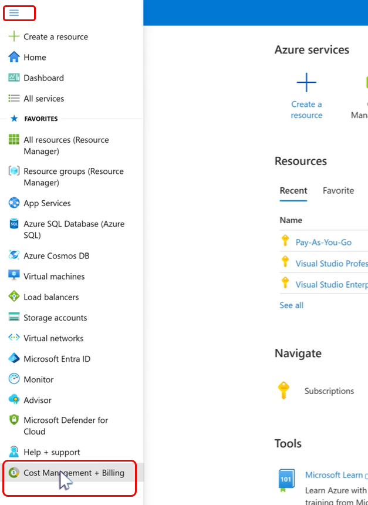
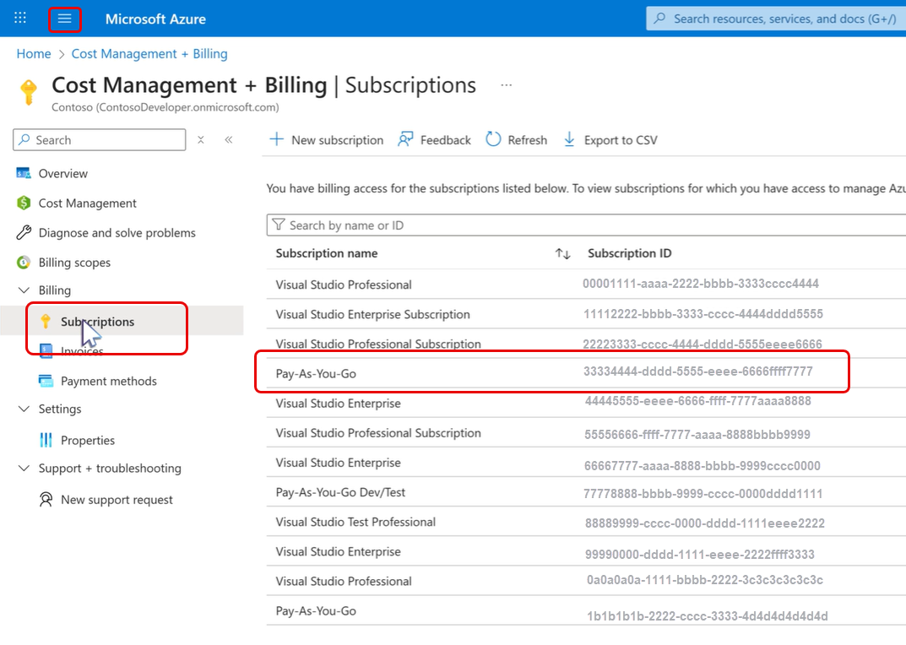
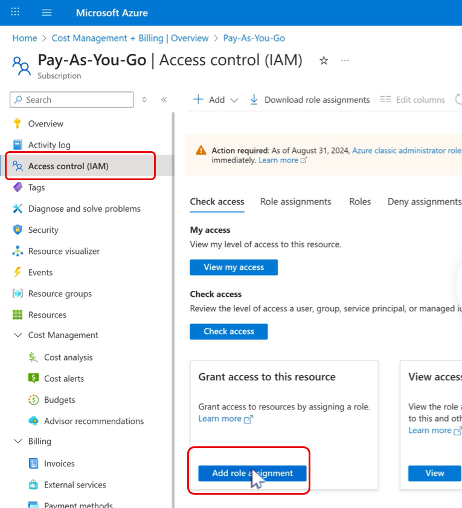
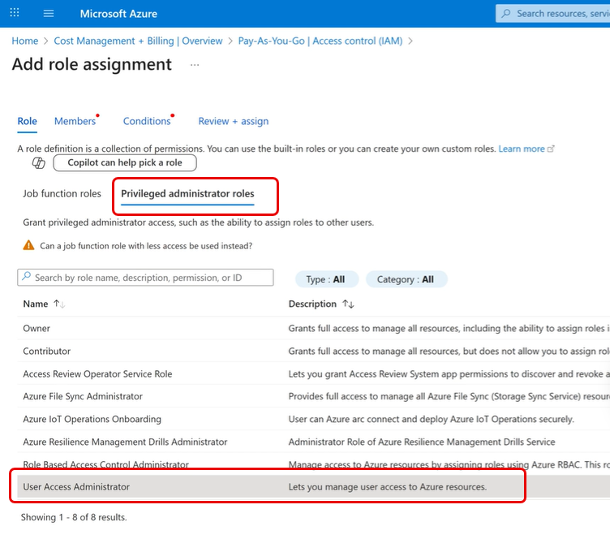
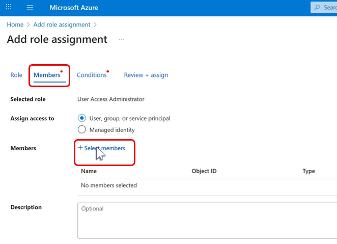
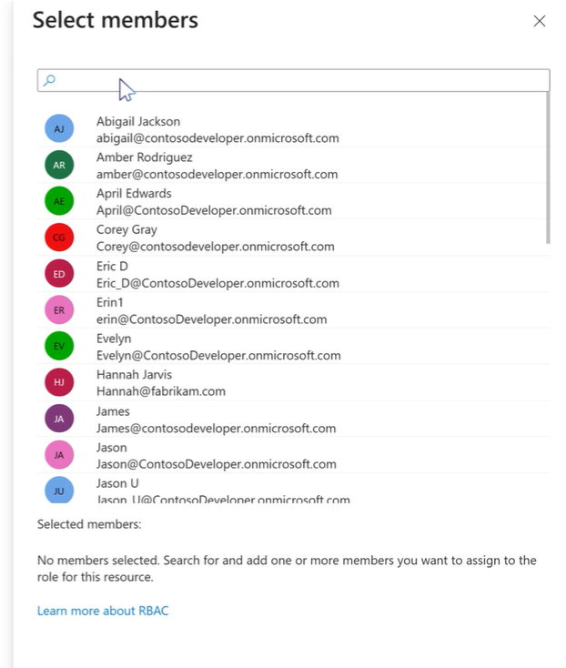
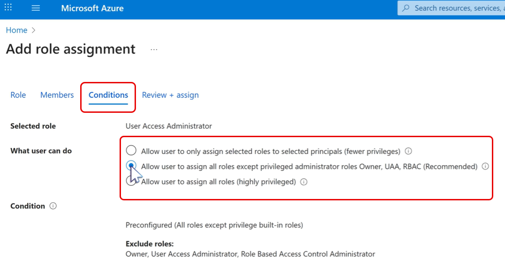

# Set up admins for Visual Studio monthly subscriptions

Admins manage Visual Studio monthly subscriptions. These individuals can assign subscriptions, edit assignments, add or delete subscriptions, and perform other subscription management tasks.

## Watch: How Visual Studio cloud subscriptions work and how to administer them

This video explains how Visual Studio **cloud subscriptions** use **Azure billing**, how to **purchase** from the Visual Studio **Marketplace**, and how admins **assign and manage** users in the **Subscriptions Admin Portal**. It also covers **adjusting quantities**, **adding admins**, and configuring **permissions** in Azure, and how **subscription changes and expirations** are handled.

 > [!VIDEO https://medius.microsoft.com/Embed/video-nc/d9193ff6-5066-4801-9756-1f6e9d440c8c?r=950085727539]

**Related resources**

+ [Purchase Visual Studio cloud subscriptions](https://learn.microsoft.com/visualstudio/subscriptions/vscloud-overview)
+ [Cloud subscriptions billing FAQ](https://learn.microsoft.com/visualstudio/subscriptions/vscloud-billing-faq)

## The Azure subscription owner is the first admin

When you purchase Visual Studio monthly subscriptions, as the owner of the Azure subscription used to make the purchases, you're automatically set up as an admin for those subscriptions.

You can purchase monthly subscriptions through the [Visual Studio Marketplace](https://marketplace.visualstudio.com/subscriptions), or by contacting a Cloud Solution Provider. If you purchase through the Visual Studio Marketplace, at the end of the purchase experience, you're provided with an opportunity to manage users. Choosing that option takes you to the Visual Studio Subscriptions Admin Portal - [https://manage.visualstudio.com](https://manage.visualstudio.com).

After you purchase subscriptions, you can visit the [Admin Portal](https://manage.visualstudio.com) at any time. Just sign into the portal and select the appropriate Azure subscription in the upper left corner.

As the owner of the Azure subscription used to purchase the monthly subscriptions, you can also assign more admins.

## Add admins

To add admins for your subscriptions:

1. Connect to the Azure portal at [portal.azure.com](https://portal.azure.com).
2. Sign in with the account you used to purchase the Visual Studio monthly subscriptions.
3. On the left pane, choose **Cost Management + Billing**.
   > [!div class="mx-imgBorder"]
   > 
4. Select **Subscriptions**, choose the Azure subscription that you used to make the purchase.
   > [!div class="mx-imgBorder"]
   > 
5. Select **Access control (IAM)**, which is located near the top of the list in the left navigation pane.
6. Select **Add role assignment** in the "Grant access to this resource" tile.
   > [!div class="mx-imgBorder"]
   > 
7. In the **Add role assignment** screen, select "Privileged administrator roles.
8. Choose **User Access Administrator** role from the list. 
   > [!div class="mx-imgBorder"]
   > 
9. Select **Next**.
10. From the **Add role** assignment screen, under Members, select **Select members**.
   > [!dvi class="mx-imgBorder"]
   > 
11. Choose the member you want to make an admin. 
   > [!dvi class="mx-imgBorder"]
   > 
12. To limit access, select **Conditions** and select from the options available in the **What user can do** section.
   > [!dvi class="mx-imgBorder"]
   > 

The recommended option is ***"Allow user to assign all roles except privileged administrator roles Owners, UAA, RBAC"***. One exception is when you need another Admin with "Owner" privileges. In this case, select ***"Allow user to assign all roles"***. (Role-base access control (RBAC))

13. Select **Next**, then **Review and assign**.

The new admin can now sign in to the [Admin Portal](https://manage.visualstudio.com). They can select the Azure subscription used to purchase the subscriptions from the list in the upper left corner of the page to manage those subscriptions.

> [!NOTE]
> If you see users with access to edit your monthly subscriptions that you didn’t establish as admins, don’t be alarmed. They might hold roles in the underlying Azure subscription that allow them to manage subscriptions. Those roles include: owner, contributor, service admin, or coadmin. For more information, visit [Add billing managers](/azure/devops/organizations/billing/add-backup-billing-managers).

For information about Visual Studio monthly subscriptions, see the [Overview](vscloud-overview.md) under Buying  subscriptions. To purchase Visual Studio monthly subscriptions, visit the Visual Studio Marketplace at [https://marketplace.visualstudio.com/subscriptions](https://marketplace.visualstudio.com/subscription).

## Resources

[Subscriptions Support](https://aka.ms/vsadminhelp)

## Other resources

+ [Visual Studio documentation](/visualstudio/)
+ [Azure DevOps Services documentation](/azure/devops/)
+ [Azure documentation](/azure/)
+ [Microsoft 365 documentation](/microsoft-365/)

## See also

+ [Purchase Visual Studio cloud subscriptions](https://learn.microsoft.com/visualstudio/subscriptions/vscloud-overview)
+ [Cloud subscriptions billing FAQ](https://learn.microsoft.com/visualstudio/subscriptions/vscloud-billing-faq)
+ [Get started in the Admin Portal](https://learn.microsoft.com/visualstudio/subscriptions/using-admin-portal)

## Next steps

Learn more about managing Visual Studio subscriptions.
+ [Assign individual subscriptions](assign-license.md)
+ [Assign multiple subscriptions](assign-license-bulk.md)
+ [Edit subscriptions](edit-license.md)
+ [Determine maximum usage](maximum-usage.md)