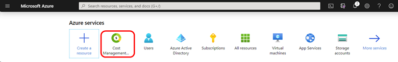
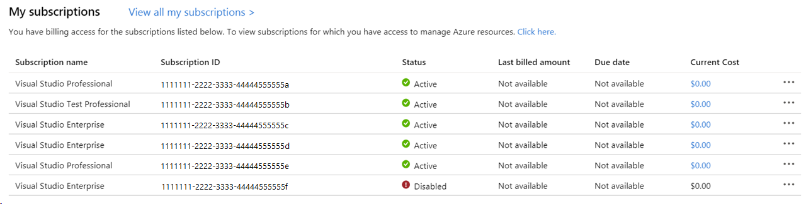
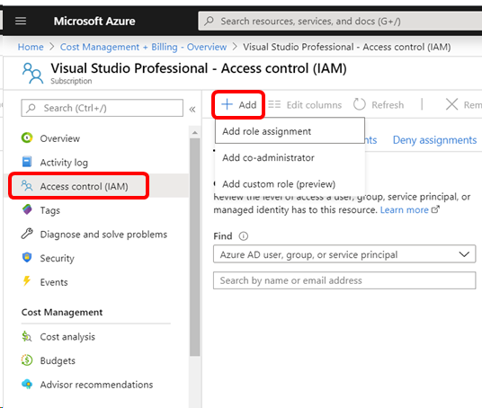
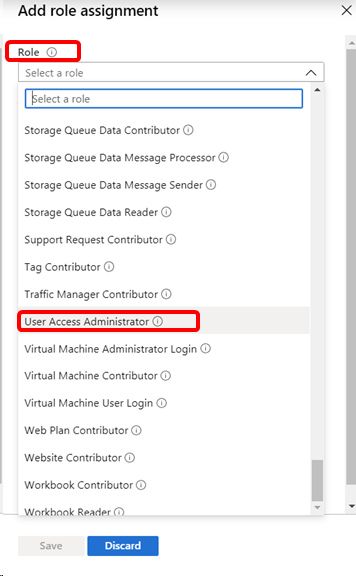

# Set up admins for Visual Studio monthly subscriptions

Admins manage Visual Studio monthly subscriptions. These individuals can assign subscriptions, edit assignments, add or delete subscriptions, and perform other subscription management tasks.

## The Azure subscription owner is the first admin

When you purchase Visual Studio monthly subscriptions, as the owner of the Azure subscription used to make the purchases, you're automatically set up as an admin for those subscriptions.

You can purchase monthly subscriptions through the [Visual Studio Marketplace](https://marketplace.visualstudio.com/subscriptions), or by contacting a Cloud Solution Provider. If you purchase through the Visual Studio Marketplace, at the end of the purchase experience, you're provided an opportunity to manage users. Choosing that option takes you to the Visual Studio Subscriptions Admin Portal - [https://manage.visualstudio.com](https://manage.visualstudio.com).

After you purchase subscriptions, you can visit the [Admin Portal](https://manage.visualstudio.com) at any time. Just sign into the portal and select the appropriate Azure subscription in the upper left corner.

As the owner of the Azure subscription used to purchase the monthly subscriptions, you can also assign more admins.

## Add admins

To add admins for your subscriptions:

1. Connect to the Azure portal at [portal.azure.com](https://portal.azure.com).
2. Sign in with the account you used to purchase the Visual Studio monthly subscriptions.
3. Under **Azure services**, choose **Cost Management + Billing**.
   > [!div class="mx-imgBorder"]
   > 
4. In the **My subscriptions** list, choose the Azure subscription that you used to make the purchase.
   > [!div class="mx-imgBorder"]
   > 
5. Select **Access control (IAM)**, which is located near the top of the list in the left navigation pane.
6. Select the **Add** tab at the top of the page.
7. Select **Add role assignment**.
   > [!div class="mx-imgBorder"]
   > 
8. In the fly-out pane on the right, select the **Role** drop-down at the top of the pane, scroll down, and choose **User Access Administrator**.
9. In the list of users, scroll down to the user you wish to make an admin, and select them. 
   > [!div class="mx-imgBorder"]
   > 
10. Select **Save**.
11. Select the **Role assignments** tab to verify that the user you selected now appears as a User Access Administrator.

The new admin can now sign in to the [Admin Portal](https://manage.visualstudio.com). They can select the Azure subscription used to purchase the subscriptions from the list in the upper left corner of the page to manage those subscriptions.

> [!NOTE]
> If you see users with access to edit your monthly subscriptions that you didn't establish as admins, they may have roles in the underlying Azure subscription that allow them to manage subscriptions. Those roles include: owner, contributor, service admin, or co-admin. For more information, visit [Add billing managers](/azure/devops/organizations/billing/add-backup-billing-managers).

For information about Visual Studio monthly subscriptions, see the [Overview](vscloud-overview.md) under Buying  subscriptions. To purchase Visual Studio monthly subscriptions, visit the Visual Studio Marketplace at [https://marketplace.visualstudio.com/subscriptions](https://marketplace.visualstudio.com/subscription).

## Resources

[Subscriptions Support](https://aka.ms/vsadminhelp)

## See also

+ [Visual Studio documentation](/visualstudio/)
+ [Azure DevOps Services documentation](/azure/devops/)
+ [Azure documentation](/azure/)
+ [Microsoft 365 documentation](/microsoft-365/)

## Next steps

Learn more about managing Visual Studio subscriptions.
+ [Assign individual subscriptions](assign-license.md)
+ [Assign multiple subscriptions](assign-license-bulk.md)
+ [Edit subscriptions](edit-license.md)
+ [Determine maximum usage](maximum-usage.md)