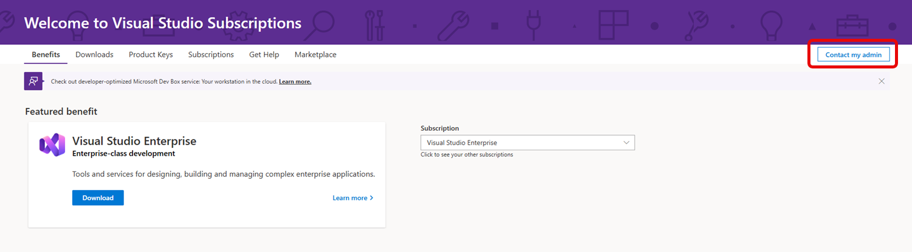

# Get assistance from your subscriptions admin

If your Visual Studio subscription is provided to you by your work or school, chances are it was assigned to you by a subscriptions admin, or "admin." Admins can assist with:
+ Assigning a subscription that meets your needs or removing one you no longer need
+ Changing the email address you use to sign in
+ Enabling access to software downloads
+ Other functions related to your subscription

Many organizations are large and complex, so you might not be aware of who your admin is. We provide a feature in the subscription portal to assist you with contacting your admins. 

## How to contact your admin

1. Sign in to the subscription portal at <https://my.visualstudio.com>.
2. Select the **Contact my Admin** button. 
   > [!div class="mx-imgBorder"]
   > 
0. Enter the message for your admin.
0. If you'd like to receive a copy of the message sent to your admin, choose the **Send me a copy** checkbox. 
0. Finally, select **Send**.

> [!NOTE]
> **Super admins:**  To set the email address to which "Contact my Admin" requests are sent, specify that address in the [Agreement Preferences](admin-preferences.md#contact-email-address).

## Resources

[Visual Studio subscriptions support](https://my.visualstudio.com/gethelp).

## See also

+ [Visual Studio documentation](/visualstudio/)
+ [Azure DevOps Services documentation](/azure/devops/)
+ [Azure documentation](/azure/)
+ [Microsoft 365 documentation](/microsoft-365/)

## Next steps

We recommend activating these benefits to get the most out of your Visual Studio subscription:
+ [Visual Studio IDE](vs-ide-benefit.md)
+ [Azure DevTest offer / credits](/azure/devtest/offer/)
+ [Azure DevOps](vs-azure-devops.md)

These benefits and more can be found at https://my.visualstudio.com/benefits.