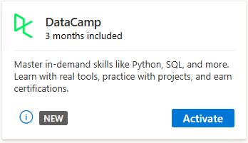
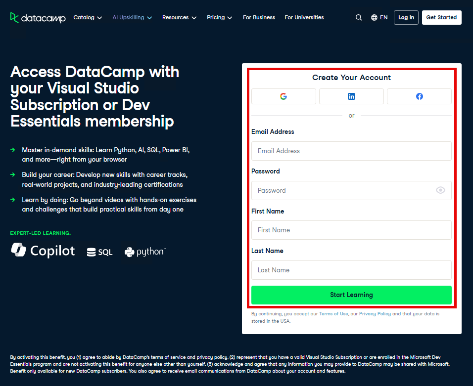

# DataCamp benefit in Visual Studio Subscriptions

DataCamp is available with eligible Visual Studio Subscriptions and Visual Studio Dev Essentials memberships as a professional development benefit. It provides access to interactive courses that help you build data science and analytics skills using technologies such as Python, SQL, and machine learning.

This benefit provides two- or three-month access to DataCamp’s online learning platform, depending on your subscription type. The level of access is comparable to a DataCamp Premium individual subscription, with all learning tracks. AI Native courses are available with limited usage based on available credits, which are tracked in your DataCamp account.

If your subscription is eligible, you can activate it from the [Visual Studio Subscriptions benefits portal](https://my.visualstudio.com/benefits) and begin learning.

## Eligibility
Before you activate the DataCamp benefit, confirm that your subscription is eligible.

| Subscription level | Channels | Benefit | Renewable? |
| ------------------- | ---------- | --------- | ------------| 
| Visual Studio Enterprise | VL, Retail | 3 months | No. Available to new subscribers only |
| Visual Studio Enterprise with GitHub Enterprise | VL | 3 months | No. Available to new subscribers only |
| Visual Studio Professional | VL, Retail | 3 months | No. Available to new subscribers only |
| Visual Studio Professional with GitHub Enterprise | VL | 3 months | No. Available to new subscribers only |
| Visual Studio Test Professional | VL, Retail | 3 months | No. Available to new subscribers only |
| MSDN Platforms | VL, Retail | 3 months | No. Available to new subscribers only |
| Visual Studio Dev Essentials | N/A | 2 months | N/A |
| Visual Studio Enterprise | NFR* | Not available | N/A |
| Visual Studio Enterprise, Visual Studio Professional (monthly cloud) | Azure | Not available | N/A |
| | | | |

\*NFR (Not for Resale) refers to subscriptions provided through programs such as FTE, Most Valuable Professional (MVP), Regional Director (RD), Microsoft AI Cloud Partner Program (MAICPP), Microsoft Partner Program (MPN), Visual Studio Industry Partner (VSIP), Microsoft Certified Trainer (MCT), Azure Dev Tools for Teaching (ADTfT), Open Source Heroes, Student Ambassadors, Microsoft Bug Bounty, Independent Software Vendor (ISV), NFR Basic programs such as Xbox and Alumni, and Microsoft for Startups.

## Not sure what subscription you're using?
Go to the [Visual Studio Subscriptions portal](https://my.visualstudio.com/benefits) to view the subscriptions assigned to your account. If you have access to multiple subscriptions, make sure you're signed in with the correct account.

## Activate your benefit
Activate the DataCamp benefit from the Visual Studio Subscriptions benefits portal.

1. Go to the [Visual Studio Subscriptions benefits portal](https://my.visualstudio.com/benefits).
1. Locate the DataCamp tile in the **Professional Development** category.
1. Select **Activate**. 
   > [!div class="mx-imgBorder"]
     
1. Follow the prompts to create your account and select **Start Learning**.
   > [!div class="mx-imgBorder"]
     

## Support
For help with DataCamp or your Visual Studio Subscription, use the following resources:

+ **DataCamp**
  + [DataCamp Help Center](https://support.datacamp.com/hc)
  + [DataCamp Community](https://www.datacamp.com/community/tutorials)
+ [**Get help with Visual Studio Subscriptions**](https://my.visualstudio.com/gethelp)
+ [**Visual Studio Support**](https://visualstudio.microsoft.com/support/) 

### Next steps
Explore other professional development benefits available with Visual Studio Subscriptions:
+ [**Pluralsight**](https://learn.microsoft.com/visualstudio/subscriptions/vs-pluralsight)
+ [**Cloud Academy**](https://learn.microsoft.com/visualstudio/subscriptions/vs-cloud-academy)
+ [**CODE Magazine**](https://learn.microsoft.com/visualstudio/subscriptions/vs-code-magazine)
