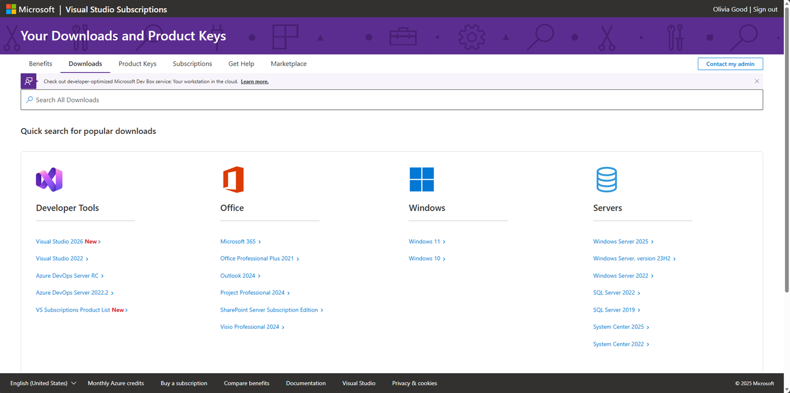
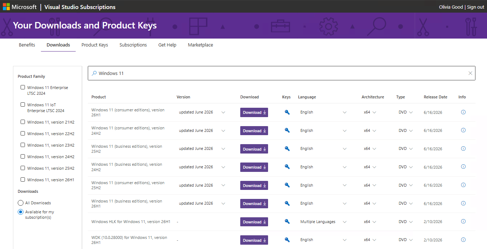
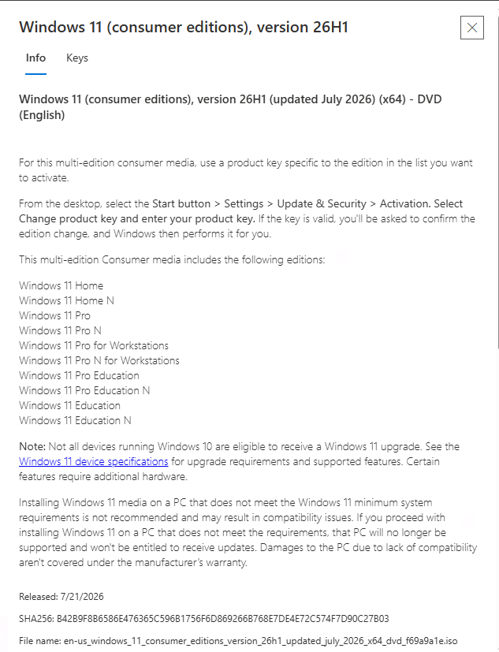
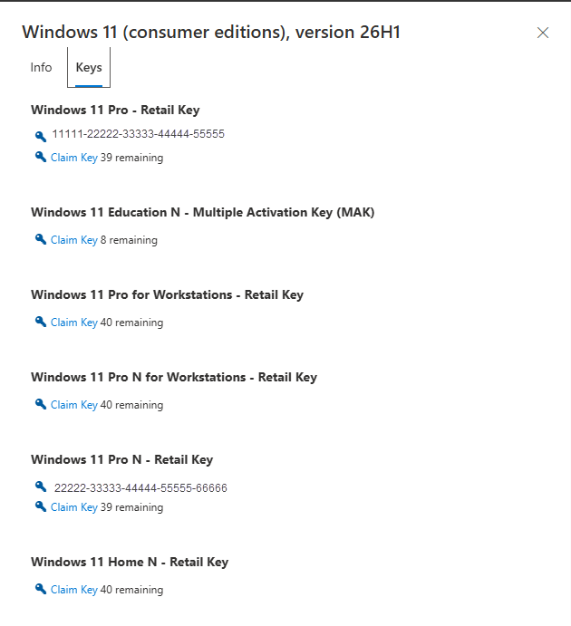

# How to download software titles in Visual Studio Subscriptions

Depending on which Visual Studio Subscription you have, you might have access to a wide variety of Microsoft software titles. This article explains how to locate and download the software you need to get the most out of your subscription. 

The [Downloads](https://my.visualstudio.com/downloads/featured) page displays only the downloads that your subscription includes. If you have more than one subscription or program membership, the downloads shown are for the **highest subscription** you hold, even if you're currently viewing a different subscription. For example, if you have both Visual Studio Enterprise and Professional subscriptions associated with the same sign-in email address, the downloads shown are the ones included in the Enterprise subscription. That's true even if you're currently using your Professional subscription. 

If your subscription is provided by your work or school, your subscriptions admin controls whether you have access to downloads. Disabling access to downloads also disables access to product keys. If you don't have access to downloads and product keys and need them, [contact your admin](contact-my-admin.md).

## How do I find downloads in the subscription portal?

When you visit the [Downloads](https://my.visualstudio.com/downloads/featured?wt.mc_id=o~msft~docs) page, you see popular downloads arranged in groups by product type. You can select one of the popular downloads shown, or search for any product using the search bar at the top of the page.
> [!div class="mx-imgBorder"]
> 

For example, if you choose **Windows 11** from the Windows list, you see a list of available Windows 11 downloads.
> [!div class="mx-imgBorder"]
> 

You easily select your architecture, language, and file type using the available drop-down menus. Choose your preferred options, and  select **Download** to begin downloading the product.

> [!NOTE]
> Not all titles are available in all architectures, languages, or file formats.

### Displaying download details

Selecting the product name or on the Info link displays the details for that download and providing access to the release notes for the product.
> [!div class="mx-imgBorder"]
> 

In the details pane, you can also select the **Keys** tab to check the status of your product keys.
> [!div class="mx-imgBorder"]
> 

### Obtaining product keys

To obtain a product key for the download, you can either select the blue key labeled **Get Key** or if you're already viewing the details pane, select **blue key** on the **Keys** tab.

> [!NOTE]
>
> Visual Studio 2026 doesn't require a product key. Instead, the IDE is available when you sign in with the account your Visual Studio Subscription is assigned to. Product keys for other eligible products and earlier Visual Studio versions remain available on the Product Keys page in the subscriber portal.
>
> If your organization uses Volume Licensing for qualifying broad, offline, or managed deployment scenarios, Visual Studio 2026 keys may still be available through your Volume Licensing administrator.

> [!div class="mx-imgBorder"]
> 

## Resources

[Visual Studio Subscriptions support](https://my.visualstudio.com/gethelp).

## See also

+ [Visual Studio documentation](/visualstudio/)
+ [Azure DevOps documentation](/azure/devops/)
+ [Azure documentation](/azure/)
+ [Microsoft 365 documentation](/microsoft-365/)

## Next steps

To learn more about locating, claiming, and exporting product keys, check out our product keys documentation:
+ [Product keys overview](product-keys.md)
+ [Locate and claim keys](find-keys.md)

Learn how to take advantage of other great benefits such as:
+ [Azure DevTest offer / credits](/azure/devtest/offer/)
+ [Azure DevOps](vs-azure-devops.md)
+ [Visual Studio IDE](vs-ide-benefit.md)
