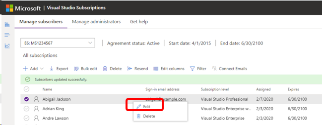
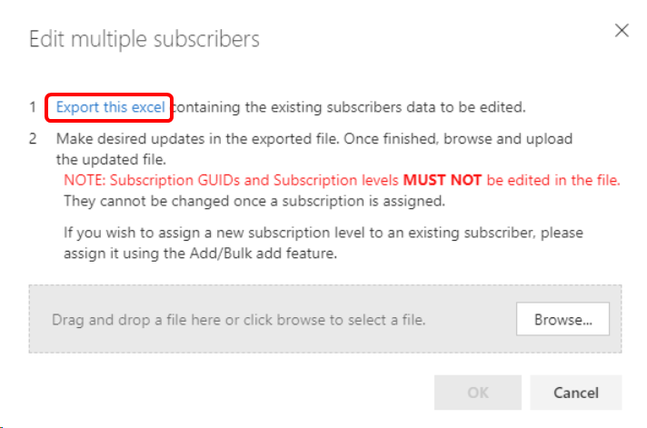
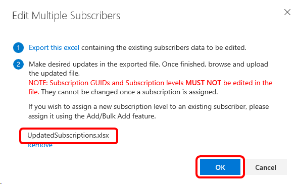

# Edit Visual Studio subscription assignments

As a subscription admin, you can make changes to the subscriptions assigned to members of your organization. This article discusses changes that you can make and provides the necessary steps.

   > [!NOTE]
   > If you need to change certain subscription details for a subscriber assigned through a Microsoft Entra group, you need to remove them from the group and add them into the admin portal individually. Changes to email addresses and name spelling should be made in the Microsoft Entra group. If you need to change subscription levels or download permissions, you need to remove them from the group and add them directly into the admin portal.

## Change subscriber information

You can edit a subscriber's information to correct errors or update information.

To edit a subscriber, select the ellipses (…) that appears next to the subscriber's email address when you hover your mouse over it. Use the dropdown to select **Edit** to modify the subscriber’s details.
> [!div class="mx-imgBorder"]
> 

You can update the following fields: subscriber's first name, family name, subscription level, email address, country/region, language, downloads, and reference. Edit the subscriber’s information, and select **Save**.

##  Edit multiple subscribers by using bulk edit

You can edit multiple subscribers at the same time by using the bulk edit process. This feature is primarily used for organizations that are going through corporate email address changes or that want to restrict access to downloads.

To learn how to edit multiple subscribers by using bulk edit, watch the following video or read on.

> [!VIDEO https://medius.microsoft.com/Embed/video-nc/325f5ca9-c8c9-4a15-a93d-8190423c9ef7?r=552201291173]

> [!NOTE]
> Don't change subscription Globally Unique Identifiers (GUIDs) in the template. See our article about [assigning specific subscription GUIDs](assign-guid.md).

1. To edit multiple subscribers at the same time, navigate to the **Subscribers** tab. In the ribbon at the top, select **Bulk Edit**.

2. The **Bulk edit** feature makes edits to subscriber information by using an Excel template. In the **Bulk Edit** box, select **Export this excel** to download the current list of subscribers including all of their information.
   > [!div class="mx-imgBorder"]
   > 

3. Next, save the file locally so that you can easily find it and make any necessary changes before uploading it.

4. Return to the Visual Studio Subscriptions Admin portal and in the **Bulk Edit** dialog box, select **Browse**. Choose the Excel file you saved and select **OK**. The upload progress appears.
   > [!div class="mx-imgBorder"]
   > 

5. After you upload the file, you see a notification that it was successful. Your edits are now reflected in the subscriber information.

## Related content

* [Subscriptions support](https://aka.ms/vsadminhelp)
* [Visual Studio documentation](/visualstudio/)
* [Azure DevOps documentation](/azure/devops/)
* [Azure documentation](/azure/)
* [Microsoft 365 documentation](/microsoft-365/)
* Need to assign a specific subscription ID? Check out [Assigning a subscription ID](https://learn.microsoft.com/visualstudio/subscriptions/assign-guid).
* For help with finding a particular subscription, check out [Search for a subscription](search-license.md).
* Need to create a list of all your subscriptions? Check out [Export subscriptions](exporting-subscriptions.md).
