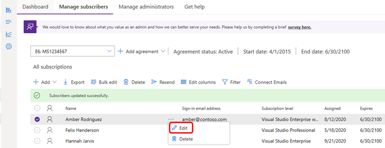
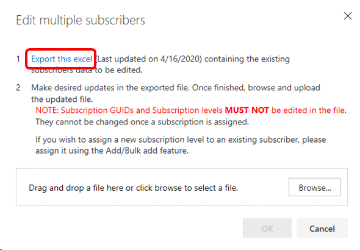
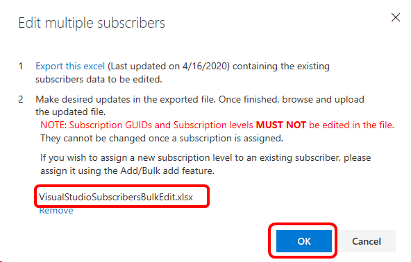

# Edit Visual Studio Subscription assignments

As a subscription admin, you can update subscriptions assigned to members of your organization. This article explains how to update subscriber information and subscription assignments.

   > [!NOTE]
   > If you assign a subscriber through a Microsoft Entra group, you can't edit some subscription details in the Admin Portal. Update email addresses and name spelling in the Microsoft Entra group. To change subscription levels or download permissions, remove the subscriber from the group and add the subscriber directly in the Admin Portal.

## Change subscriber information

Edit subscriber information to correct errors or update details.

To edit a subscriber, select the ellipsis (...) next to the subscriber's email address, and then select **Edit**.
> [!div class="mx-imgBorder"]
> 

Update the subscriber's name, subscription level, email address, country or region, language, download and product key access, expiration date, or reference information, and then select **Save**.

##  Edit multiple subscribers by using bulk edit

Edit multiple subscribers at the same time by using the Bulk Edit feature. This feature is commonly used during corporate email address changes or when managing download and product key access for multiple subscribers.

To edit multiple subscribers by using bulk edit, watch the following video or read on.

> [!VIDEO https://medius.microsoft.com/Embed/video-nc/325f5ca9-c8c9-4a15-a93d-8190423c9ef7?r=552201291173]

> [!NOTE]
> Don't change subscription GUIDs in the template. For more information, see [assigning specific subscription GUIDs](assign-guid.md).

1. Sign in to the Visual Studio Subscriptions [Admin Portal](https://manage.visualstudio.com/). On the **Manage Subscribers** tab, select **Bulk Edit**.

1. The **Bulk edit** feature uses an Excel template to update subscriber information. In the **Bulk Edit** dialog, select **Export this excel** to download the current subscriber list.
   > [!div class="mx-imgBorder"]
   > 

1. Save the file locally and the required changes before uploading it.

1. Return to the Visual Studio Subscriptions Admin Portal. In the **Bulk Edit** dialog, select **Browse**, choose the Excel file, and select **OK**. The upload progress appears.
   > [!div class="mx-imgBorder"]
   > 

1. After the upload completes, a confirmation message appears. The Admin Portal displays the updated subscriber information.

## Related content

* [Subscriptions support](https://aka.ms/vsadminhelp)
* [Manage subscriptions for large teams](manage-teams.md)
* [Assign specific subscription IDs](https://learn.microsoft.com/visualstudio/subscriptions/assign-guid)
* [Export subscriber information](exporting-subscriptions.md)
