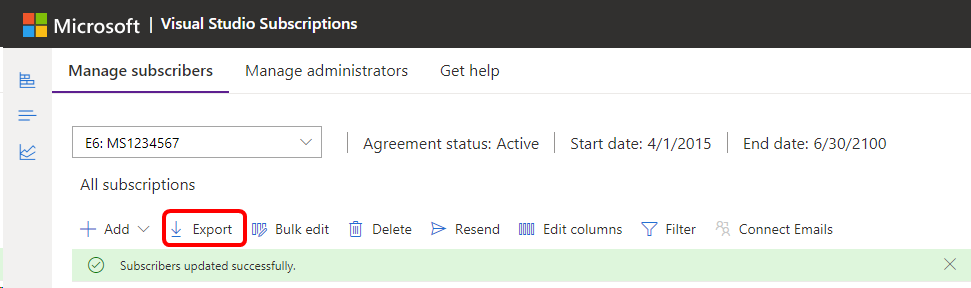

# Export subscription information in Visual Studio

In the Visual Studio Subscriptions [Admin portal](https://manage.visualstudio.com), you can export a list of your subscribers with details about their subscriptions. The exported list contains all of the fields in the subscriber list in the admin portal.

When all of your subscriber information is in one place, it can help you do things like:

* Get an overall view of which subscriptions are used by teams and/or locations across your organization.
* Develop plans and budgets for future subscription purchases.
* Encourage users to activate their assigned subscriptions.
* Identify where subscriptions might be overallocated.
* Assign subscriptions by using the subscription ID to control subscription expiration dates.
* Migrate subscriptions from expiring agreements to new ones.  

## Export your subscriptions

To perform the export:

1. Sign in to the [admin portal](https://manage.visualstudio.com).
2. Select the **Export** tab. The file downloads to your local machine. The file includes the name of the agreement that contains your user subscriptions, and the date of the export.

   > [!div class="mx-imgBorder"]
   > 

3. The exported list appears as a .csv file in your normal downloads location. The file name includes the agreement number and the date that you exported the list.  

## Related content

* [Subscriptions Support](https://aka.ms/vsadminhelp)
* [Visual Studio documentation](/visualstudio/)
* [Azure DevOps services documentation](/azure/devops/)
* [Azure documentation](/azure/)
* [Microsoft 365 documentation](/microsoft-365/)

For more information about managing subscriptions, see these helpful articles:
* [Expired subscriptions](handle-expired-license.md)
* [Overallocations](handle-overclaimed-license.md)
* [Maximum usage](maximum-usage.md)
