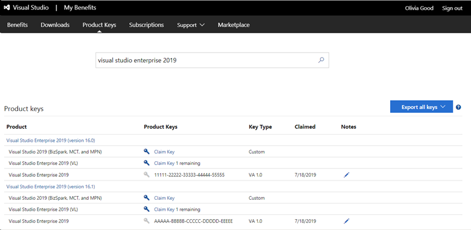

# Finding and claiming product keys in Visual Studio subscriptions

This article explains how to locate, claim, and export product keys from https://my.visualstudio.com/productkeys. For more information about product key types, limits, and more visit the [product keys overview](product-keys.md).

## Locating and claiming product keys

You must be signed in to your Visual Studio subscription to view your product keys. Individual product keys are found by selecting the blue **Get Key** link for a particular product on the [Downloads](https://my.visualstudio.com/downloads) page. All keys are also available in aggregate on the [Product Keys](https://my.visualstudio.com/productkeys?wt.mc_id=o~msft~docs) page. When multiple keys exist for a single product, notes are displayed on the Notes column for the download to assist you in identifying which key should be used.
> [!div class="mx-imgBorder"]
> 

Some products bundle multiple editions of the product into a single download. In these cases, the product key entered determines which edition of the product is installed.
Some keys are provided automatically, such as "static" keys, which you can use as many times as needed because activation isn't required. Other keys must be claimed by selecting the **Get Key** link for the product.

Various key types are available, depending on the product.

### Product key types

|  Key Type   |  Description |
|-------------|--------------|
|    Not Applicable  | No key is needed to install this product. |
|    Retail | Retail keys allow multiple activations and are used for retail builds of the product. |
|    Multiple Activation | A Multiple Activation Key (MAK) enables you to activate multiple installations of a product with the same key. MAK are used with Volume Licensing   versions of products. Typically, only one MAK key is provided per subscription. |
|    Static Activation Key | Static activation keys are provided for products that don't require activation. They can be used for any number of installations. |
|    Custom Key | Custom keys provide special actions or information to activate or install the product. |
|    VA 1.0  |  Multiple activation keys similar to a MAK. |
|    OEM Key |  Original Equipment Manufacturer keys that allow multiple activations. |
|    Azure Dev Tools for Teaching Retail Key  | Retail keys for Azure Dev Tools for Teaching allow activation on one device. These keys are intended for student consumption. |
|    Azure Dev Tools for Teaching Lab Key | Lab use keys for allow multiple activations. Azure Dev Tools for Teaching Lab Keys are intended for use in university computer lab scenarios. |
|    Azure Dev Tools for Teaching MAK Key | MAK keys for Azure Dev Tools for Teaching program customers. |

You can claim a key from the download page for the product, or you can search for the key you need on the [Product Keys](https://my.visualstudio.com/productkeys) page.

### Claiming product keys

Only subscribers with active subscriptions can download products and claim product keys. You can export your claimed keys from the [Product Keys](https://my.visualstudio.com/productkeys) page while your subscription is active.

To claim a product key:
1. Sign in to your Visual Studio subscription. You must be signed in to download products or claim product keys.
2. Select the [Product Keys](https://my.visualstudio.com/productkeys?wt.mc_id=o~msft~docs) tab.
3. Product keys are listed alphabetically by the name of the product. You can either scroll down to the name of the desired product, or search for it using the search bar at the top of the page.
> [!div class="mx-imgBorder"]
> 
 
In this example, we used the search bar to locate a product key for Visual Studio Enterprise 2019.
As you can see, there are several versions listed. One key each was previously claimed for Visual Studio Enterprise 2019 versions 16.0 and 16.1. More keys of different types are still available for both versions. 

Notice that you can record a brief note about claimed keys in the **Notes** column. You can use this feature with the date in the **Claimed** column to keep track of the keys you claim. You might, for example, make notes when you activate an installation of the product using the key.

### Exporting your claimed keys

You can export a list of the keys you claim. This list includes a large selection of static and other keys that are automatically marked as "claimed" for you.

> [!IMPORTANT]
> If your subscription expires, you'll no longer be able to claim new keys or export your claimed keys.

To export your keys, select the **Export all keys** link at the far right of the Product Keys page. An .xml file entitled KeysExport.xml is created. You can choose to open or save the file. You need to open the file with an application capable of handling .xml files. For example, you can open the file as a read-only workbook in Microsoft Excel.

### Office 2024 installation update

As of October 2024, access to Office 2024 and related Office 2024 products is still available to subscribers; however, the link on the downloads page in the subscriptions portal will redirect you to setup.office.com where subscribers can create a new account or sign-in with their Microsoft account credentials. The product keys listed here are used on setup.office.com for obtaining and setting up Office applications.

[Get help with setting up Office](https://support.microsoft.com/office/get-help-with-setup-office-com-6e1bc8e8-9e8e-4cce-8b9d-80dcbe17f253).

For more information, visit [Office 2024 and Office LTSC 2024 FAQ](https://support.microsoft.com/office/office-2024-and-office-ltsc-2024-faq-1c454a7d-3d0a-4139-b1bd-c61725ea436c).

## Resources

[Visual Studio subscriptions support](https://aka.ms/vssubscriberhelp).

## See also

+ [Visual Studio documentation](/visualstudio/)
+ [Azure DevOps documentation](/azure/devops/)
+ [Azure documentation](/azure/)
+ [Microsoft 365 documentation](/microsoft-365/)

## Next steps

When you're ready to download software and use keys, visit https://my.visualstudio.com/downloads. For more information about downloading software, see the [downloading overview](download-software.md).