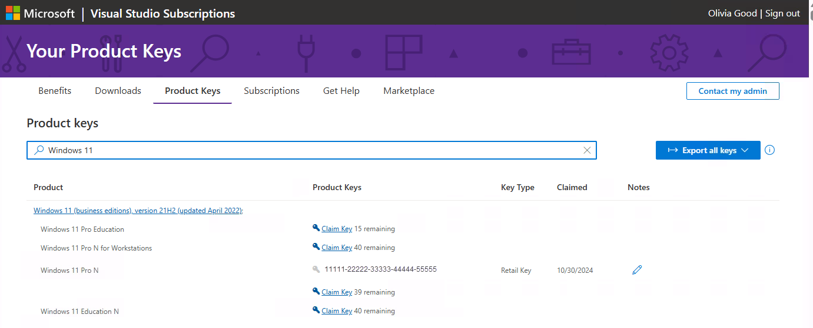

# Finding and claiming product keys in Visual Studio Subscriptions

This article explains how to locate, claim, and export product keys from the [Product Keys page](https://my.visualstudio.com/productkeys).

Visual Studio 2026 doesn't require a product key. Instead, the IDE is available when you sign in with the account your Visual Studio Subscription is assigned to. Product keys for other eligible products and earlier Visual Studio versions remain available on the Product Keys page in the Subscriber portal.

If your organization uses Volume Licensing for qualifying broad, offline, or managed deployment scenarios, Visual Studio 2026 keys may still be available through your Volume Licensing administrator.

For more information about product key types, limits, and more, see the [product keys overview](product-keys.md).

## Locating and claiming product keys

You must sign in to the Visual Studio Subscriptions to view product keys. Find individual product keys by selecting the **Blue Key** icon for a particular product on the [Downloads](https://my.visualstudio.com/downloads) page. You can also view all product keys in aggregate on the [Product Keys](https://my.visualstudio.com/productkeys?wt.mc_id=o~msft~docs) page, including earlier versions of Visual Studio. Visual Studio 2026 doesn't appear because it's activated through subscription sign-in. When multiple keys exist for a single product, the **Notes** column identifies which key to use.
> [!div class="mx-imgBorder"]
> 

Some products bundle multiple editions into a single download. In these cases, the product key you enter determines which edition of the product is installed.
Some keys are provided automatically, such as "static" keys, which you can use as many times as needed because activation isn't required. Other keys must be claimed by selecting the **Key** link for the product.

Various key types are available, depending on the product.

### Product key types

This section applies only to products that require product keys. The Visual Studio IDE doesn't use product keys and doesn't display one in the portal.

|  Key Type   |  Description |
|-------------|--------------|
|    Not Applicable  | No key is needed to install this product. |
|    Retail | Retail keys allow multiple activations and are used for retail builds of the product. |
|    Multiple Activation | A Multiple Activation Key (MAK) activates multiple installations of a product with the same key. MAKs are used with Volume Licensing versions of products. Typically, only one MAK key is provided per subscription. |
|    Static Activation Key | Static activation keys are provided for products that don't require activation. They can be used for any number of installations. |
|    Custom Key | Custom keys provide special actions or information to activate or install the product. |
|    VA 1.0  |  Multiple activation keys similar to a MAK. |
|    OEM Key |  Original Equipment Manufacturer keys that allow multiple activations. |
|    Azure Dev Tools for Teaching Retail Key  | Retail keys for Azure Dev Tools for Teaching allow activation on one device. These keys are intended for student consumption. |
|    Azure Dev Tools for Teaching Lab Key | Lab use keys allow multiple activations. Azure Dev Tools for Teaching Lab Keys are intended for use in university computer lab scenarios. |
|    Azure Dev Tools for Teaching MAK Key | MAK keys for Azure Dev Tools for Teaching program customers. |

You can claim a key from the **Downloads** page for the product, or you can search for the key you need on the [Product Keys](https://my.visualstudio.com/productkeys) page.

### Claiming product keys

Only subscribers with active subscriptions can download products and claim product keys. You can export your claimed keys from the [Product Keys](https://my.visualstudio.com/productkeys) page while your subscription is active.

To claim a product key:
1. Sign in to your Visual Studio subscription. You must be signed in to download products or claim product keys.
2. Select the [Product Keys](https://my.visualstudio.com/productkeys?wt.mc_id=o~msft~docs) tab.
3. Product keys are listed alphabetically by the name of the product. You can either scroll down to the name of the desired product, or search for it using the search bar at the top of the page.
> [!div class="mx-imgBorder"]
> 
 
This example uses the search bar to locate a product key for Windows 11. Multiple versions are listed. 

Notice that you can record a brief note about claimed keys in the **Notes** column. You can use this feature with the date in the **Claimed** column to keep track of the keys you claim. You might, for example, make notes when you activate an installation of the product using the key.

### Exporting your claimed keys

You can export a list of the keys you claim. This list includes a large selection of static and other keys that are automatically marked as "claimed" for you.

> [!IMPORTANT]
> If your subscription expires, you'll no longer be able to claim new keys or export your claimed keys.

To export your keys, select the **Export all keys** link at the far right of the Product Keys page. Select from Active or Expired subscriptions. An .xml file entitled KeysExport.xml is created. You can choose to open or save the file. You need to open the file with an application capable of handling .xml files. For example, you can open the file as a read-only workbook in Microsoft Excel.

### Office 2024 installation update

As of October 2024, subscribers can access Office 2024 and related Office 2024 products. However, the link on the downloads page in the subscriptions portal redirects you to [setup.office.com](https://setup.office.com) where subscribers can create a new account or sign in with their Microsoft account credentials. Use the product keys listed in the Visual Studio Subscriptions portal on [setup.office.com](https://setup.office.com) for obtaining and setting up Office applications.

[Get help with setting up Office](https://support.microsoft.com/office/get-help-with-setup-office-com-6e1bc8e8-9e8e-4cce-8b9d-80dcbe17f253).

For more information, visit [Office 2024 and Office LTSC 2024 FAQ](https://support.microsoft.com/office/office-2024-and-office-ltsc-2024-faq-1c454a7d-3d0a-4139-b1bd-c61725ea436c).

## Resources

[Visual Studio subscriptions support](https://aka.ms/vssubscriberhelp).

## See also

+ [Visual Studio documentation](/visualstudio/)
+ [Azure DevOps documentation](/azure/devops/)
+ [Azure documentation](/azure/)
+ [Microsoft 365 documentation](/microsoft-365/)

## Next steps

When you're ready to download software and use keys, visit https://my.visualstudio.com/downloads. For more information about downloading software, see the [downloading overview](download-software.md).
