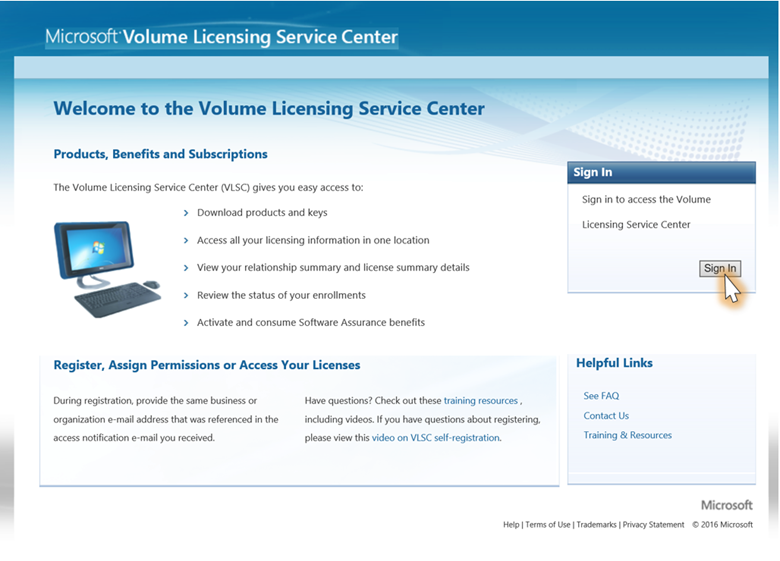

# How do I locate my “Public Customer Number” (PCN) or Authorization Number?

In order to complete the onboarding of your organization to the subscription administration portal, you will need your Public Customer Number (PCN) or Authorization Number. This article provides the steps to locate those numbers for your organization.  

## To locate your PCN or Authorization Number

1.  Log in to the Volume Licensing Service Center at: [https://www.Microsoft.com/licensing/servicecenter](https://www.Microsoft.com/licensing/servicecenter).

    

2. From the Subscriptions tab, select **Visual Studio Subscriptions**.

    

3. The PCN or Public Customer Number is located halfway down the page.
    
    

If you are not seeing the above page and are being redirected to the Visual Studio sign-in page, please copy and paste the following link into your browser: https://www.microsoft.com/Licensing/servicecenter/Subscription/AgreementSearch.

## If I have more than one PCN, which one should I use?

If you have more than one Public Customer Number (PCN), you will receive one email with a unique onboarding URL for each PCN. Each unique URL only works with the corresponding PCN, the last three digits of which are also provided in the same email. You’ll need to complete the onboarding process through the unique link in each email, for each PCN. 