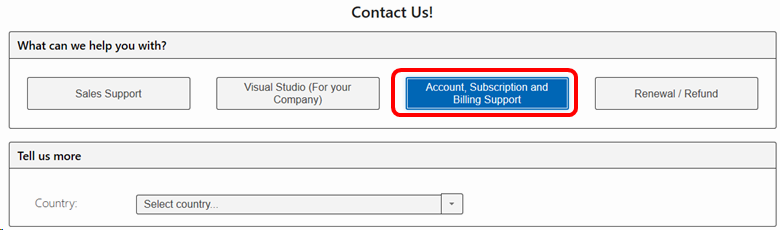

# How do I locate my “Public Customer Number” (PCN) or Authorization Number?

In order to complete the onboarding of your organization to the subscription administration portal, you will need your Public Customer Number (PCN) or Authorization Number. This article provides the steps to locate those numbers for your organization.

## To locate your PCN or Authorization Number

The Volume License Service Center no longer provides access to your PCN.  To obtain it, please contact Visual Studio Subscriptions support.
1. Visit https://visualstudio.microsoft.com/subscriptions/support/#talktous
2. Tap the **Account, Subscription and Billing Support** button.
    > [!div class="mx-imgBorder"]
    > 
3. Choose your country from the drop-down list.
4. Choose from the list of support options available in your country to contact a support agent who can research your PCN for you.

## If I have more than one PCN, which one should I use?

If you have more than one Public Customer Number (PCN), you will receive one email with a unique onboarding URL for each PCN. Each unique URL only works with the corresponding PCN, the last three digits of which are also provided in the same email. You’ll need to complete the onboarding process through the unique link in each email, for each PCN.
