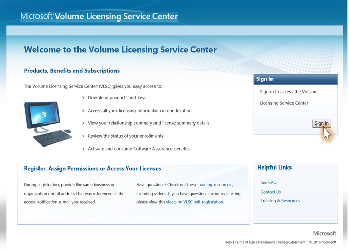

# Locating the Primary Contact Associated with Visual Studio Subscriptions

1. To locate your primary contact, visit the Volume Licensing Service Center at: https://www.Microsoft.com/licensing/servicecenter and click **Sign In**.

2. From the Licenses tab, select **Relationship Summary** in the dropdown.

3. Select the applicable agreement number. 

4. Select the **Contacts** tab.  The Primary Contact will be listed in the list of contacts associated with the agreement. 

 
 
