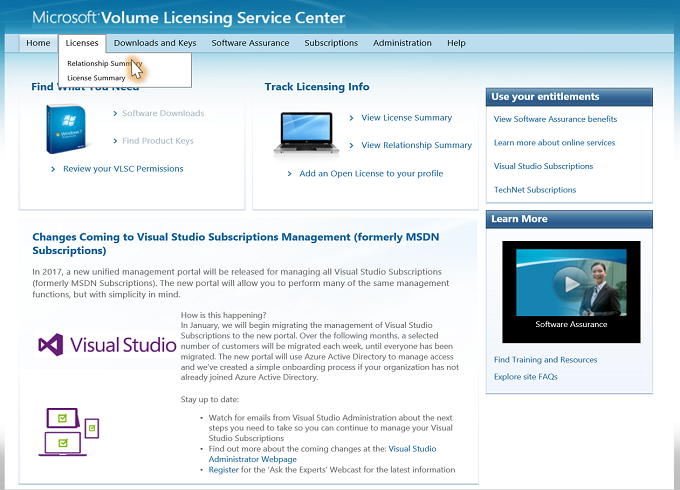
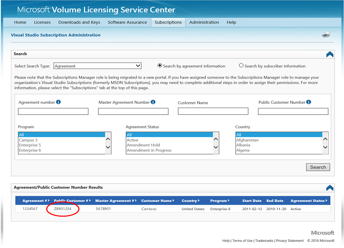
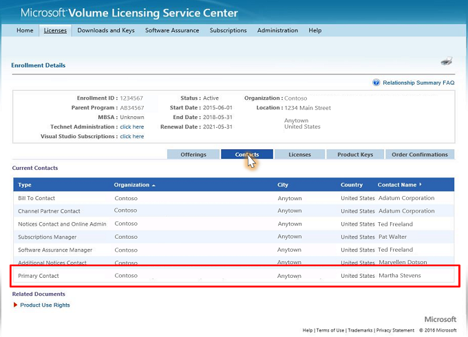

# Locating the Primary Contact associated with Visual Studio subscriptions

In order to complete the onboarding of your organization to the subscriptions administration portal, you'll need to identify your Primary Contact.  This article explains where to locate that information.

1. To locate your primary contact, visit the Volume Licensing Service Center at: https://www.Microsoft.com/licensing/servicecenter and click **Sign In**.

2. From the Licenses tab, select **Relationship Summary** in the dropdown.
    > [!div class="mx-imgBorder"]
    > 

3. Select the applicable agreement number.
    > [!div class="mx-imgBorder"]
    > 

4. Select the **Contacts** tab.  The Primary Contact will be listed in the list of contacts associated with the agreement.
    > [!div class="mx-imgBorder"]
    > 
