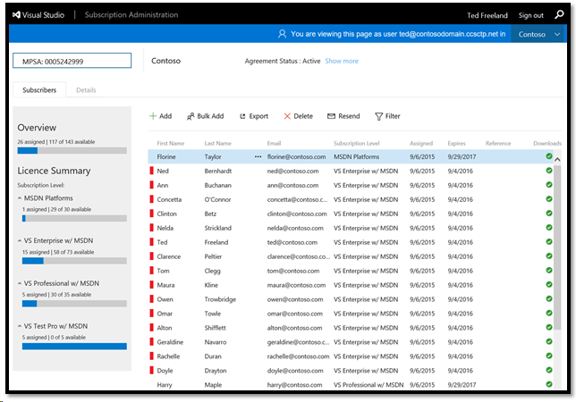

# Expired subscriptions
When a user’s subscription has expired, this is indicated in the portal by a red bar next to their name in the list of subscribers. For those subscribers to continue using their Visual Studio Subscription benefits, you will need to renew their licenses.
> [!div class="mx-imgBorder"]
> 

## Renew subscriptions
1. Contact your Volume Licensing reseller or your Microsoft seller.
2. Provide them with your Agreement Number and Purchase Account Number. 

Your reseller or Microsoft seller will guide you through the renewal or purchasing additional subscriptions process. Once the order has been placed or the contract has been renewed, the new subscriptions will be available and can be [assigned to your subscribers](assign-license.md).

## Next steps
- For help using the Administration Portal, contact [Visual Studio Administration and Subscriptions Support](https://visualstudio.microsoft.com/support/support-overview-vs)
- Find a [Microsoft Solution Provider](https://www.microsoft.com/solution-providers/home)