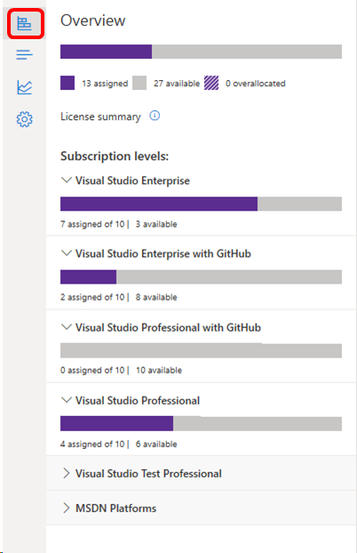

# Handle over-allocated subscriptions

Sometimes orders are changed after subscribers have been added, which can result in having more assigned subscriptions than licenses owned by your company, which is called "over-allocation."  

To see your subscription allocations, select the top icon at the left to open the overview pane.  

> [!NOTE]
> Over-allocations are not allowed in Open License programs.  Also, other programs may display this information in the portal differently.
>
> [!div class="mx-imgBorder"]
> 

The display uses a hashed bar to indicate over-allocated subscriptions. The number of over-allocations across all subscription types is included in the Overview section at the top, and each subscription level also displays its own allocation status.  

## Receive notifications when over-allocations occur

You can designate an email address to receive notifications when overallocations occur, and set a threshold that must be exceeded before notifications are sent. Learn more about [setting preferences for your agreements](admin-preferences.md) in the admin portal.

## Resolve over-allocated subscriptions

There are several ways to resolve over-allocations:
+ Contact your reseller to purchase more subscriptions.
+ Wait until your annual true-up period and pay for the over-allocated subscriptions at that point. 
+ Delete some subscription assignments.  (The true-up still takes place based on the maximum number of subscriptions assigned at any time during the year.)

## Billing and true-up

If your organization has an Enterprise Agreement (EA), admins are able to assign subscriptions without purchasing them, and pay for them later through a reconciliation process known as a "true-up." When you over-allocate, your organization is billed for the maximum number of subscriptions assigned to users during the "true-up." The billing takes place even if you no longer have the maximum number of subscriptions assigned at the time the true-up takes place. To learn more about monitoring your maximum usage, visit the [Maximum Usage](maximum-usage.md) article.

## See also

+ [Visual Studio documentation](/visualstudio/)
+ [Azure DevOps Services documentation](/azure/devops/)
+ [Azure documentation](/azure/)
+ [Microsoft 365 documentation](/microsoft-365/)

## Next steps

+ Learn more about managing [Visual Studio subscriptions with GitHub Enterprise](assign-github.md).
+ For assistance with sales, subscriptions, accounts and billing for Visual Studio Subscriptions, contact Visual Studio [Subscriptions Support](https://aka.ms/vsadminhelp).
