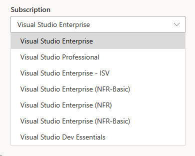
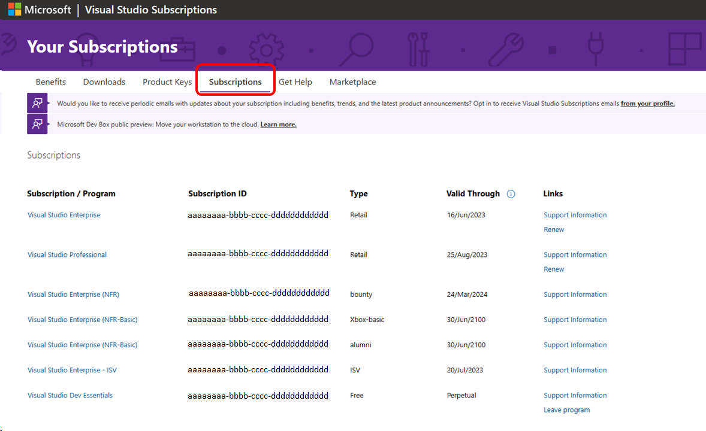
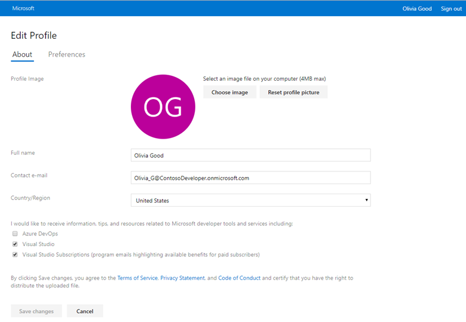

# Managing subscriptions

The Visual Studio [subscription portal](https://my.visualstudio.com) gives you the ability to manage all your subscriptions and program memberships in a single place. You can make changes to your profile, use all of the benefits included with your subscriptions, and switch between subscriptions quickly and easily.

> [!NOTE]
> Visual Studio Subscriptions [subscription portal](https://my.visualstudio.com?wt.mc_id=o~msft~docs) and [admin portal](https://manage.visualstudio.com) do not support [GCC High tenants](https://learn.microsoft.com/office365/servicedescriptions/office-365-platform-service-description/office-365-us-government/gcc-high-and-dod), also known as private or government domains. This also applies to subscribers attempting to sign into the Visual Studio IDE. To access Visual Studio subscriptions, your organization will need to have a public tenant. For further assistance creating a public tenant, contact [Azure support](https://azure.microsoft.com/support/create-ticket/). 

## Managing multiple subscriptions

The Visual Studio subscriptions portal brings together all your Visual Studio subscriptions and programs in a single improved portal experience. For example, you might have one subscription through work, and another subscription or Visual Studio Dev Essentials membership you use at home.

### Which subscription am I using? How can I switch subscriptions?

On the Benefits page, the subscription in use is displayed in the drop-down list next to the *Featured benefit*. You can use the drop-down to switch between subscriptions if you have more than one. If you only have one, the drop-down is disabled. 
  > [!div class="mx-imgBorder"]
  > 

### To switch between subscriptions, you can:

+ Select the drop-down in the top right and choose the subscription from the list
+ Select the Subscriptions tab and then select the desired subscription
  > [!div class="mx-imgBorder"]
  > 

### If your subscription isn't visible...

+ It could be expired. Only active subscriptions are displayed in the subscription portal.
+ It could be associated with a different email address. If you have multiple subscriptions and they're assigned to different email addresses, you only see one at a time. To switch to a different subscription, sign out of the portal and sign in with the email associated with the desired subscription. 
+ If your company buys subscriptions through a Volume License, it's possible that your admin didn't assign one to you, or might have reassigned your subscription to another user.

## Renewing my subscriptions

**Standard subscriptions**
+ Microsoft Store: If you purchased your subscription from the [Microsoft Store](https://www.microsoft.com/store), you can renew it there as well.
+ Volume License: If your company buys subscriptions through a Volume License, your admin should contact a reseller to renew your subscriptions.

**Cloud subscriptions:** Cloud subscriptions don't need to be renewed. As long as your subscription is paid, it remains active.

**Subscriptions acquired through programs:** If you get your subscription through a program, your subscription is tied to your participation in the program. Reach out to your program contacts for additional information.

+ [Imagine](https://imagine.microsoft.com/about)
+ [Microsoft Partner Network](https://partner.microsoft.com)
+ [Microsoft Certified Trainer](https://www.microsoft.com/learning/mct-certification.aspx)

## Transferring subscriptions

If your subscription was purchased through Microsoft Volume Licensing and you need to reassign it to someone else within the organization, your admin can help you.
Retail subscriptions can be transferred to another user by contacting Customer Service. Complimentary or "Not For Resale" subscriptions can't be transferred.

## Managing my profile

The subscriptions portal lets you create and manage a profile, making subscriptions management easy. You can make changes to your identity information, and you can associate your subscriptions with other sign-in identities from existing Azure accounts or Azure DevOps organizations using alternate identities.

### Changing profile information

You can easily change the contact information and preferences in your profile.

1. Select your name in the upper right corner of the subscription portal.
2. Select the **Edit profile** button.
3. On the **About** tab, you can change your name, email, country/region, profile picture and contact preferences. On the **Preferences** tab, you can select your preferred language, date and time patterns, time zone, and user interface theme.
4. When your changes are done, select **Save**.
5. Select your browser's **back** button to return to the Benefits page.

### Setting communications preferences

To receive periodic updates and newsletters about your subscription and benefits, [update your preferences](https://app.vsaex.visualstudio.com/me?workflowID=devprogram&tab=edit) and check the box for Visual Studio Subscriptions in your Visual Studio profile. You can change these preferences and unsubscribe at any time. 

   > [!div class="mx-imgBorder"]
   > 
 
### Linking my subscription to existing Azure DevOps Services or Azure subscriptions

If you sign in to your subscription using a personal Microsoft account (MSA) and have a subscription that includes Azure DevOps Services or Microsoft Azure using a work or school account managed by Azure, you can link the two subscriptions. Use an "alternate account" to keep using your MSA to sign in to your subscription and still have access to existing Azure, Azure DevOps Services, or IDE resources associated with your school or work accounts.

Even if both accounts use the same email address, you need to add your work/school account as an alternate to use your benefits across both accounts.

To add an alternate account:

1. Sign in to the [subscription portal](https://my.visualstudio.com?wt.mc_id=o~msft~docs) with your Microsoft Account (MSA).
2. Select the **Subscriptions** tab.
3. Under **Alternate account**, choose **Add alternate account**.
4. Enter your work/school account email address and select **Add**.

After you add an alternate account, you can update or remove it at any time by selecting the **Subscriptions** tab and choosing the appropriate option in the **Related Links** section.

## Frequently asked questions

### Q: If I don't renew my subscription, how long does Microsoft keep my data?

A: Depending on the purchasing channel, Microsoft maintains customer data for different lengths of time.

| Channel | Duration (days) |
|---------|-----------------|
| Retail (for example, through Microsoft Store) | 360 |
| Volume Licensing Service Center (VLSC) | 180 |
| Microsoft Products and Services Agreement (MPSA) | 180 |
| Visual Studio Cloud Subscriptions | 180 |
| Program (for example, Microsoft Certified Trainer, Microsoft Cloud Partner Program, Imagine) | 180 |
| Not For Resale (for example, MVP, MSP) | 180 |
| DevEssentials | 30 |

> [!NOTE]
> + If you choose to close your Microsoft Account or Microsoft Entra ID, your personal data will be anonymized immediately.
> + We will not fully remove all your personal data if you have active subscriptions.

### Q: How do I leave the Visual Studios Dev Essentials program?

A: To leave the program, select the [Subscriptions tab](https://my.visualstudio.com/Subscriptions), locate the entry for Visual Studio Dev Essentials, and select the "Leave program" link in the far right column. 

## Support resources

For assistance with sales, subscriptions, accounts, and billing for Visual Studio Subscriptions, contact [Visual Studio subscriptions support](https://aka.ms/vssubscriberhelp).

## See also

+ [Visual Studio documentation](/visualstudio/)
+ [Azure DevOps documentation](/azure/devops/)
+ [Azure documentation](/azure/)
+ [Microsoft 365 documentation](/microsoft-365/)

## Next steps

Do you manage subscriptions for your organization? Learn more about managing Visual Studio subscriptions:
+ [Assign individual subscriptions](assign-license.md)
+ [Assign multiple subscriptions](assign-license-bulk.md)
+ [Edit subscriptions](edit-license.md)
+ [Delete subscriptions](delete-license.md)
+ [Determine maximum usage](maximum-usage.md)
