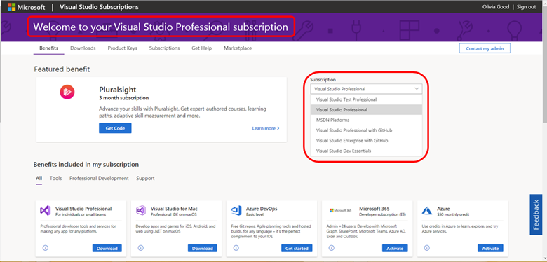
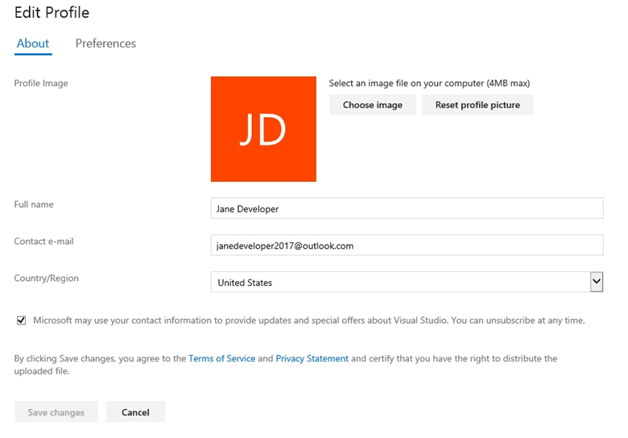
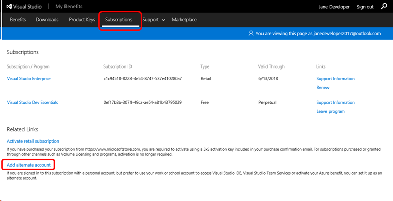

# Managing subscriptions

The Visual Studio [Subscriber Portal](https://my.visualstudio.com) gives you the ability to manage all your subscriptions and program memberships in a single place. You can make changes to your profile, use all of the benefits included with your subscriptions, and switch between subscriptions quickly and easily.

## Signing in to the portal

Welcome to your Visual Studio subscription!  Your subscription provides you with all the software and benefits you need to stay up on all things code, including software, monthly Azure credits, collaboration tools, training perks, support, and more—all the latest and greatest from Microsoft. In order to use the portal, you’ll need to sign in.

### First time access

The steps to use your subscription for the first time depend on how you obtained your subscription.

#### Microsoft Store

If you've purchased a Visual Studio subscription through the Microsoft Store, the activation steps can be initiated from the payment **Confirmation Page** or **Confirmation Email.**

1. On the “Confirmation Page” or in the “Confirmation Email”, click on **Click here to sign in**. You will be redirected to https://my.visualstudio.com/subscriptions/activate.
2. Enter the email address you'll use to sign in to the Subscriber Portal and click **Continue**.
3. Depending on the email address, you may be redirected to the Microsoft Account sign-in page, or your company/school's sign-in page.
4. Enter your password, or complete sign in requirements.
5. Enter the Product Key provided in your confirmation page or welcome email, and click **Activate**.

#### Work/School accounts

If your subscription was provided by your work/school, you will have received a welcome email.

1. Visit the [Subscriber Portal](https://my.visualstudio.com/)
2. Enter the email address that was assigned the new Visual Studio subscription. This address is also identified in the subscriber welcome email. Please check junk mail folders if the welcome email was not received.
3. Click **Continue**
4. You will be redirected to your corporate sign-in page.
5. Enter your password.
6. Click **Sign in**.

#### Visual Studio Marketplace

If you purchased a monthly or annual cloud subscription from the Visual Studio Marketplace, visit the [Subscriber Portal](https://my.visualstudio.com/) and sign in with the Microsoft Account (MSA) you provided when you purchased the subscription.

#### Using a work/school account with a Microsoft Account (MSA)

If your organization has an Azure Active Directory, but you don't have an Azure Active Directory account you may need to leverage the **personal** options provided during the sign in process.

1. Please go to the [Subscriber Portal](https://my.visualstudio.com)
2. Enter the email address that was assigned the new Visual Studio subscription. This address is also identified in the subscriber **Welcome Letter**. (Check your junk mail folders if you didn't receive the welcome email.)
3. Click **Continue**
4. You will be redirected to a **Decision Page**.  Select **Work or school account** if your subscription is assigned to a **Work or school** account associated with an Azure Active Directory (AAD) tenant. Select **Personal** if the subscription is associated with a **corporate** email address, but has also been converted to a **personal** Microsoft Account (MSA)
5. Enter your password
6. Click **Sign in**

## Managing multiple subscriptions

The Visual Studio subscriptions portal brings together all your Visual Studio subscriptions and programs in a single improved portal experience. For example, you might have a standard subscription such as Visual Studio Enterprise through work, and a monthly Visual Studio Professional subscription or Visual Studio Dev Essentials membership you use at home.

### Which subscription am I using?

On the Benefits page, the subscription in use will be prominently displayed in the blue banner. It's also displayed in the upper-right of the page.
> [!div class="mx-imgBorder"]
> 

### To switch between subscriptions, you can:

- Click on the drop-down in the top right and choose the subscription from the list
- Click on the Subscriptions tab and then click on the desired subscription
  > [!div class="mx-imgBorder"]
  > 

### If your subscription is not visible...

- It may be expired. Only active subscriptions are displayed in the Subscriber Portal.
- It may be associated with a different email address. For example, if you sign in to a Visual Studio Professional subscription with your work/school email and have a Visual Studio Dev Essentials membership associated with your Microsoft Account, you will only see the subscription corresponding to the email address you used to sign in to the Subscriber Portal. To see the other subscription, you will need to sign out, and then sign in with the other email address.
- If your company buys subscriptions through a Volume License, your admin may not have assigned a subscription to you or may have reassigned your subscription to another user.

## Renewing my subscriptions

**Standard subscriptions**

- Microsoft Store: If you purchased your subscription from the [Microsoft Store](http://www.microsoft.com/store), you can renew it there as well.
- Volume License:  If your company buys subscriptions through a Volume License, your admin should contact a reseller to renew your subscriptions.

**Cloud subscriptions:**  Cloud subscriptions don't need to be renewed. As long as your subscription is paid, it will remain active.

**Subscriptions acquired through programs:**  If you get your subscription through a program, your subscription is tied to your participation in the program. Please reach out to your program contacts for additional information.

- [Imagine](https://imagine.microsoft.com/about)
- [BizSpark](https://bizspark.microsoft.com/About/Offers)
- [Microsoft Partner Network](https://partner.microsoft.com/en-us)
- [Microsoft Certified Trainer](https://www.microsoft.com/en-us/learning/mct-certification.aspx)

**Visual Studio Dev Essentials:**  Dev Essentials is a free program, and memberships do not expire.

## Transferring subscriptions

If your subscription was purchased through Microsoft Volume Licensing and you need to re-assign it to someone else within the organization, your administrator will need to do this for you.
Retail subscriptions can be transferred to another user by contacting Customer Service. Complimentary or “Not For Resale” subscriptions cannot be transferred.

## Managing my profile

The subscriptions portal lets you create and manage a profile, making subscriptions management easy. You can make changes to your identity information, and you can associate your subscriptions with other sign-in identities from existing Azure accounts or Azure DevOps organizations using alternate identities.

### Changing profile information

You can easily change the contact information and preferences in your profile.

1. Click on your name in the upper right corner of the Subscriber Portal.
2. Click the **Edit profile** button.
3. On the **About** tab, you can change your name, email, country/region, profile picture and contact preferences. On the **Preferences** tab, you can select your preferred language, date and time patterns, time zone, and user interface theme.
4. When you’ve finalized your changes, click **Save**.
5. Click your browser's **back** button to return to the Benefits page.

   > [!div class="mx-imgBorder"]
   > 

### Setting communications preferences
If you would like to receive periodic updates about your subscription and benefits, including the monthly Visual Studio Subscriptions newsletter, [update your preferences](https://app.vsaex.visualstudio.com/me?workflowID=devprogram&tab=edit) by checking the box for Visual Studio Subscriptions in your Visual Studio profile. You can change these preferences and unsubscribe at any time. 
   
### Linking my subscription to existing Azure DevOps Services or Azure subscriptions

If you sign in to your subscription using a personal Microsoft account (MSA) and have a subscription that includes Azure DevOps Services or Microsoft Azure using a work or school account managed by Azure, you can link the two subscriptions. This is called an "alternate account" and allows you to keep using your MSA to sign in to your subscription while having access to existing Azure, Azure DevOps Services or IDE resources that are associated with your school or work accounts.

Even if both accounts use the same email address, you need to add your work/school account as an alternate to use your benefits across both accounts.

To add an alternate account:

1. Sign in to the [Subscriber Portal](https://my.visualstudio.com?wt.mc_id=o~msft~docs) with your Microsoft Account (MSA).
2. Click on the **Subscriptions** tab.
3. Under **Related Links**, choose **Add alternate account**.
4. Enter your work/school account email address and click **Add**.

   > [!div class="mx-imgBorder"]
   > 

Once you have added an alternate account, you can update or remove it at any time by clicking the **Subscriptions** tab and choosing the appropriate option in the **Related Links** section.

## Frequently asked questions

### Q: If I do not renew my subscription, how long will Microsoft keep my data?

A: Depending on the purchasing channel, Microsoft maintains customer data for different lengths of time.

| Channel                                                | Duration (days) |
|--------------------------------------------------------|-----------------|
|    Retail (e.g. through Microsoft Store)               |    360          |
|    Volume Licensing Service Center (VLSC)              |    180          |
|    Microsoft Products and Services Agreement (MPSA)    |    180          |
|    Visual Studio Cloud Subscriptions                   |    180          |
|    Program (e.g. MCT, BizSpark, MPN, Imagine)          |    180          |
|    Not For Resale (e.g. MVP, MSP)                      |    180          |
|    DevEssentials                                       |    30           |

> [!NOTE]
> - If you choose to close your Microsoft Account or Azure AD, your personal data will be anonymized immediately.
> - We will not fully remove all your personal data if you have active subscriptions.
