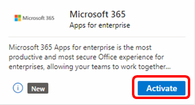

# Microsoft 365 apps for enterprise in Visual Studio subscriptions

Microsoft 365 apps for enterprise (formerly Office 365 Pro Plus) is available in selected Visual Studio subscriptions. 

Create your best work. Work anywhere with apps that are always updated. Microsoft 365 apps for enterprise is a subscription that comes with premium apps like Word, Excel, PowerPoint, OneNote, Outlook, Publisher, and Access. (Publisher and Access available on PC only). The apps can be installed on multiple devices, including PCs, Macs, iPads, iPhones, Android tablets, and Android phones. With a subscription, you get the latest versions of the apps and automatically receive updates when they happen.

> [!NOTE]
> When it's included in your Visual Studio subscription, you're licensed to use Microsoft 365 apps for enterprise for production use. The subscription lasts for 12 months, so if your Visual Studio subscription runs longer than one year, the Microsoft 365 apps for enterprise offer might expire before your subscription ends, depending on the activation date of the benefit.

## Activation steps

The process for activating your Microsoft 365 apps for enterprise subscription is simple. Follow these steps to activate your subscription and install your applications:

1. Sign in to your Visual Studio subscription at [https://my.visualstudio.com](https://my.visualstudio.com/benefits?wt.mc_id=o~msft~docs)
1. Locate the Microsoft 365 apps for enterprise tile and select **Get code**.
1. Select **Activate**.
   > [!div class="mx-imgBorder"]
   > 

1. In the "Welcome, let's get to know you" dialog, provide the requested personal contact information and then select **Next**.
   > [!div class="mx-imgBorder"]
   > 

1. In the "Create your user ID" dialog, create your username and password for your tenant, then select **Create my account**.
   > [!div class="mx-imgBorder"]
   > 

1. Next, you're asked to provide a code to prove you're not a robot. You can have the code sent to you as a text message. Enter the code and select **Next**. 
   > [!div class="mx-imgBorder"]
   > 

1. After your account has been successfully created, you'll see a dialog displaying the sign-in page for the Office portal, and your new user ID. Make note of this information for your later use, and select **Start Setup** to begin installing your Microsoft 365 apps.
   > [!div class="mx-imgBorder"]
   > 

1. You are into the Office portal, and you're now ready to install your applications. Select the **Install** button to get started.
   > [!div class="mx-imgBorder"]
   > 
1. Follow the prompts to install your selected apps.  

## Eligibility

| Subscription Level | Channels | Benefit | Renewable? |
|--------------------|----------|---------|------------|
| Visual Studio Enterprise (Standard)   | VL, Azure, Retail| 12-month trial |  No |
| Visual Studio Enterprise subscription with GitHub Enterprise  | VL | 12-month trial |  No |
| Visual Studio Enterprise (Standard)   | NFR \* | Not available |  N/A |
| Visual Studio Professional (Standard) | VL, Azure, Retail | Not available |  N/A |
| Visual Studio Professional subscription with GitHub Enterprise | VL | Not available | N/A |
| Visual Studio Test Professional (Standard) | VL, Retail | Not available |  N/A |
| MSDN Platforms (Standard) | VL, Retail | Not available |  N/A |
| Visual Studio Enterprise, Visual Studio Professional (monthly cloud) | Azure | Not available | N/A |
| Visual Studio Dev Essentials | my.visualstudio.com | Not available | N/A |
|  |

\* Includes: Not for Resale (NFR), Visual Studio Industry Partner (VSIP), Microsoft Cloud Partner Network (formerly MPN), FTE, MCT Software & Services Developer, Most Valuable Professional (MVP), Regional Director (RD), Imagine, Microsoft Partner Network.*

> [!NOTE]
> Microsoft 365 apps for enterprise is no longer included in Visual Studio Dev Essentials memberships.  

> [!NOTE]
> Microsoft no longer offers Visual Studio Professional Annual subscriptions and Visual Studio Enterprise Annual subscriptions in Cloud Subscriptions. There will be no change to existing customers experience and ability to renew, increase, decrease, or cancel their subscriptions. New customers are encouraged to go to [https://visualstudio.microsoft.com/vs/pricing/](https://visualstudio.microsoft.com/vs/pricing/) to explore different options to purchase Visual Studio.

Not sure which subscription you're using? Connect to [https://my.visualstudio.com/subscriptions](https://my.visualstudio.com/subscriptions?wt.mc_id=o~msft~docs) to see all the subscriptions assigned to your sign-in email address. If you don't see all your subscriptions, you might have one or more assigned to a different sign-in email address. You need to sign in with that email address to see those subscriptions.

## Frequently asked questions

### Q: I have a three year Visual Studio subscription. Is the Microsoft 365 apps for Enterprise benefit available for the full length of that subscription?
A:  No. The Microsoft 365 offer is a 12-month trial. You can activate it at any time within the term of your Visual Studio subscription. 

## Support resources

+ For technical support with any component of Microsoft 365 apps for enterprise, visit https://support.microsoft.com/all-products and select the product.
+ For assistance with sales, subscriptions, accounts, and billing for Visual Studio Subscriptions, contact Visual Studio [Subscriptions Support](https://aka.ms/vssubscriberhelp).
+ Have a question about Visual Studio IDE, Azure DevOps or other Visual Studio products or services?  Visit [Visual Studio Support](https://visualstudio.microsoft.com/support/).

## See also

+ [Visual Studio documentation](/visualstudio/)
+ [Azure DevOps documentation](/azure/devops/)
+ [Azure documentation](/azure/)
+ [Microsoft 365 documentation](/microsoft-365/)

## Next steps

To make the most of your Visual Studio subscription, activate these great benefits:
+ [Visual Studio](vs-ide-benefit.md)
+ [Azure DevOps](vs-azure-devops.md)
+ [Azure DevTest offer / credits](/azure/devtest/offer/)
If you're planning to develop applications for Office, activate your [Office Developer Subscription](./vs-m365.md)
