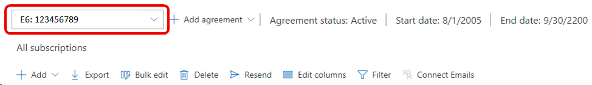
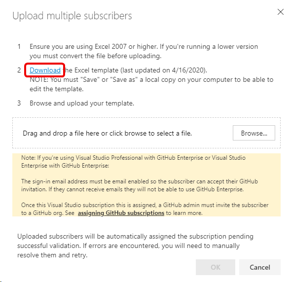
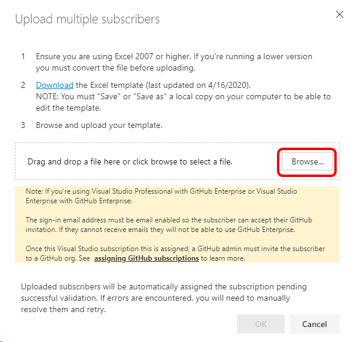

# Migrate subscriptions from one agreement to another

If you have Visual Studio subscriptions assigned as part of one agreement and your company purchases a new agreement, you might need to migrate subscribers from the current agreement to the new one. This article explains how to move your assigned subscriptions to the new agreement. 

When you move your subscribers to the new agreement, here's what happens:
+ They get a new subscription GUID.
+ Their benefits are reset. For example, if they already used a training benefit, they receive a new instance of that benefit. 
+ If they used Azure individual credits in their old subscription, they need to activate a new subscription and transfer their Azure assets to it. 

The process for moving subscribers to the new agreement consists of three steps:
1. Export your current subscription assignments from the old agreement. 
2. Prepare a subscription list for upload to the new agreement.
3. Upload your subscription list to the new agreement.

> [!IMPORTANT]
> Note the following considerations before you start this process:
> + If your reseller selected the option to automatically transfer the subscribers to the new agreement when it was purchased, you might not see the changes until 48-72 hours after the agreement was submitted. Before you proceed with the process to manually move your subscribers, check with your reseller. 
> + You can use Microsoft Entra groups to simplify the process of moving subscribers to the new agreement. 

## Export your current subscription assignments

The first step to migrate your assigned subscriptions from one agreement to another is to export your current subscription assignments as a CSV file. In the Visual Studio Subscriptions admin portal, you can export a list of your subscribers and details about their assignments. 

This information includes: 
+ Subscriber name
+ Email address
+ Notification email address 
+ Subscription level
+ Assigned date
+ Expiration date
+ Reference field
+ Whether downloads are enabled
+ Country/region
+ Language
+ Subscription status
+ Subscription GUID

The list is exported as a CSV file that you can easily open in Microsoft Excel so you can prepare it for uploading to the new agreement.

To export your assigned subscriptions:
1. Sign in to the [admin portal](https://manage.visualstudio.com).
2. Select the **Export** tab.
3. A CSV file downloads to your computer. The name of the file reflects the name and type of your current agreement and the date the file was created.  

   > [!div class="mx-imgBorder"]
   > 

## Prepare your subscription list for upload to the new agreement

Take these steps to open your exported subscriptions list and move the relevant data to a template for upload to the new agreement:
1. Locate and open the file that was created when you exported your subscriptions list. You should see the following column names and their associated data:
   + **Subscriber Name**
   + **Email**
   + **Notification Email Address**
   + Microsoft Entra group
   + **Subscription Level**
   + Assigned
   + Activated 
   + Expiration Date (UTC)
   + **Reference**
   + **Downloads**
   + **Country**
   + **Language**
   + Subscription Status
   + **Subscription GUID**
   + Usage Status
 
   Not all the fields in the exported CSV file are needed in the file used to upload your subscriptions to the new agreement. The fields appearing in **bold** in the previous list appear in the template used to upload your list. 

2. Download the Excel template that you use to upload your subscriptions. 
   1. Sign in to the [admin portal](https://manage.visualstudio.com).
   1. On the **Manage Subscribers** tab, select your new agreement in the dropdown list:
      > [!div class="mx-imgBorder"]
      > 
   1. Select **Add** and then select **Bulk add**.
   1. The **Upload multiple subscribers** dialog appears. 
   1. Under step 2, select the **Download** link to download the template. 
      > [!div class="mx-imgBorder"]
      > 
   
      The template appears in your Downloads folder. 
   1. Open the template.

3. Open both the exported subscriber list and the empty bulk add template. Manually copy your subscription data from the exported list and paste it into the template. 

   > [!NOTE]
   > The order of the columns in the exported subscriber list is different from the order in the template. The names of the columns also differ slightly. The following table shows the names of the fields that are common to both spreadsheets:

   | Export list                | Bulk add template  |
   |----------------------------|--------------------|
   | Subscriber Name            | Name               |
   | Email                      | Sign-in Email      |
   | Notification Email Address | Notification Email |
   | Subscription Level         | Subscription Level |
   | Reference                  | Reference          |
   | Downloads                  | Downloads          |
   | Country                    | Country            |
   | Language                   | Language           |
 

   > [!IMPORTANT] 
   > Do not copy data from the **Subscription GUID** column into the bulk add template. Leave that column blank in the Bulk add template. Adding the GUIDs will cause the upload to fail.

   > [!TIP]
   > If you have a lot of subscribers, you might find it helpful to use keyboard shortcuts when you're copying and pasting data. 
   > To select all the entries in a column like "Subscriber Name", select the first entry in the column (not the column heading), select and hold **Ctrl+Shift**, and then select the Down arrow key. This will select all the data in that column. 

4. When all your data is moved to the bulk add template, save the template and close it. This list is the subscription list that you upload to your new agreement.

## Upload your subscription list to the new agreement

1. In the [admin portal](https://manage.visualstudio.com), if the **Upload multiple subscribers** dialog is still open, select the **Browse** button. Go to the location where you saved your subscription list, select it, and then select **Open**. (If the dialog isn't open, choose **Add**, and then select **Bulk add**.)
    > [!div class="mx-imgBorder"]
    > 
0. The name of your subscription list appears in the **Upload multiple subscribers** dialog. Select **OK** to upload the file. In the admin portal, you might briefly see a status message stating that a file is being uploaded. When the upload is complete, you see the message **Subscribers updated successfully**.
The migration of your subscribers from your old agreement to your new one is complete. 
  > [!NOTE]
  > After you add your subscribers to your new agreement, you should remove them from your old agreement. Removing them will prevent them from getting notifications about their old subscriptions.

## Resources

For help with managing Visual Studio subscriptions, see [Visual Studio Subscription support](https://aka.ms/vsadminhelp).

## See also

+ [Visual Studio documentation](/visualstudio/)
+ [Azure DevOps Services documentation](/azure/devops/)
+ [Azure documentation](/azure/)
+ [Microsoft 365 documentation](/microsoft-365/)

## Next steps

+ [Edit existing subscriptions](edit-license.md)
