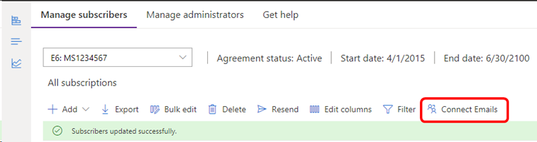
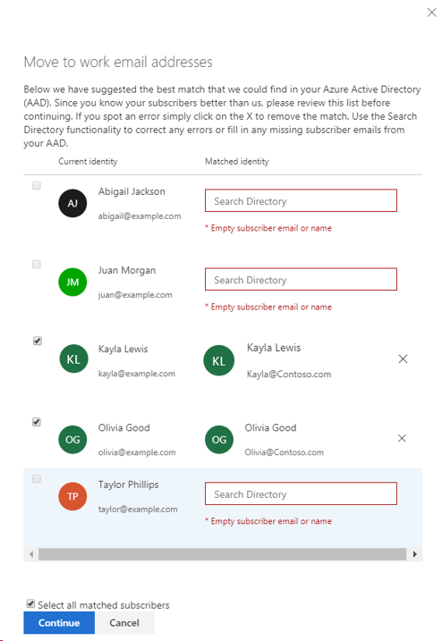

# Why do I see personal accounts for my subscribers?

After companies migrated from the Volume Licensing Service Center (VLSC) to the new Visual Studio [Subscriptions Admin Portal](https://manage.visualstudio.com), admins were surprised to find that the "Sign-in Email Address" for some subscribers shows a personal email address like Hotmail or Outlook. 

## Cause

This scenario occurs due to sign-in processes that were associated with the legacy Microsoft Developer Network (MSDN) subscriber experience. Users were migrated from the Volume License Service Center (VLSC) to the Visual Studio Subscriptions Admin Portal without modifications. Admins might not know that users are using personal accounts to access their subscription benefits. Before the Visual Studio subscriber migrations, which were completed in 2016, there were two actions required to successfully use a Visual Studio Subscription:
1. The admin "assigned" the subscription to an individual subscriber, using their work or school email address.
2. The subscriber "activated" the subscription.

During the subscriber activation process, a Microsoft Account (MSA) was required to sign-in. If the subscriber didn’t attempt to make their work or school account (example: 'tasha@contoso.com') an MSA, they could create a new MSA or use an existing one. Use of a personal email resulted in their "Sign-in Email Address" being different than their "Assigned to Email Address."

> [!NOTE]
> The modern subscriber experience on [https://my.visualstudio.com](https://my.visualstudio.com?wt.mc_id=o~msft~docs) supports both Work/School and Microsoft Account (MSA) identity types.

## Solution

To correct the problem, select the **Connect Emails** button. The system attempts to match the accounts with MSAs to existing users in your organization’s Microsoft Entra ID based on matching the first and family name. If there's an error, you can remove any match by selecting the **X** to the right of the match. 

Watch this video or keep reading to learn how to fix this problem. 

> [!VIDEO https://learn-video.azurefd.net/vod/player?id=5a397f88-8287-42d3-ac7f-903298ce500c]

> [!div class="mx-imgBorder"]
> 

You can also use the **Search Directory** to correct the errors or fill in missing information from your Microsoft Entra ID. If the all the matches look correct, you can choose the **Current identity** button to select all matched entries rather than selecting them one at a time. 

> [!div class="mx-imgBorder"]
> 

Next select on **Continue** which takes you to a list of the changes to take place. If you agree, select **Save** and the changes are made. Your subscriber will also get a message informing them of the change the next time they sign in to their subscription. Notice that only the two subscribers that were matched in the Microsoft Entra ID appear in this list. In our example, since Frederick didn't have a corresponding address in the Microsoft Entra ID, the Microsoft account (MSA) wasn't matched to a work account. 

## What happens when I update a Visual Studio subscriber's sign-in address?

> [!NOTE]
> When you edit the sign in email address, this updates the email used by the subscriber to sign in to their subscription on https://my.visualstudio.com. Subscribers can use the newly updated email address going forward when activating benefits. For previously activated benefits, continue reading below for more information about which email address a subscriber should use.

## Impact on Benefits

If you, the admin, changed the sign-in email address on a subscription, subscribers should use this new email address for any new benefit activations. Refer to the chart below for insights on any currently active benefits that might be impacted.

| Benefit Name | Use updated email address? | If subscriber hasn't activated the benefit yet | If subscriber activated with the previous sign-in email address | If the subscriber is using an alternate email address |
|--------------|----------------------------|-------------------------------------------------|-----------------------------------------------------------------|------------------------------------------------------|
| **Power BI Pro** **Microsoft 365 apps for Enterprise** **DataCamp - 3-month subscription** **CODE Magazine** | No  | Use new sign-in email address to activate. | Continue using the old email address for access. | N/A |
| **Pluralsight** **Cloud Academy** **Dometrain** **DevForge** | No | Access can be created using any email address. Once it's created, it will not change even if an admin updates the subscriber's sign in email. | Access can be created using any email address. Once it's created, it will not change even if an admin updates the subscriber's sign in email. | Access can be created using any email address. Once it's created, it will not change even if an admin updates the subscriber's sign in email. |
| **Visual Studio LIVE! Events discount** | No | No email address is needed. | No email address is needed. | No email address is needed. |
| **GitHub Enterprise** | No\* | This benefit is set up by the GitHub admin in your org. Subscribers should use the email address where their invitation was sent. | This benefit is set up by the GitHub admin in your org. Subscribers should use the email address where their invitation was sent. | This benefit is set up by the GitHub admin in your org. Subscribers should use the email address where their invitation was sent. |
| **Visual Studio IDE** **Azure DevOps** **Azure dev/test monthly credit** **Azure Dev/Test PAYG subscription (Unlimited)** | Yes | Use new sign-in email address to activate. | Use the new sign-in email address to continue accessing. | Continue using alternate email address. |
| **TFS License** **TFS CAL** **Visual Studio App Center** **Windows Developer Account** **Microsoft 365 Developer** **Microsoft R Server** **Most Microsoft Server trials** **Microsoft Office Pro Plus 2021, Project, Visio** **Windows, Windows Server, Windows Embedded, SQL Server** **SharePoint, Exchange, Dynamics & other MS** **Technical Support** **Developer Community Forums** **Azure Community Forum** **Online Concierge Chat** **Code Search (included as Basic license)** **Exploratory Testing (included in Basic license)** **Azure Artifacts** **C# Dev Kit for VS Code** **Azure Test Plans** | Yes  | Use new sign-in email address to activate. | Use the new sign-in email address to continue accessing. | N/A |

\* *Note: This benefit is set up by the GitHub Admin. To determine the email address to use, get in touch with the GitHub Admin.* 

## Support resources

For assistance with the administration of Visual Studio Subscriptions, contact [Visual Studio subscriptions support](https://aka.ms/vsadminhelp).

## See also

+ [Visual Studio documentation](/visualstudio/)
+ [Azure DevOps Services documentation](/azure/devops/)
+ [Azure documentation](/azure/)
+ [Microsoft 365 documentation](/microsoft-365/)

## Next steps

+ If you update the subscribers' email addresses, you might want to notify them that their sign-in information changed. They receive an email with the updated information.
+ It might be useful to [filter the list of subscribers](search-license.md) in your organization to look for any sign in email addresses that might need to be changed.
