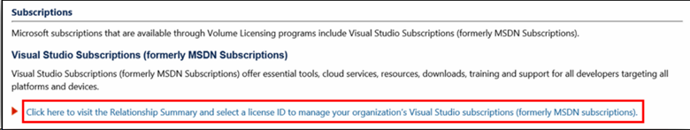

# Onboarding to the Visual Studio Subscriptions Administration Portal After Your Organization Was Migrated 

If you managed Visual Studio Subscriptions in the Volume Licensing Service Center (VLSC) and have recently visited the site to manage subscriptions, you will notice that subscription management is no longer available in the VLSC. Your process to manage subscriptions would have looked like this:

Upon arriving at the subscriptions page, you’d likely click the link the below. 

This previously would’ve taken you to the page where you could manage subscriptions.   However, subscriptions are now managed via a new portal called the Visual Studio Subscriptions Administration Portal.  There are several steps that need to be taken by the Primary or Notices Contact for your organization’s Volume Licensing agreement. In the event that the Primary or Notices Contact didn’t complete this process or is no longer available, there are a few scenarios that may occur. The following will direct you through the steps to take to gain access to managing subscriptions. 

You may encounter one of several scenarios:
1.	[The Primary Contact didn’t complete the onboarding process](#Onboarding-not-completed-by-Primary-Contact)1 
2.	[The Primary Contact completed onboarding, but didn’t add you as an administrator.  Your credentials were listed in VLSC.](#Primary-Contact-did-not-provide-you-administrator-access) 
3.	[The Primary Contact completed onboarding, but didn’t add you as an administrator and your credentials were not listed in the VLSC](#Your-credentials-were-not-listed-in-VLSC-prior-to-migration)  

1 If you are the Primary or Notices Contact and didn’t complete the onboarding process, you will need to follow the steps in scenario one in order to set up your organization. 

Following will be examples of the screens you can expect to see and the steps that you can take, for each of the scenarios. 

## Onboarding not completed by Primary Contact

If the Primary Contact didn’t complete the onboarding experience, you can expect to see the screen below. If you have access to the [Volume Licensing Service Center (VLSC)](https://www.microsoft.com/Licensing/servicecenter/default.aspx) then you will be able to complete this process and gain access to manage subscriptions. You’ll need your organization’s [Public Customer Number (PCN)](find-pcn.md) which can be found in the VLSC. 

If the Primary Contact didn’t complete the onboarding process, simply enter the [PCN](find-pcn.md) in the field and select “Send invitation”. 

Once you’ve clicked the button to send the invitation, you’ll receive an email with a unique link to complete the onboarding process. You’ll need to click the link in the email, sign-in with your email address and once again, enter the PCN. The unique link in the email is what enables you to gain access to the Visual Studio Subscriptions Administration Portal. You will then be able to access and manage subscriptions. 

## Primary Contact did not provide you administrator access

If your Primary Contact completed the onboarding process and your credentials were previously in the VLSC, but the Primary Contact didn’t provide you with access, you’ll see the following notification when signed into the [Visual Studio Subscriptions Administration Portal](https://manage.visualstudio.com/).  To become an administrator, you will need to contact one of your organization’s super admins listed on the screen.

## Your credentials were not listed in VLSC prior to migration

If your Primary Contact completed the onboarding, but didn’t add you as a user and your credentials were not previously listed in the VLSC, you’ll see the below notification when attempting to access the [Visual Studio Subscriptions Administration Portal](https://manage.visualstudio.com/). You’ll need to reach out to your [Primary Contact](find-primary-contact.md) to gain access to the portal. 

