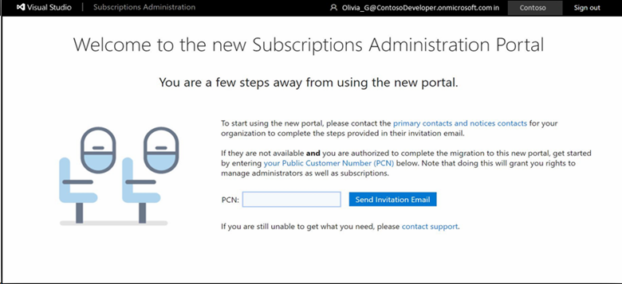
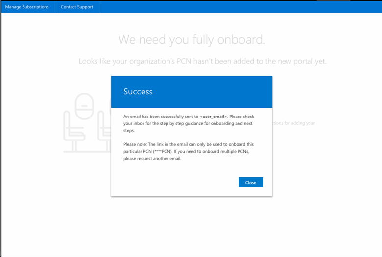
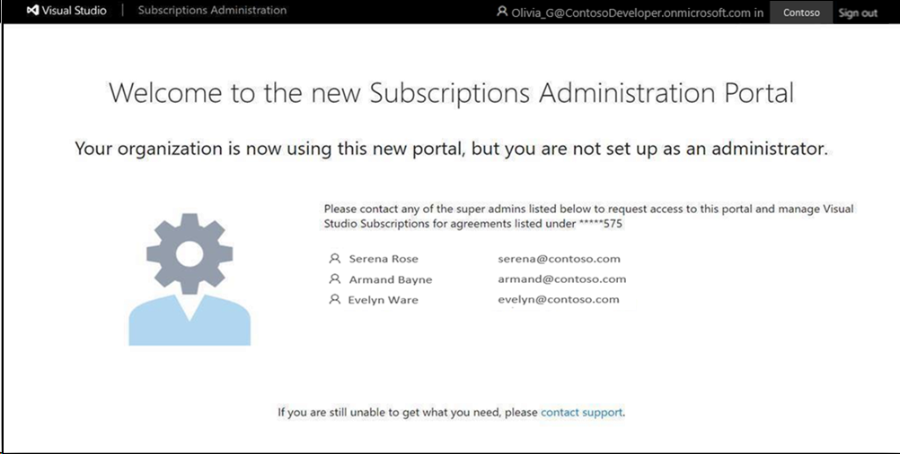
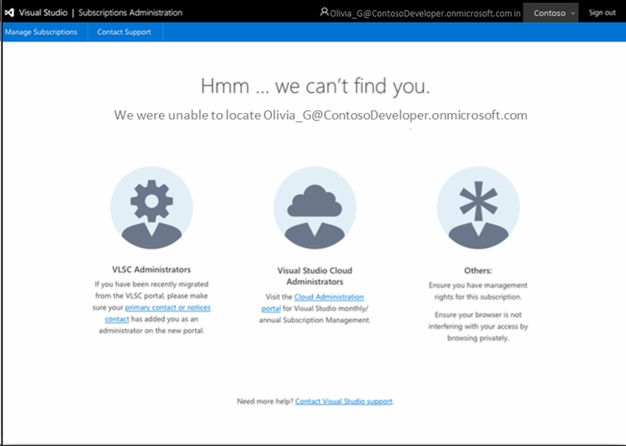

# Onboard to the Visual Studio Subscriptions Administration Portal after your organization is migrated

If you managed Visual Studio subscriptions in the Microsoft Volume Licensing Service Center (VLSC), and have recently visited the site to manage subscriptions, you will notice that subscription management is no longer available in the VLSC. Your process to manage subscriptions would have looked like this:
> [!div class="mx-imgBorder"]
> 

However, subscriptions are now managed via a new portal called the Visual Studio Subscriptions Administration Portal. Typically, the primary or notices contact for your organization's volume licensing agreement completes this process. If not, the following information helps you gain access to managing subscriptions.

You might encounter one of several scenarios:

1. [The primary contact didn’t complete the onboarding process.](#onboarding-not-completed-by-primary-contact)
2. [The primary contact completed onboarding, but didn’t add you as an administrator. Your credentials were listed in VLSC.](#primary-contact-did-not-provide-you-administrator-access)
3. [The primary contact completed onboarding, but didn’t add you as an administrator. Your credentials were not listed in the VLSC.](#your-credentials-were-not-listed-in-vlsc-prior-to-migration)

1 If you are the primary or notices contact and didn’t complete the onboarding process, you will need to follow the steps in scenario one in order to set up your organization.

The following sections provide more details about each of these scenarios.

## Onboarding not completed by primary contact

If the primary contact didn’t complete the onboarding experience, you see the following screen. If you have access to the [Volume Licensing Service Center (VLSC)](https://www.microsoft.com/Licensing/servicecenter/default.aspx), you can complete this process and gain access to manage subscriptions. You’ll need your organization’s [public customer number (PCN)](find-pcn.md), which can be found in the VLSC.

In the PCN field, enter the [PCN](find-pcn.md), and select **Send Invitation Email**.
> [!div class="mx-imgBorder"]
> 

You receive an email with a unique link to complete the onboarding process. Click the link in the email, sign-in with your email address, and once again, enter the PCN. The unique link in the email is what enables you to gain access to the Visual Studio Subscriptions Administration Portal. You can then access and manage subscriptions.
> [!div class="mx-imgBorder"]
> 

## Primary contact did not provide you administrator access

If your primary contact completed the onboarding process and your credentials were previously in the VLSC, but the primary contact didn’t provide you with access, you see the following notification. To become an administrator, contact one of your organization’s super admins listed on the notification.
> [!div class="mx-imgBorder"]
> 

## Your credentials were not listed in VLSC prior to migration

If your primary contact completed the onboarding, but didn’t add you as a user and your credentials were not previously listed in the VLSC, you see the following notification. Reach out to your [primary contact](find-primary-contact.md) to gain access to the portal.
> [!div class="mx-imgBorder"]
> 
