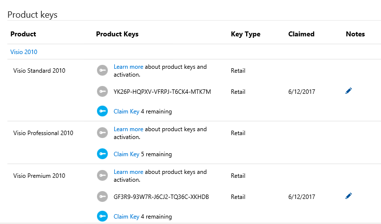

# Using product keys in Visual Studio subscriptions

Visual Studio subscriptions provide access to a wide range of Microsoft products for designing, developing, testing, and demonstrating applications. Some of these products require product keys during installation, and some of those require activation.

Visual Studio subscriptions typically include five product keys for current versions of Windows and Office products, and three keys for older versions.

Most product keys also allow multiple activations of the product for each key.  Many products also allow you to install and use the product for 30 days or more without activation.  For most subscribers, this provides more than enough activations to meet their needs.  However, if you have exhausted the available activations for a product, you can submit a request for additional keys through Visual Studio [Subscriptions Customer Service](https://visualstudio.microsoft.com/subscriptions/support/).

## Activating a product
Activation is required for certain products.  Generally, in Visual Studio subscriptions this is limited to Windows, Windows Server, Microsoft Office client applications, and Expression Studio. When activation is required, many products — including Windows and Office — allow you to install and use the product without activation for 30 days or more. If you re-image your computers frequently (at least once every 30 days), consider NOT activating the product. Product keys supplied as part of your Visual Studio subscription do not allow unlimited activations of a product.

If you’ve claimed all the available product keys under your subscription and have used up all the available activations, you can request additional keys by contacting your local Visual Studio Subscription [Customer Service Center](https://visualstudio.microsoft.com/subscriptions/support/). Requests will be considered on a case-by-case basis. If approved, product keys will be accessible in [Downloads](https://my.visualstudio.com/downloads).

## Retail and Volume Licensing versions of products
Visual Studio subscriptions offer a selection of retail and Volume Licensing versions of Microsoft products. Certain products are available from Downloads only in their retail version or only in their Volume Licensing version; some are available in both versions. Generally, products requiring activation, such as Windows, Windows Server, and Office client products, are only offered in their retail version through Downloads.

Volume Licensing customers can also download software from the Volume Licensing Service Center (VLSC) to get Volume Licensing versions of products (and the corresponding product keys).  Access to the VLSC is managed by designated administrators within the customer’s organization.

## Daily product key claim limits
Microsoft is committed to protecting the integrity of the Visual Studio subscriptions program and the value of the software and benefits that the program’s legitimate subscribers receive for their investment. In support of this commitment, Microsoft has implemented daily key claim limits for Visual Studio subscriptions. Daily key claim limits restrict the number of keys that can be claimed per day per subscription.

The daily key claim limit is 10 keys for all Visual Studio subscriptions, including those offered through MPN, BizSpark, MCT Software & Services, and MCT, with the exception of Visual Studio Professional (MPN), which has a daily key claim limit of 7 keys.

Note: Key claim limits are subject to change. Please check here for the most up-to-date limits.

If you have claimed the maximum number of keys available for your subscription within a 24-hour period, you will see an error telling you that your limit has been reached. The limit resets every 24 hours, starting at 12:01 AM Pacific Time.

Our research shows that most subscribers are covered by the number of product keys included in their subscription. If you need additional keys, you can submit a request through Visual Studio Subscription [Customer Service](https://visualstudio.microsoft.com/subscriptions/support/) and it will be considered for approval on a case-by-case basis.

## Locating and claiming product keys
You must be signed in to your Visual Studio subscription to view your product keys. Individual product keys are found by selecting the blue **Get Key** link for a particular product on the [Downloads](https://my.visualstudio.com/downloads) page as shown below.  All keys are also available in aggregate on the [Product Keys](https://my.visualstudio.com/productkeys?wt.mc_id=o~msft~docs) page. When multiple keys exist for a single product, notes will be displayed on the Notes column for the download to assist you in identifying which key should be used.
> [!div class="mx-imgBorder"]
> 

Some products bundle multiple editions of the product into a single download. In these cases, the product key entered determines which edition of the product is installed.
Some keys are provided automatically, such as “static” keys, which you can use as many times as needed because activation is not required. Other keys must be claimed by selecting the **Get Key** link for the product.

A variety of key types are available, depending on the product.

### Product key types

|    Key Type           |    Description                                                                                                                                                                                                           |
|-------------------------------|------------------------------------------------------------------------------------------------------------------------------------------------------------------------------------------------------------------------------------------------------------|
|    Not Applicable                    |    No key is needed to install this product.                                                       |
|    Retail                     |    Retail keys allow multiple   activations and are used for retail builds of the product. In many cases, 10   activations are allowed per key, though often more are allowed on the same   machine.                                                       |
|    Multiple Activation        |    A Multiple   Activation Key (MAK) enables you to activate multiple installations of a   product with the same key. MAKs are generally used with Volume Licensing   versions of products. Typically, only one MAK key is provided per   subscription.    |
|    Static Activation   Key    |    Static activation   keys are provided for products that do not require activation. They can be   used for any number of installations.                                                                                                                  |
|    Custom Key                 |    Custom keys provide   special actions or information to activate or install the product.                                                                                                                                                                |
|    VA 1.0                     |    These are multiple   activation keys, similar to a MAK.                                                                                                                                                                                                 |
|    OEM Key                    |    These are Original   Equipment Manufacturer keys that allow multiple activations.                                                                                                                                                                       |
|    DreamSpark Retail   Key    |    These retail keys   are for DreamSpark and allow one activation. DreamSpark Retail keys are   issued in batches and are primarily intended for student consumption.                                                                                     |
|    DreamSpark Lab Key         |    These lab use keys   are for DreamSpark programs and allow multiple activations. DreamSpark Lab   Keys are intended for use in university computer lab scenarios.                                                                                       |
|    DreamSpark MAK Key         |    These are MAK keys   for DreamSpark program customers.                                                                                                                                                                                                  |
|

You can claim a key from the download page for the product, or you can search for the key you need on the [Product Keys](https://my.visualstudio.com/productkeys) page.

### Claiming product keys
Only subscribers with active subscriptions can download products and claim product keys.  You can export your claimed keys from the [Product Keys](https://my.visualstudio.com/productkeys) page while your subscription is active.

To claim a product key:
1. Sign in to your Visual Studio subscription.  You must be signed in to download products or claim product keys.
2. Click on the [Product Keys](https://my.visualstudio.com/productkeys?wt.mc_id=o~msft~docs) tab.
3. Product keys are listed alphabetically by the name of the product.  You can either scroll down to the name of the desired product, or search for it using the search bar at the top of the page.
   > [!div class="mx-imgBorder"]
   > 

In this example, we’ve used the search bar to locate a product key for Visio 2010.
As you can see, there are several versions of Visio 2010 listed.  One key each has already been claimed for Visio Standard 2010 and Visio Premium 2010, and both have four keys remaining.  The keys that were claimed are both retail keys, and are displayed on the page.  Notice that you can record a brief note about claimed keys in the **Notes** column.  You can use this in conjunction with the date in the **Claimed** column to keep track of the keys you’ve claimed.  You might, for example, make notes when you activate an installation of the product using the key.

### Exporting your claimed keys
You can export a list of all the keys you have claimed, along with a large selection of static and other keys that are automatically marked as “claimed” for you.

> [!IMPORTANT]
> If your subscription expires, you will no longer be able to claim new keys or export your claimed keys.

To export your keys, simply click on the **Export all keys** link at the far right of the Product Keys page.  An .xml file entitled KeysExport.xml will be created, and you’ll have the option to open or save the file.  You will need to open the file with an application capable of handling .xml files.  For example, you can open the file as a read-only workbook in Excel.

## Internet demonstrations via Terminal Services
With a Visual Studio subscription, you are allowed to provide end users access to Internet demonstrations of your programs via Terminal Services (Windows Server 2003 or Windows Server 2008) or Remote Desktop Services (Windows Server 2008 R2 and later). Up to 200 anonymous users can simultaneously access your demonstration this way. Your demonstration must not use production data. Visual Studio subscribers are licensed to demonstrate their applications to end users. This Internet demonstration using Terminal Services (TS) or Remote Desktop Services (RDS) is the only scenario where end users without a Visual Studio subscription can interact with the demonstration application when the software is licensed through Visual Studio subscriptions.

This is in addition to dev/test rights, where Visual Studio subscribers can use as many RDS or TS connections as needed.

### Enabling RDS Access
Visual Studio subscribers can increase the number of users who can access a Windows Server via RDS by entering a product key supplied in the [Product Keys](https://my.visualstudio.com/productkeys?wt.mc_id=o~msft~docs) tab on the [subscriber portal](https://my.visualstudio.com?wt.mc_id=o~msft~docs). To obtain a product key, connect to the Product Keys page and scroll down to the version of Windows Server you are running. Locate “Windows Server < version > R2 Remote Desktop Services < user or device > connections” and click the **Claim Key** link. For example, if you’re using RDS on Windows Server 2012 R2 and your deployment uses user CALs, choose “Windows Server 2012 Remote Desktop Services user connections (50)”.
Five keys of each type are available for Windows Server 2008 R2, and each key will support 20 connections. For Windows Server 2012 R2, four keys for each type are provide and will support 50 connections each.

#### To enable additional connections in Windows Server:
1. Open Server Manager.
2. Open the Servers list in the left nav pane.
3. Right click on your license server and choose “Install Licenses”.
4. Follow the steps in the wizard.  When you’re selecting the agreement type, choose “License Pack (retail)” and enter the product key you obtained from the MY portal.

End users can connect to access applications via RDS if the following conditions are met:
- Users must be anonymous (in a non-authenticated state).
- Connections must be over the Internet.
- Up to 200 concurrent user connections may be used for demonstrations of the application.
- The product keys to enable user connections must be obtained by a Visual Studio subscriber.

If you need instructions for setting up RD Licensing on your server, please see [RD Licensing Configuration on Windows Server 2012](http://blogs.technet.com/b/askperf/archive/2013/09/20/rd-licensing-configuration-on-windows-server-2012.aspx). If you have any questions, please visit the [Microsoft Remote Desktop Services forum](https://social.technet.microsoft.com/Forums/windowsserver/home?forum=winserverTS).
