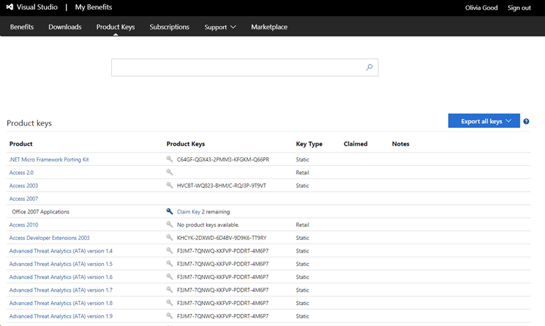

# Using product keys in Visual Studio subscriptions

Visual Studio subscriptions provide access to a wide range of Microsoft products for designing, developing, testing, and demonstrating applications. Some of these products require product keys during installation, and some of those require activation.

Visual Studio subscriptions typically include five product keys for current versions of Windows and Office products, and three keys for older versions.
Keys often have multiple activations, and many products allow 30-day use without activation. For most subscribers, that's more than enough. 

Learn how to [find and claim product keys](find-keys.md). 

> [!NOTE]
> If your subscription is provided to you by your work or school, your subscription admin controls whether you get access to software downloads. If access to downloads is disabled for your subscription, access to product keys is also disabled. If you need downloads and/or product keys, [contact your admin](contact-my-admin.md).

## Activating a product

Activation is required for certain products. Generally, in Visual Studio subscriptions, this requirement applies to Windows, Windows Server, Microsoft Office client applications, and Expression Studio. If you reimage your computers frequently (at least once every 30 days), we don't recommend activating the product. Instead, use the 30 day trial period since the product keys supplied as part of your Visual Studio subscription don't allow unlimited activations of a product.

If you claimed all the available product keys under your subscription and used up all the available activations, you can request more keys by contacting your local Visual Studio Subscription [Customer Service Center](https://visualstudio.microsoft.com/subscriptions/support/). Requests are considered on a case-by-case basis. If approved, product keys are accessible in [Downloads](https://my.visualstudio.com/downloads).

## Retail and Volume Licensing versions of products

Visual Studio subscriptions offer a selection of retail and Volume Licensing versions of Microsoft products. Certain products are available from Downloads only in their retail version or only in their Volume Licensing version; some are available in both versions. Generally, products requiring activation, such as Windows, Windows Server, and Office client products, are only offered in their retail version through Downloads.

Volume Licensing customers can also download software from the Volume Licensing Service Center (VLSC) to get Volume Licensing versions of products (and the corresponding product keys). Designated admins within your organization control access to the VLSC.

## Product key claim limits

Microsoft is committed to protecting the value of the software and benefits that the program’s legitimate subscribers receive for their investment. Microsoft implemented daily key claim limits for Visual Studio subscriptions. Key claim limits restrict the number of keys that can be claimed per subscription.

Our research shows that most subscribers are covered by the number of product keys included in their subscription. If you need more keys, you can submit a request through Visual Studio Subscription [Customer Service](https://visualstudio.microsoft.com/subscriptions/support/). Requests are considered for approval on a case-by-case basis.

## Accessing product keys

1. Sign in to your Visual Studio subscription. 
2. Go to the [Product Keys](https://my.visualstudio.com/productkeys?wt.mc_id=o~msft~docs) page. On this page you can find static keys that work for all users of a product, get custom keys just for your use, see the status of your key claim limits, and export all of your product keys. 
3. For a specific key, select the blue **Get Key** link for a particular product on the [Downloads](https://my.visualstudio.com/downloads) page as shown in the following image. 
 When multiple keys exist for a single product, notes are displayed on the Notes column for the download to assist you in identifying which key should be used.

Some products bundle multiple editions of the product into a single download. In these cases, the product key entered determines which edition of the product is installed.
Some keys are provided automatically, such as "static" keys, which you can use as many times as needed because activation isn't required. Other keys must be claimed by selecting the **Get Key** link for the product.
> [!div class="mx-imgBorder"]
> 

> [!div class="mx-imgBorder"]
> 

Various key types are available, depending on the product.

### Product key types

|  Key Type | Description  |
|-----------|--------------|
|  Not Applicable  |  No key is needed to install this product. |
|  Retail |  Retail keys allow multiple activations and are used for retail builds of the product. |
|  Multiple Activation |  A Multiple Activation Key (MAK) enables you to activate multiple installations of a product with the same key. MAKs are most often used with Volume Licensing versions of products. Typically, only one MAK key is provided per subscription. |
|  Static Activation Key |  Static activation keys are provided for products that don't require activation. They can be used for any number of installations. |
|  Custom Key  |  Custom keys provide special actions or information to activate or install the product. |
|  VA 1.0  |  These keys are multiple activation keys, similar to a MAK. |
|  OEM Key |  These keys are Original Equipment Manufacturer keys that allow multiple activations on OEM hardware. |
|  Azure Dev Tools for Teaching Retail Key |  These retail keys are for Azure Dev Tools for Teaching and allow one activation. These keys are primarily intended for student consumption. |
|  Azure Dev Tools for Teaching Lab Key |  These lab use keys are for Azure Dev Tools for Teaching programs and allow multiple activations. They're intended for use in university computer lab scenarios. |
|  Azure Dev Tools for Teaching MAK Key |  These keys are MAK keys for Azure Dev Tools for Teaching program customers. |

You can claim a key from the download page for the product, or you can search for the key you need on the [Product Keys](https://my.visualstudio.com/productkeys) page.

### Office 2024 deployment

As of October 2024, access to Office 2024 and related Office 2024 products is still available to subscribers; however, the link on the downloads page in the subscriptions portal will redirect subscribers to setup.office.com where subscribers can create a new account or sign-in with their Microsoft account credentials. The product keys listed here are used on setup.office.com for obtaining and setting up Office applications.

[Get help with setting up Office](https://support.microsoft.com/office/get-help-with-setup-office-com-6e1bc8e8-9e8e-4cce-8b9d-80dcbe17f253).

For more information, visit [Office 2024 and Office LTSC 2024 FAQ](https://support.microsoft.com/office/office-2024-and-office-ltsc-2024-faq-1c454a7d-3d0a-4139-b1bd-c61725ea436c).

## Support resources

For assistance with sales, subscriptions, accounts, and billing for Visual Studio Subscriptions, contact [Visual Studio subscriptions support](https://aka.ms/vssubscriberhelp).

## Next steps

To claim keys, visit https://my.visualstudio.com/productkeys. 
Learn how to [find and claim keys](find-keys.md).
You can also learn about using product keys to support [internet demonstrations](internet-demos.md).
