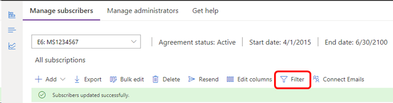
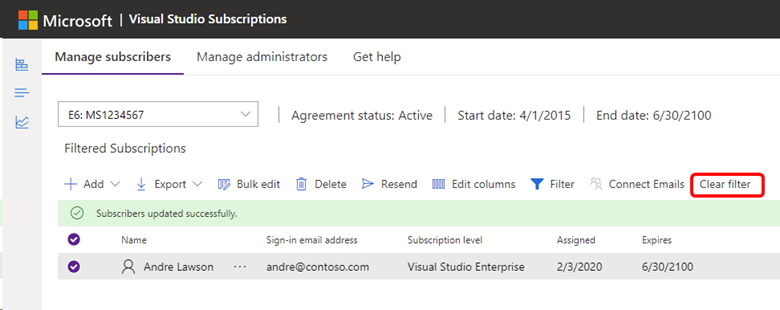

# Search and filter subscribers in Visual Studio subscriptions
The Visual Studio Subscriptions Administration Portal allows you to find a specific subset of subscribers based on various criteria. You can filter the subscriber list by name, email address, or reference.

## To filter the subscriber list
1. To search for a specific group of subscribers, click in the **Filter by name, email, or reference** box located just below the menu on the "Manage subscribers" page.
   > [!div class="mx-imgBorder"]
   > 

2. Enter your search criteria.  You'll notice that the list is updated dynamically as you type.  
Example:  If you wanted to find all of the subscribers that use Outlook email addresses, you could type "@outlook" and the list would be limited to only those subscribers with Outlook.com addresses.  

> [!TIP]
> The search includes subscribers that are members of Azure Active Directory groups, so even though they're not displayed on your subscribers list unless you drill down into the group, they will be listed individually in the search results.  

3. To clear the filter and restore the unfiltered list, click the **X** at the far right of the filter box. 
   > [!div class="mx-imgBorder"]
   > 

## See also
- [Visual Studio documentation](/visualstudio/)
- [Azure DevOps documentation](/azure/devops/)
- [Azure documentation](/azure/)
- [Microsoft 365 documentation](/microsoft-365/)

## Next steps
- Now that you know how to find a subscriber, learn how to [edit](edit-license.md) their subscription.
- Need help using the Administration Portal?  Contact [Visual Studio Administration and Subscriptions Support](https://aka.ms/vsadminhelp).