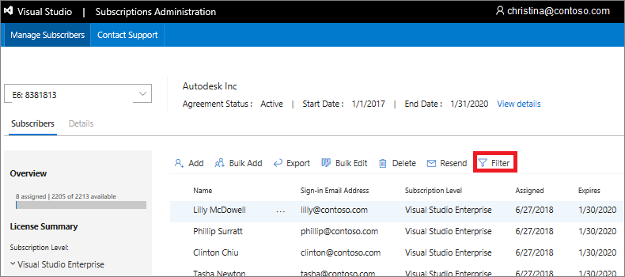
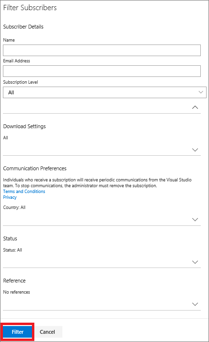
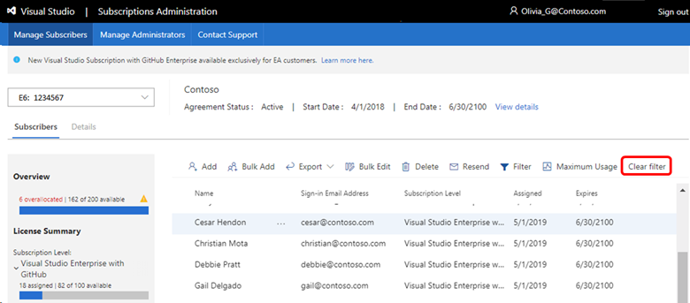

# Search and filter subscribers in Visual Studio subscriptions
The Visual Studio Subscriptions Administration Portal allows you to find a specific subset of subscribers based on various criteria. You can filter the subscriber list by name, email address, subscription level, and other information.

## To filter the subscriber list
1. To search for a specific group of subscribers, select the **Filter** tab.
   > [!div class="mx-imgBorder"]
   > 

2. Enter the criteria you would like to use as the basis of your search, and then select **Filter** again.
   > [!div class="mx-imgBorder"]
   > 

   Your subscriber list then matches the criteria that you chose.  You can click on the headings of the filtered results to change the sort order for each field.  
   > [!NOTE]
   > The **Name** field is sorted by first name.

3. To clear the filter and restore the unfiltered list, click the **Clear filter** tab at the top right. 
   > [!div class="mx-imgBorder"]
   > 

## Next steps
- Now that you know how to find a subscriber, learn how to [edit](edit-license.md) their subscription.
- Need help using the Administration Portal?  Contact [Visual Studio Administration and Subscriptions Support](https://visualstudio.microsoft.com/support/support-overview-vs).