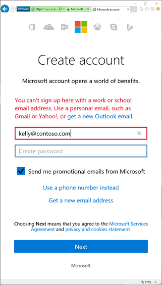
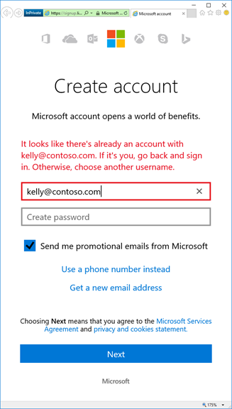

# Issues signing in to Visual Studio subscriptions
To use your Visual Studio subscription, you must first sign in.  Depending on your subscription, you may have set it up with either a Microsoft account (MSA) or an Azure Active Directory (Azure AD) identity.  This article discusses some of the issues you may encounter while signing in to your subscription.

## Microsoft Accounts (MSA) cannot be created using work/school email addresses
Creating a new personal Microsoft Account (MSA) using a work/school email address is no longer allowed when the email domain is configured in Azure AD. What does this mean? If your organization uses Microsoft 365 or other business services from Microsoft that rely on Azure AD, and if you've added a domain name to your Azure AD tenant, users will no longer be able to create a new personal Microsoft account using an email address in your domain.

### Why was this change made?
Having a personal Microsoft Account with a work address as a username is fraught with issues for end-users and IT departments alike. For example:
- Users might think that their personal Microsoft account is business-compliant and that they're in compliance when they save business document to their OneDrive
- Users who leave an organization generally lose access to their work email address. When they do, they may not be able to get back into their personal Microsoft account if they forget their password. Conversely, their IT department could reset their password and get into the personal account of former employees.
- IT departments have a false sense of account ownership and security. But users only need to roundtrip a code to their work email address once, and can rename their account at any time in the future.

The situation is particularly confusing for users who have two accounts with the same email address (one in Azure AD & one Microsoft account).

### What does this experience look like?
If you try to sign up for a Microsoft consumer app with a work or school email address, you'll see the message below.

   > [!div class="mx-imgBorder"]
   > 

However, if you try to sign up for a Microsoft app that supports personal and work/school accounts, you should see this message:

   > [!div class="mx-imgBorder"]
   > 

### Are existing accounts affected?
The sign-up block described here only prevents the creation of new accounts. It has no impact on users who already have a Microsoft Account with a work/school email address. If you are already in this situation, we've made making it easier to rename a personal Microsoft account. This [support article](https://windows.microsoft.com/en-US/Windows/rename-personal-microsoft-account) provides simple step-by-step guidance. Renaming your personal Microsoft account means changing the username, and does not impact your work email or how you sign in to business services such as Microsoft 365. It also doesn't impact your personal stuff—it just changes the way you sign in to it. You can use another (personal) email address, get a new @outlook.com email address from Microsoft, or use your phone number as a new username.

> [!NOTE]
> If your IT department asked you to create a personal Microsoft account with your work/school email, for example to access Microsoft business services like Premier Support, then talk to your admin team before renaming your account.

## Deleting a sign-in address may prevent access to a subscription
If you delete one or more identities (MSA or AAD) associated with your subscription, your subscriber information including your user name and sign-in ID may be rendered anonymous, resulting in the loss of access to your subscription.

To avoid impacts to your subscription access, use one of these techniques.
- Deploy a single identity management system -- either MSA or AAD -- but not both.
- Associate the AAD and MSA identities via the tenant.

## Signing in may fail when using aliases
Depending on the account type used to sign in, available subscriptions may not be correctly displayed when signing in to [https://my.visualstudio.com](https://my.visualstudio.com?wt.mc_id=o~msft~docs). One potential cause is the use of "aliases" or "friendly names" in place of the sign-in identity to which the subscription is assigned. This is called "aliasing".

### What is aliasing?
The term “aliasing” refers to users having different identities to sign in to Windows (or your Active Directory) and to access email.

Aliasing can be encountered when a company has a Microsoft Online Service for their directory sign-in, like JohnD@contoso.com, but users access their email accounts using aliases or friendly names, such as John.Doe@contoso.com. For many customers who manage their subscriptions through the Volume Licensing Service Center (VLSC), this can result in an unsuccessful sign-in experience as the email address provided (John.Doe@contoso.com) does not match the directory address (JohnD@contoso.com) required for successful authentication through the “Work or School Account” option.

### What options do I have?
From a subscriber perspective, it is important to first work with your admin to understand your company’s identity configuration. If necessary, your admin may have to update your account settings from their admin portal, or you may need to create a Microsoft Account (MSA) using your corporate email address. Before taking the steps to create an MSA, speak with your admin regarding any policies or issues with taking this action.

## Resources
- For assistance with sales, subscriptions, accounts and billing for Visual Studio Subscriptions, see Visual Studio [Subscriptions support](https://aka.ms/vssubscriberhelp). 

## See also
- [Visual Studio documentation](/visualstudio/)
- [Azure DevOps documentation](/azure/devops/)
- [Azure documentation](/azure/)
- [Microsoft 365 documentation](/microsoft-365/)

## Next steps
- Learn how to [link MSA and AAD accounts](/azure/active-directory/b2b/add-users-administrator) within AAD.
- Learn more about [anonymization](anonymization.md).