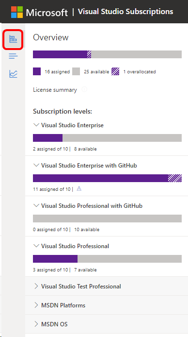
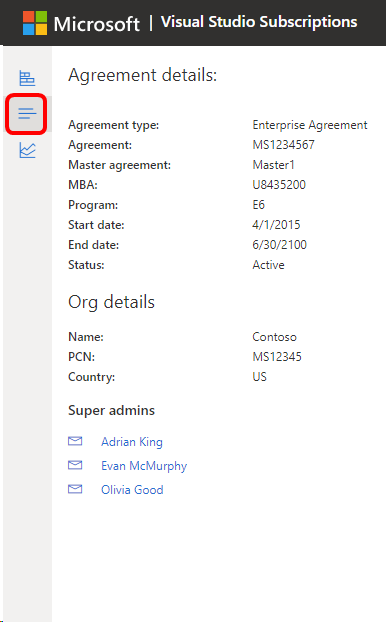

# Overview of the Visual Studio Subscriptions Admin Portal

The Visual Studio Subscriptions Admin Portal gives you the tools to manage your organization's subscriptions in one place. 

Take a tour of the portal.

> [!VIDEO https://medius.microsoft.com/Embed/video-nc/6d1b9008-3c87-4a29-87ac-c1b134130f51?r=779528946203]

## Important considerations

Keep these points in mind when you use the Visual Studio Subscriptions Admin Portal:
+ **Visual Studio subscriptions are licensed per user.** Each subscriber can use the software on as many computers as needed for development and testing.
+ **Assign only one subscription level for each subscriber**, corresponding to the Visual Studio subscription your organization purchased. If you have subscribers with more than one subscription level assigned to them, edit their settings so that they only have one.
+ **A subscriber’s subscription level will need to be updated** when the subscription is upgraded (after the purchase of a “step-up” license) or renewed at a lower level.
+ **Do not share subscriptions between subscribers.** Subscriptions must be assigned to named individuals. Assignment of subscriptions to teams isn't permitted. You must assign a subscription to anyone who uses all or part of the subscription benefits (software for development and testing, Microsoft Azure, e-learning, etc.).

> [!NOTE]
> Visual Studio Subscriptions [subscription portal](https://my.visualstudio.com?wt.mc_id=o~msft~docs) and [admin portal](https://manage.visualstudio.com) don't support [GCC High tenants](https://learn.microsoft.com/office365/servicedescriptions/office-365-platform-service-description/office-365-us-government/gcc-high-and-dod), also known as private or government domains. This also applies to subscribers attempting to sign into the Visual Studio IDE. To access Visual Studio subscriptions, your organization needs to have a public tenant. For further assistance creating a public tenant, contact [Azure support](https://azure.microsoft.com/support/create-ticket/). 

## The Subscribers page

After you assign subscriptions, the Manage subscribers tab provides detailed information about your subscribers, including:
+ First and family name of each subscriber
+ Email address for this user
+ Subscription level assigned to them
+ Date that their subscription was assigned
+ Expiration date for their subscription
+ Reference field for notes
+ Whether subscriber downloads are enabled or disabled
+ Country or region in which they're located
+ Preferred language for the assignment communication email from the admin portal
+ An optional field for a different email address used for communications than sign-in

On the top left side of the page, there are several icons you can select to reveal a subscription assignment overview, the agreement details, and the maximum usage report.

To see additional information about the number of subscription licenses purchased, assigned, and still available in your organization for each agreement, select the top icon to enable the slide-out panel.
> [!div class="mx-imgBorder"]
> 

## The Details page

For more information about the agreement you're viewing, select the second icon to see the Agreement Details tab. The slide-out panel shows the agreement status, purchase account, org details, super-admins, and other pertinent information.
> [!div class="mx-imgBorder"]
> 

## The Notification center 

To view notifications related to portal announcements, newsletters, and more, select the bell icon on the upper right-hand corner. 

Hover over a notification to dismiss an individual notification or select **Dismiss all** to clear the notification center. Some critical notifications might appear at the top of the center and aren't dismissible. 

Navigate to the **Settings** wheel to set your preferences on the notifications you're interested in receiving. This option is only reflected in the portal, and not in email notifications. 

## Resources

+ [Visual Studio licensing white paper](https://aka.ms/vslicensing)
+ [Compare subscription options and pricing](https://visualstudio.microsoft.com/vs/pricing)
+ [Compare Visual Studio IDE features](https://visualstudio.microsoft.com/vs/compare)
+ [Subscriptions support for admins](https://aka.ms/VSSAdminSupport)

## See also

+ [Visual Studio documentation](/visualstudio/)
+ [Azure DevOps Services documentation](/azure/devops/)
+ [Azure documentation](/azure/)
+ [Microsoft 365 documentation](/microsoft-365/)

## Next steps

Learn more about responsibilities for admins:
+ [Overview of admin responsibilities](admin-responsibilities.md)
+ [Inventory of preproduction environment](admin-inventory.md)
+ [Manage large teams and external contractors](manage-teams.md)
+ [Track user assignments and process orders](assignments-orders.md)
+ Use [Maximum Usage](maximum-usage.md) to track purchase commitments
