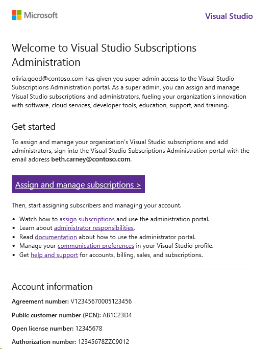

# Accessing the Administration Portal as an admin on a Volume License agreement

If you are the primary or notices contact on your organization’s agreement, you will be automatically provisioned access to the portal upon setting up your Volume Licensing agreement. You’ll receive a system-triggered welcome email which will prompt you to sign into the portal. The email will indicate which email address to use to sign into the portal. 

   > [!div class="mx-imgBorder"]
   > 

Once you’re signed in, you will be automatically set up as a super admin and can begin managing subscriptions and other administrators. For information about the differences between super admins and administrators, take a look at our article about [admin roles](admin-roles.md).

This applies to all Volume Licensing agreement types including, but not limited to: Enterprise agreements, Enterprise subscriptions, Select, Select Plus, Open, Open License, Govt. and Academic agreements. 

## Resources
- [Visual Studio Administration and Subscriptions Support](https://visualstudio.microsoft.com/support/support-overview-vs)

## Next steps
- Learn how to [assign subscriptions](assign-license.md)
- Learn more about the full range of [subscription benefits](https://visualstudio.microsoft.com/vs/benefits/)
- [Set agreement preferences](admin-prefs.md) 