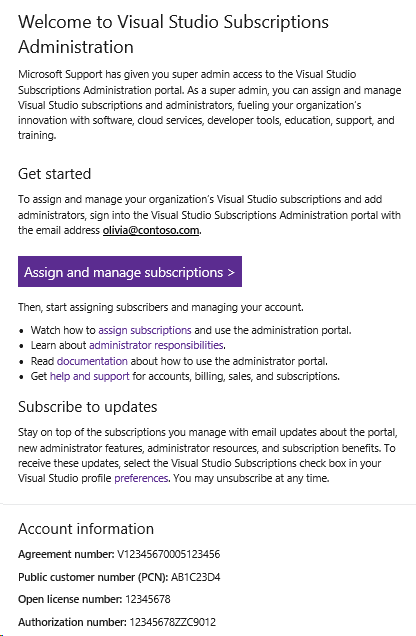

# Accessing the Admin Portal as an admin on a Volume License agreement

If you're the primary or notices contact on your organization’s agreement, you're automatically granted access to the portal upon setting up your Volume Licensing agreement. You receive a system-triggered welcome email, which prompts you to sign into the portal. The email shows which email address to use to sign into the portal.  To sign in, visit https://manage.visualstudio.com.

   > [!div class="mx-imgBorder"]
   > 

After you’re signed in, you'll be automatically set up as a super admin and can begin managing subscriptions and other admins. For information about the differences between super admins and admins, take a look at our article about [admin roles](admin-roles.md).

This process applies to all Volume Licensing agreement types including, but not limited to: Enterprise agreements, Enterprise subscriptions, Select, Select Plus, Open, Open License, Government. and Academic agreements. 

## Resources

For assistance with sales, subscriptions, accounts and billing for Visual Studio Subscriptions, see Visual Studio [Subscriptions Support](https://aka.ms/VSSAdminSupport)

## See also

+ [Visual Studio documentation](/visualstudio/)
+ [Azure DevOps Services documentation](/azure/devops/)
+ [Azure documentation](/azure/)
+ [Microsoft 365 documentation](/microsoft-365/)

## Next steps

+ Learn how to [assign subscriptions](assign-license.md)
+ Learn more about the full range of [subscription benefits](https://visualstudio.microsoft.com/vs/benefits/)
+ [Set agreement preferences](admin-preferences.md)
